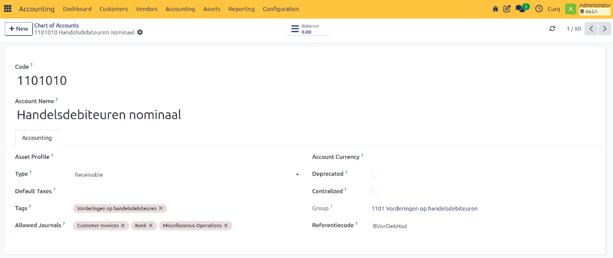

# Accounting Overview

Accurate accounting is the backbone of every successful business. It provides vital financial transparency, supports robust financial management, and enables you to precisely track:

- **Income and expenses**
- **Profits and losses**

> [!IMPORTANT]
> In many countries, companies are legally required to maintain proper accounting records and submit tax returns. Failure to comply can lead to severe penalties or legal issues.

Moreover, accounting data is critical for informed decision-making. It empowers businesses to evaluate their financial performance, plan budgets strategically, and allocate resources effectively.

---

## CURQ Accounting

**CURQ** is an all-in-one business software platform that features a powerful, integrated accounting module. It seamlessly connects your accounting operations with other core business processes, such as sales, purchasing, and inventory management.

### Key Benefits of CURQ Accounting

- **Automation:** CURQ automates a wide range of repetitive accounting tasks—such as automatically generating recurring journal entries. This significantly reduces manual workload and minimizes the risk of human error.
- **Real-Time Insights:** The platform offers real-time access to your financial data, allowing you to monitor your business's financial position at any given moment.
- **Advanced Reporting:** Equipped with robust reporting tools, CURQ helps you generate comprehensive financial reports and perform deep analyses of your financial performance.

> [!TIP]
> With its built-in automation and deep system integration, CURQ is designed to help your business maintain an efficient, accurate, and highly streamlined financial management workflow.

---

## Getting Started with RGS

### What is RGS?

The **Reference General Ledger Scheme (RGS)** is a standardized chart of accounts that uses uniform codes for financial data. Companies that use RGS can easily retrieve information from their accounting systems and share it with other systems or include it in reports for external parties.

Using RGS makes it easier and faster to create internal and external reports, prepare reliable dashboards, and compare financial data.

The core of RGS is the **reference code**. Each ledger account is linked to a unique reference code. These codes are connected to **SBR (Standard Business Reporting)**, the national standard for the digital exchange of business reports such as annual accounts, tax returns, and other financial reports.

---

### Benefits of RGS 

Companies and intermediaries, such as accountants and tax advisors, can generate reports and dashboards directly from financial records when using RGS. This reduces the need for manual processing.

Working with RGS also makes it easier to compare financial results with industry benchmarks or other companies.

For accountants and advisors, RGS improves service quality because reports can be prepared more quickly and financial insights become clearer.

Using RGS provides several benefits:
- **More consistent and efficient administration**, as all records follow a standardized structure
- **Faster and more accurate reporting** through automatic links with RGS codes
- **Better data exchange** between different systems
- **Improved financial insight**, making it easier to evaluate company performance and compare with other businesses

It also enables organizations such as banks, government institutions, and other stakeholders to analyze financial data more easily.

---

### RGS in CURQ 

The RGS structure contains approximately **1,400 ledger accounts**. These accounts are included in the standard configuration of CURQ.

Out of these 1,400 accounts, around **600 commonly used accounts** are active by default, while the remaining **800 accounts** are inactive. 

> [!NOTE]
> These accounts can be activated or archived if needed, preferably in consultation with your accountant.

RGS is fully integrated into the accounting system in CURQ. It is used in various areas such as:
- General accounting settings
- VAT codes
- Fiscal positions
- Reports such as VAT declaration, ICP declaration, Balance Sheet, and Profit & Loss statement

---

### Explanation of General Ledger Account Fields

Each general ledger account contains several fields that define how the account behaves within the accounting system.

| Field | Description |
| :--- | :--- |
| **Code** | A six-digit identifier based on the standard RGS structure. ⚠️ *Although the code can be modified, financial reports are not based on this field. Any changes should be made only in consultation with your accountant.* |
| **Account Name** | Describes the purpose of the ledger account. Changing the account name does not affect the structure of financial reports. |
| **Asset Profile** | Asset profiles can be linked to ledger accounts. When a ledger account is used on a purchase invoice, CURQ can automatically suggest creating an asset and linking it to the invoice. |
| **Type** | Determines whether the account belongs to the **Balance Sheet** or **Profit & Loss Statement**. ⚠️ *Changing an account type can affect financial reporting and should be done carefully.* |
| **Standard VAT** | A default VAT code can be assigned to a ledger account. When the account is selected on an invoice, CURQ automatically suggests the configured VAT code. |
| **Labels** | Labels provide additional categorization within the account structure. Because labels are linked to reporting groups, changing them may affect standard financial reports. |
| **Allowed Journals** | Helps ensure that ledger accounts are used in appropriate accounting journals. For example, expense accounts should not normally be used on sales invoices. If an account is selected in a journal where it is not typically allowed, CURQ displays a warning message. |
| **Account Currency** | If a currency is specified, all transactions posted to the account must use that currency. If no currency is defined, any active currency can be used. |
| **Deprecated** | Indicates whether the account is currently active or no longer in use. |
| **Group** | Originates from the RGS structure and determines how accounts are classified in financial reports. 🚨 **IMPORTANT:** *This field cannot be modified because reports such as the Balance Sheet and Profit & Loss Statement rely on it.* |
| **Reference Code** | Uniquely identifies an account within the RGS structure. The reference code forms the foundation of the RGS structure and ensures that every account can be uniquely identified and classified (see example below). |

#### Reference Code Hierarchy Example

The reference code follows a hierarchical structure consisting of five levels:
1. Balance Sheet or Profit & Loss (Starts with **B** for Balance Sheet, **W** for Profit & Loss)
2. Main Category
3. Category
4. General Ledger Account
5. Transaction Level

| Level | Example | Description |
| :---: | :--- | :--- |
| **1** | B | Balance Sheet |
| **2** | BLim | Liquid Assets |
| **3** | BLimKas | Cash Resources |
| **4** | BLimKasKas | Cash Ledger Account |
