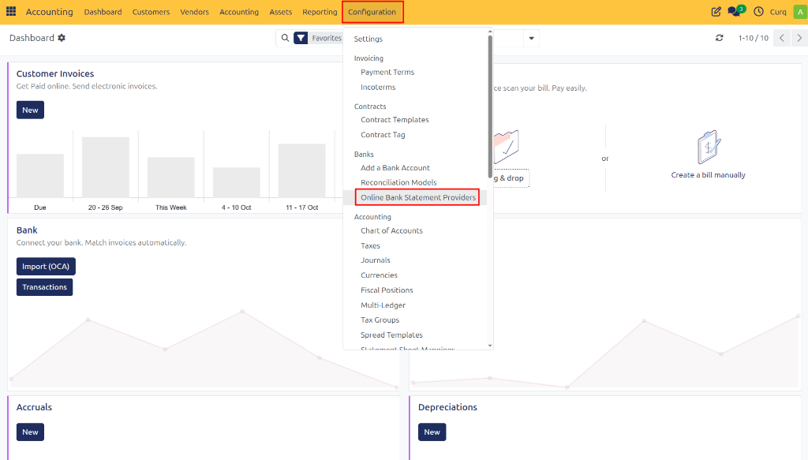
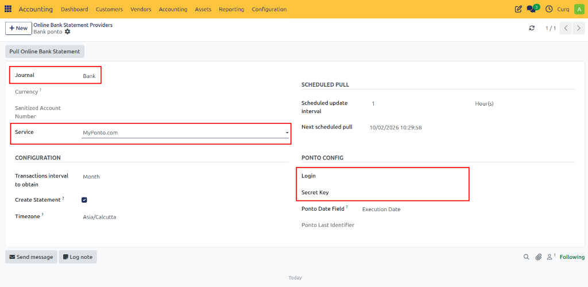
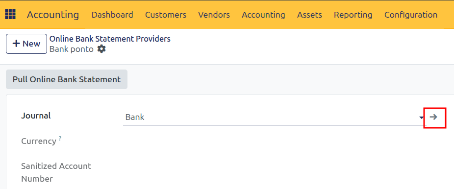
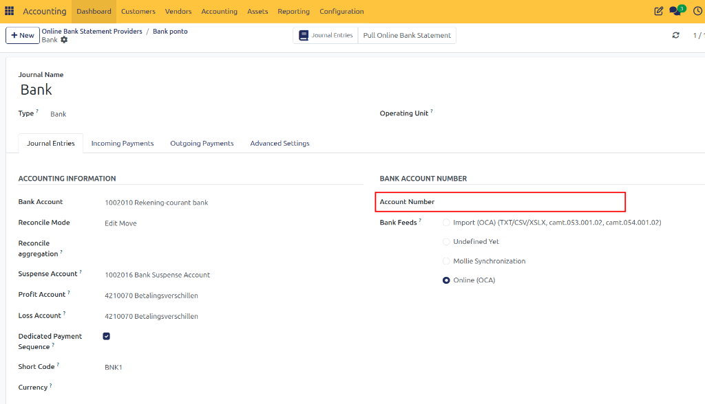

# Configure Bank Link (Ponto)

You can connect your bank account to CURQ to automatically import bank transactions and simplify the reconciliation process.

CURQ uses **Ponto** to securely connect with your bank and retrieve transaction data. Before you begin, make sure you have an active Ponto account and the required login credentials.

---

## Create a Bank Connection

1. Go to **Invoicing**.
2. Navigate to **Configuration → Online Bank Statement Providers**.
3. Click **New**.

Enter the required information for the bank connection.

## Configure the Ponto Connection

When creating the connection:

- Select **Bank** as the journal if you do not yet have a dedicated bank journal.
- Select **MyPonto.com** as the service provider.
- Enter the **Login** and **Secret Key** from your Ponto account.
- Review the remaining settings and adjust them if needed.

> [!TIP]
> It is recommended to keep the **Retrieve Interval** at **1 hour or higher** to ensure steady performance and avoid API rate limits.

## Configure Bank Account Details

After creating the connection, you must configure the account details:

1. Open the selected **Bank Journal**.

2. Enter the bank account number.
3. Click **Create and Edit**.
4. Complete the remaining bank account information.

> [!IMPORTANT]
> Make sure all bank details are entered accurately to ensure successful and uninterrupted synchronization.

## Result

Once the setup is complete, CURQ can automatically retrieve bank transactions from your connected bank account. These transactions can then be reviewed and reconciled seamlessly within the Accounting module.

> [!NOTE]
> CURQ automatically saves changes as you make them. There is no need to manually save your configuration.
