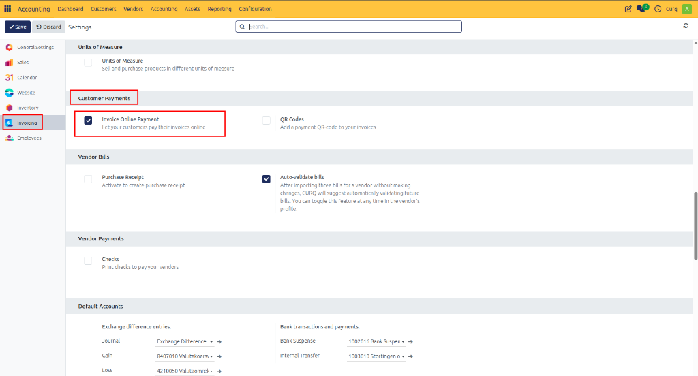
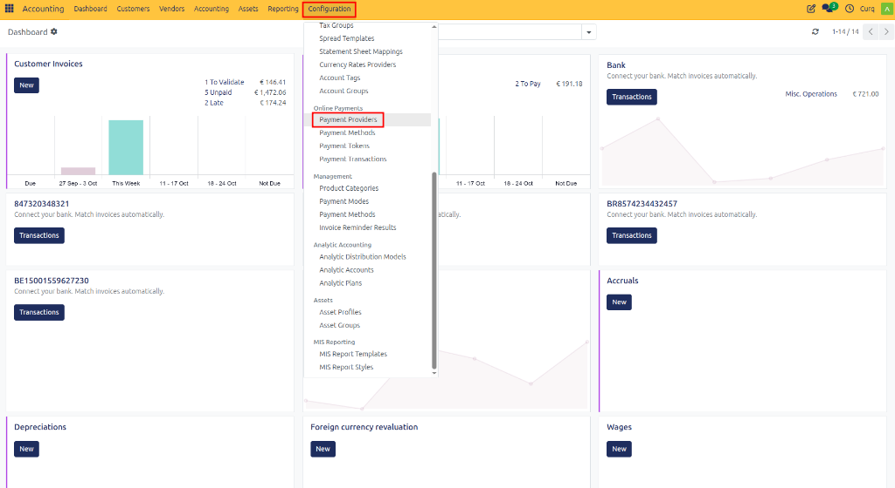
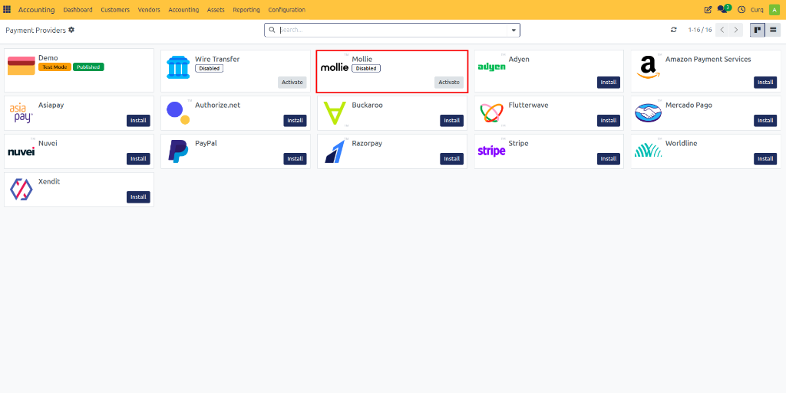
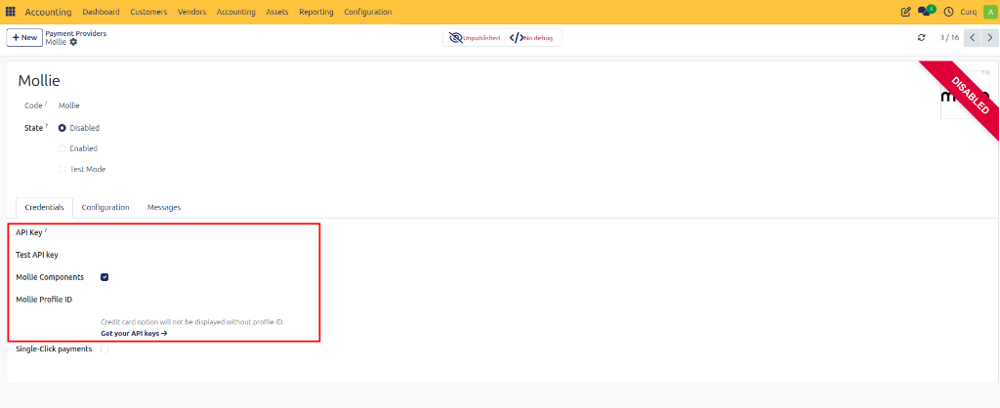
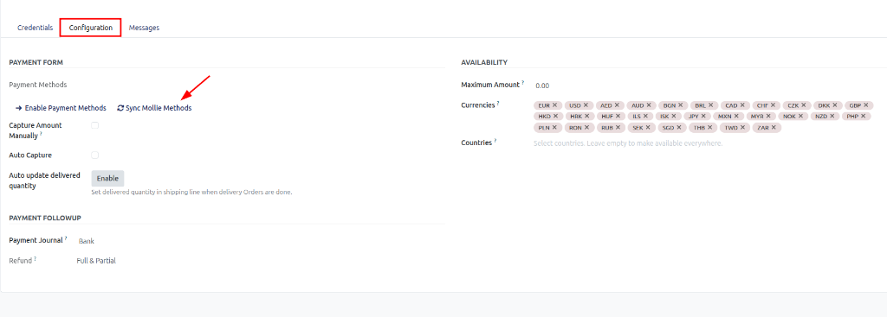
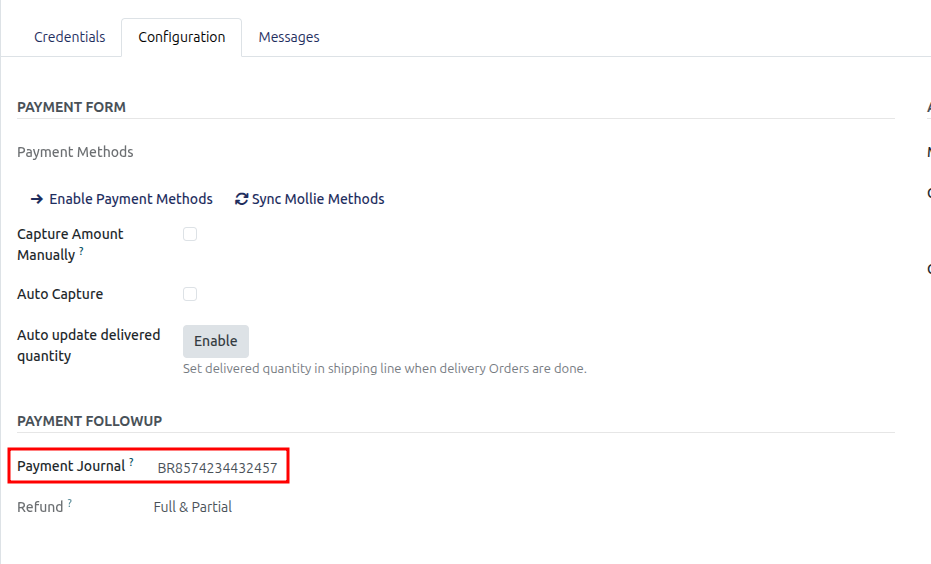
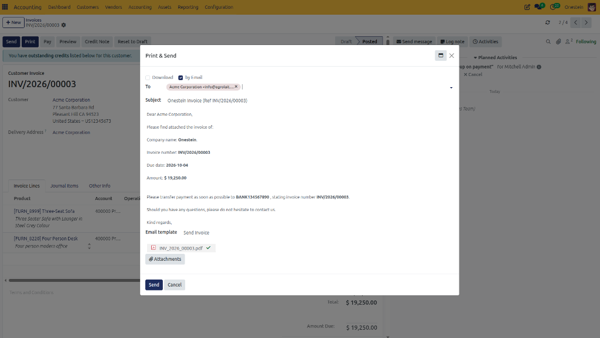
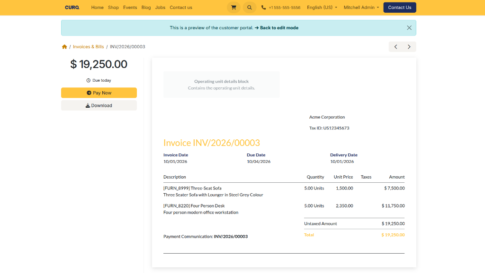
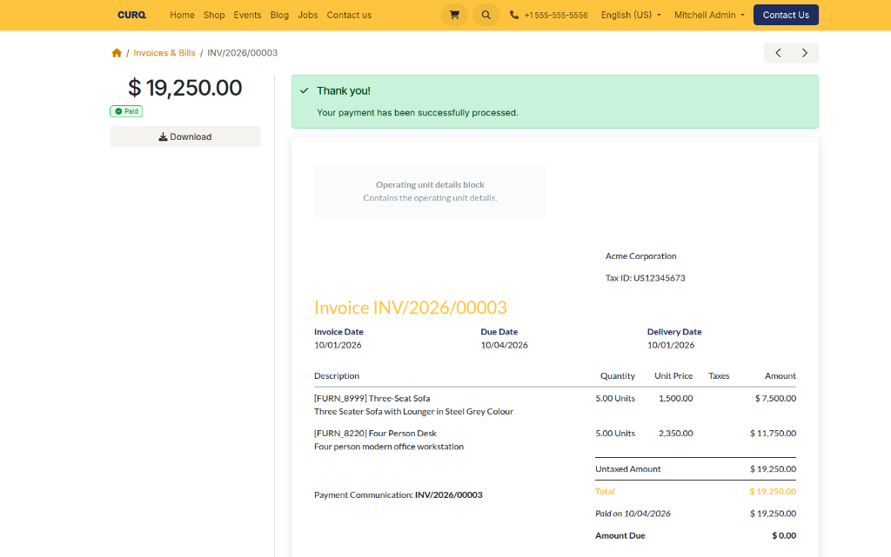

# Online Invoice Payments

## Overview

CURQ allows customers to pay invoices directly online through the Customer Portal. When the **Pay Invoice Online** feature is enabled, a **Pay Now** button is added to customer invoices, making it easy for customers to view and pay outstanding invoices using their preferred payment method.

This streamlined payment process improves the customer experience, accelerates payment collection, and automatically updates invoice statuses within CURQ.

---

## Enable Online Invoice Payments

To activate online invoice payments, navigate to:
`Accounting → Configuration → Settings → Customer Payments`

Enable the **Pay Invoices Online** option and click **Save**.

Once enabled, customers will be able to access and pay invoices directly from the customer portal.

---

## Payment Providers

CURQ supports multiple online payment providers. One of the most commonly used integrations is **Mollie**, which allows customers to pay invoices using payment methods such as:
- iDEAL
- Credit Card
- Bancontact
- PayPal (if enabled in Mollie)
- Other payment methods supported by your Mollie account

**Navigation:**
`Accounting → Configuration → Payment Providers`

From this menu, you can activate and configure payment providers that will be available in the customer portal.

---

## Configure Mollie Integration

Mollie can be used as the payment provider for online invoice payments.

### Step 1: Activate Mollie
Navigate to:
`Accounting → Configuration → Payment Providers`

Select **Mollie** from the list of available providers.

### Step 2: Enter API Credentials
Open the Mollie provider configuration and enter the required:
- API Key
- Authentication Credentials
- Other configuration details provided by Mollie

These credentials can be obtained from your Mollie Dashboard.

Save the configuration once all details have been entered.

### Step 3: Synchronize Payment Methods
After configuring Mollie, open the **Mollie Payment Methods** tab.

Click: **Sync Payment Methods**

CURQ will retrieve all available payment methods from your Mollie account.

After synchronization, supported methods such as iDEAL will become available for use within the customer portal.

### Step 4: Configure the Payment Provider
Open the **Configuration** tab of the Mollie payment provider.

Link the appropriate **Mollie Journal** that will be used to register incoming payments.

You can also configure:
- **Countries**: Specify the countries where the payment method is available.
- **Payment Icons**: Select which payment method icons should be displayed in the customer portal.
- **Maximum Amount**: Define a maximum invoice amount for which this payment provider can be used. Leave this field empty if no maximum limit is required.

---

## Customer Payment Workflow

After configuration is complete, customers can pay invoices directly through the CURQ Customer Portal.

### Step 1: Send the Invoice
Create and send an invoice from CURQ.
When an invoice email is sent, CURQ automatically includes a link to the customer portal.

### Step 2: Customer Opens the Portal
The customer clicks the link contained in the email.

This link provides direct access to the customer portal and the corresponding invoice.

### Step 3: Customer Reviews the Invoice
Inside the portal, the customer can:
- View invoice details
- Check outstanding balances
- Review payment information
- Access the **Pay Now** button

### Step 4: Customer Pays the Invoice
The customer clicks **Pay Now** and selects one of the available payment methods.

For example, when using Mollie with iDEAL enabled, the customer can choose their bank and complete the payment securely.

### Step 5: Payment Confirmation
Once the payment has been completed successfully:
- The invoice is immediately marked as **Paid** in the customer portal.
- The customer receives instant confirmation.
- The outstanding balance becomes zero.

---

## Invoice Status in CURQ

After successful payment processing:
- CURQ automatically updates the invoice status to **Paid**.
- A payment transaction is created.
- The payment transaction is linked to the invoice.
- The payment is recorded in the configured journal.
- The customer balance is updated automatically.

This eliminates manual payment registration and ensures that customer and accounting records remain synchronized.

---

## Benefits of Online Invoice Payments

Using online invoice payments in CURQ provides several advantages:
- Faster invoice payments
- Improved customer experience
- Reduced manual payment processing
- Automatic payment registration
- Real-time invoice status updates
- Secure payment processing through trusted providers such as Mollie
- Direct integration with the Customer Portal

## Complete Online Payment Process

1. Enable **Pay Invoices Online** in Accounting Settings.
2. Configure a payment provider such as **Mollie**.
3. Enter API credentials and synchronize payment methods.
4. Link the appropriate payment journal.
5. Create and send a sales invoice.
6. The customer receives an email containing a portal link.
7. The customer opens the invoice and clicks **Pay Now**.
8. The payment is processed through the selected provider.
9. CURQ automatically marks the invoice as **Paid**.
10. The payment transaction is linked to the invoice and recorded in the accounting system.

This functionality allows customers to pay invoices quickly and securely while ensuring that all payment information is automatically processed and tracked within CURQ.
