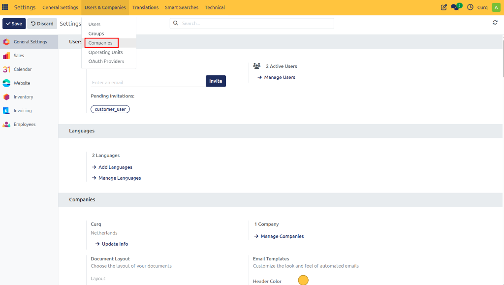
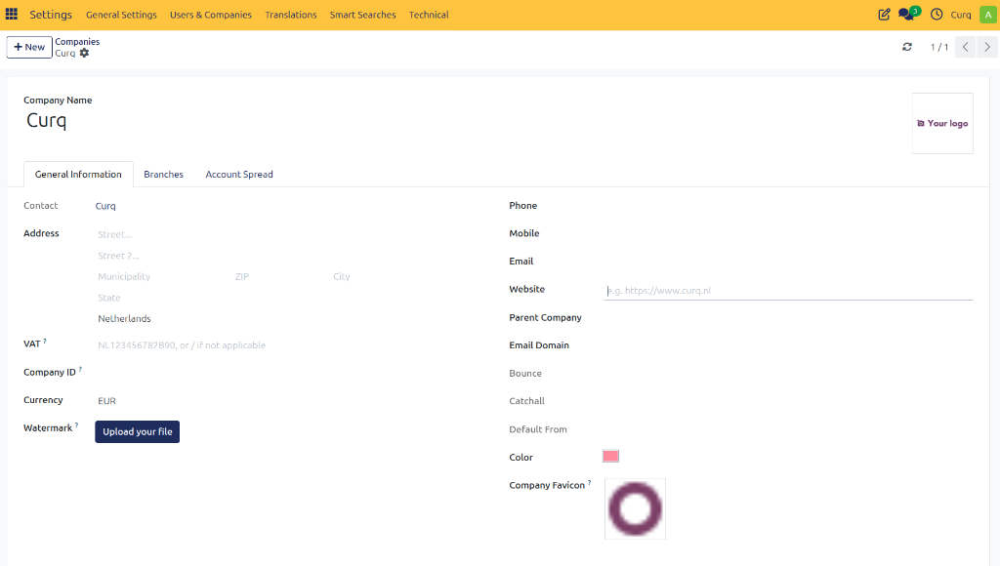

# Configure Company Information

Before you start using Accounting in CURQ, make sure your company information is configured correctly. This information is used throughout the system, including on invoices, reports, and other business documents.

## Open Company Settings

To get started with updating your company information, follow these steps:
1. Go to **Settings**.
2. Select **Users & Companies**.
3. Click on **Companies**.
4. Open your company record.

You can now review and update your company information.

## Enter Basic Company Details

Ensure that all basic contact details are accurate:
- **Company Name**
- **Address** (Street, City, Postal Code, Country)
- **Phone Number**
- **Email Address**
- **Website**

## Enter Financial Information

Depending on your business requirements and local regulations, you may also need to enter:
- **VAT Number**
- **Chamber of Commerce Registration Number**
- **Tax Identification Number**
- **Other legal registration details**

> [!NOTE]
> These details may appear on invoices and official documents. It is important to ensure they match your official registrations exactly.

## Upload Company Logo

To personalize your documents and brand your business:
1. Open the company record.
2. Upload your company logo.
3. Save the changes.

> [!TIP]
> Your logo will be prominently displayed on invoices, quotations, and reports, giving your documents a highly professional appearance!

## Verify Contact Information

Make sure all contact details are up to date so customers, suppliers, and employees can easily reach your business when needed.

> [!IMPORTANT]
> **Save Your Changes:** CURQ automatically saves changes as you make them. There is no separate save button!
