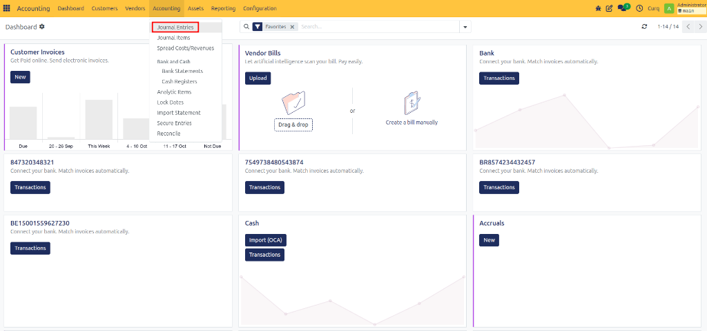
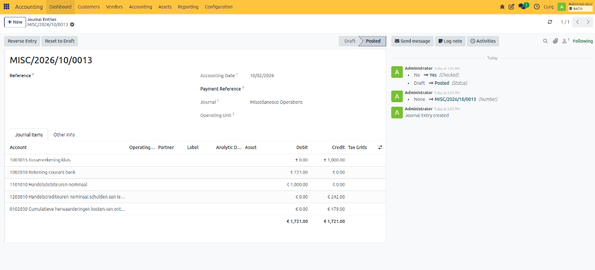
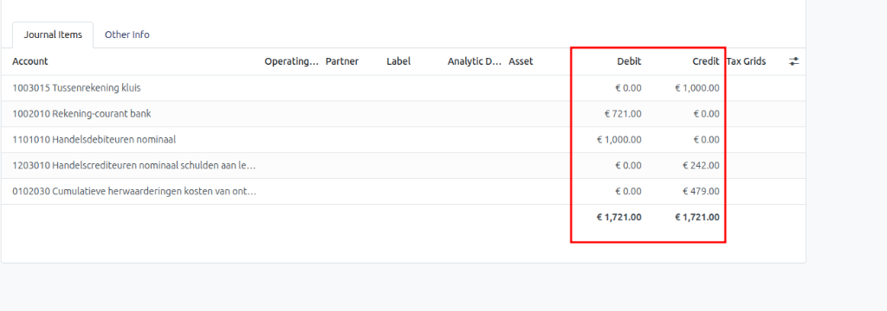

# Create Opening Balance

## Overview

When setting up accounting in CURQ, it is common to start with an **opening balance**. The opening balance represents the financial position of your company at the start of your accounting records.

For a new business, the opening balance may include the money or assets invested in the company. For an existing business moving to CURQ, the opening balance is used to transfer balances from the previous accounting system.

Opening balances are often prepared in collaboration with an accountant or bookkeeper.

---

## Create an Opening Balance Entry

To create an opening balance, navigate to:

**Invoicing → Accounting → Journal Entries**

Click **New** to create a new journal entry.

---

## Enter General Information

### Reference

Enter a clear description for the journal entry.

Examples:
- Opening Balance 2026
- Opening Balance Migration

This helps identify the purpose of the entry later.

### Accounting Date

Select the accounting date for the opening balance.

Common practices include:
- **31 December** of the previous financial year.
- **Last day of the previous month** when switching to CURQ during the year.

If you are unsure which date to use, consult your accountant.

### Journal

Select the **Miscellaneous Journal** (also known as the Memorial Journal) for the opening balance entry.

---

## Add Opening Balance Lines

After entering the general information, add the journal entry lines.

### Account

Select the appropriate general ledger account.

Examples:
- Bank Account
- Accounts Receivable
- Accounts Payable
- Equity Account
- Fixed Assets

### Partner

If the opening balance includes outstanding customer invoices or supplier bills, select the related customer or supplier.

Create a separate line for each customer or supplier balance.

For large numbers of outstanding invoices, it may be easier to create separate opening balance entries for:
- Customers
- Suppliers
- General balances

### Label

Enter a meaningful description for each line.

Examples:
- Opening Bank Balance
- Outstanding Customer Invoice
- Supplier Balance Transfer

If outstanding invoices are included, you can use the invoice number as the label.

### Debit

Enter the amount on the debit side of the journal entry.

### Credit

Enter the amount on the credit side of the journal entry.

---

## Verify the Balance

Before posting the opening balance, verify that the journal entry is balanced.

The total of all **Debit** amounts must be equal to the total of all **Credit** amounts.

CURQ displays the totals at the bottom of the journal entry.

The journal entry cannot be posted until the debit and credit totals match.

---

## Example

| Account | Debit | Credit |
| :--- | :--- | :--- |
| Bank Account | €10,000 | |
| Accounts Receivable | €2,000 | |
| Accounts Payable | | €1,000 |
| Owner's Equity | | €11,000 |

**Total Debit** = €12,000  
**Total Credit** = €12,000  

Because both totals are equal, the opening balance can be posted.
