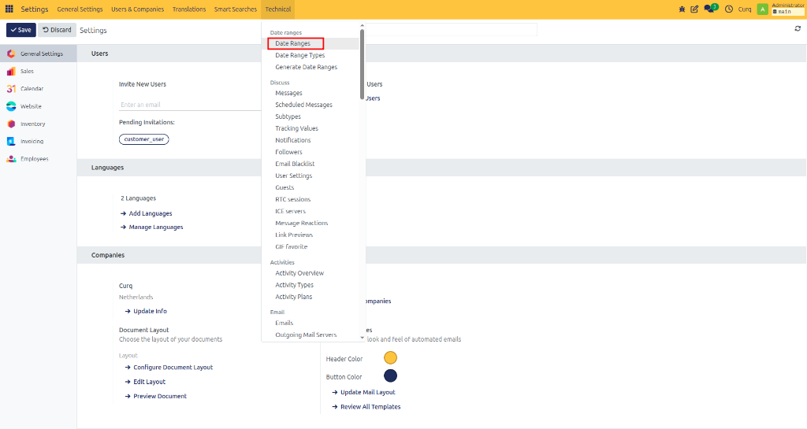
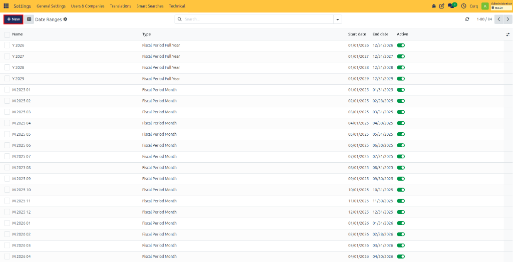
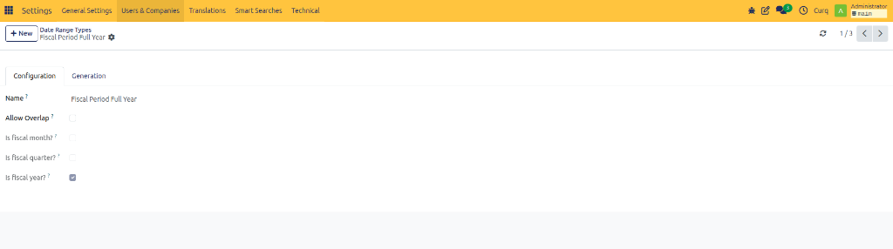
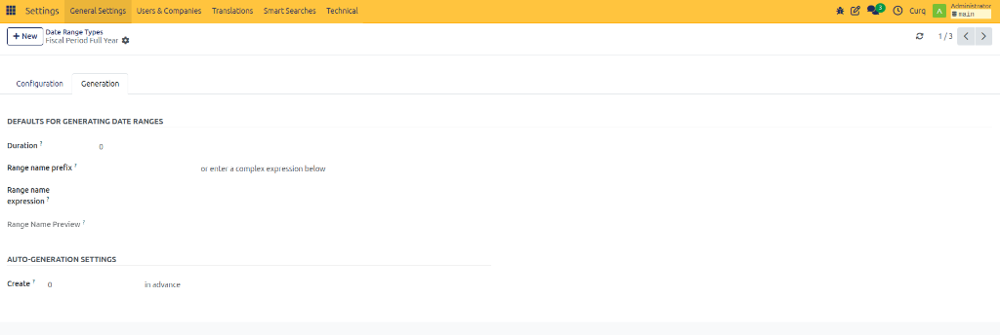
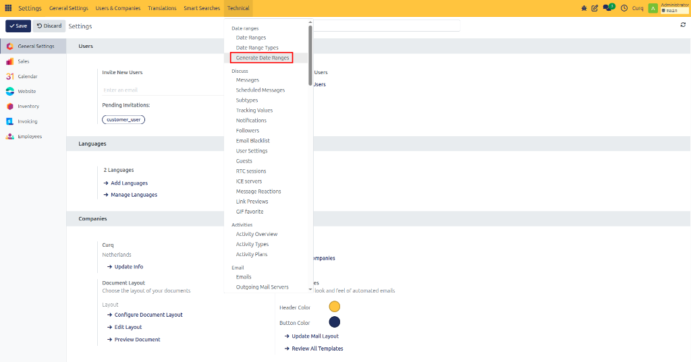
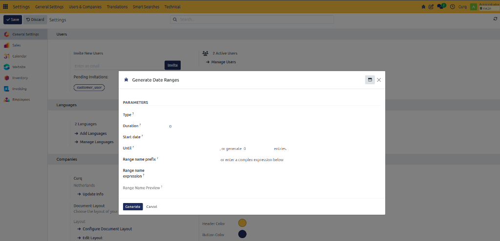

# Manage Date Ranges

## Overview

CURQ uses dates instead of fixed accounting periods. To help organize financial data and reports, the system uses **date ranges** such as months, quarters, and years.

Date ranges make it easier to filter transactions, generate reports, and manage accounting information over specific periods.

CURQ automatically creates date ranges for months, quarters, and years. In most cases, no manual setup is required.

---

## Manage Date Ranges

If you need to create or modify date ranges manually, you must first enable **Developer Mode**.

Navigate to:

**Settings → Technical → Date Ranges**

From this screen, you can view existing date ranges or create new ones.

Click **New** to create a new date range.

### Available Fields

| Field | Description |
| :--- | :--- |
| **Name** | Enter a name for the date range. Examples: `January 2026`, `Q1 2026`, `Fiscal Year 2026`. |
| **Type** | Select the type of date range: `Month`, `Quarter`, `Year`. |
| **Start Date** | Enter the first date of the period. |
| **End Date** | Enter the last date of the period. |
| **Active** | Enable this option if the date range should be available for reporting and filtering. |

> [!NOTE]
> CURQ automatically maintains standard monthly, quarterly, and yearly date ranges. Manual changes are usually only required for special business requirements.

---

## Manage Date Range Types

Date range types define how date ranges are generated and structured.

Navigate to:

**Settings → Technical → Date Range Types**

Most organizations do not need to modify these settings because CURQ already provides standard configurations.

### Available Fields

| Field | Description |
| :--- | :--- |
| **Name** | The name of the date range type. Examples: `Month`, `Quarter`, `Year`. |
| **Allow Overlap** | Enable this option if date ranges of this type are allowed to overlap. |
| **Fiscal Month** | Predefined system setting. Normally not modified. |
| **Fiscal Quarter** | Predefined system setting. Normally not modified. |
| **Fiscal Year** | Predefined system setting. Normally not modified. |

---

## Generation Settings

Open the **Generation** tab to configure how date ranges are created automatically.

| Field | Description |
| :--- | :--- |
| **Duration** | Defines the default length of the date range. Examples: `1 Month`, `1 Quarter`, `1 Year`. |
| **Range Name Prefix** | Adds a prefix to generated date range names. Examples: `FY-2026`, `Q-2026`. |
| **Range Name Expression** | Defines a naming formula that CURQ uses when creating date ranges automatically. |
| **Create** | Determines how far in advance future date ranges should be generated. |

---

## Generate Date Ranges

If you need to create multiple date ranges at once, you can use the automatic generation feature.

Navigate to:

**Settings → Technical → Generate Date Series**

Select a date range type and define the generation criteria.

### Available Fields

| Field | Description |
| :--- | :--- |
| **Start Date** | The date from which date ranges should begin. |
| **Until** | The date up to which date ranges should be generated. |
| **Or Generate ... Items** | Instead of entering an end date, specify how many date ranges should be created. Examples: `Generate 12 monthly date ranges`, `Generate 4 quarterly date ranges`. CURQ will automatically create the required date ranges based on the selected settings. |
