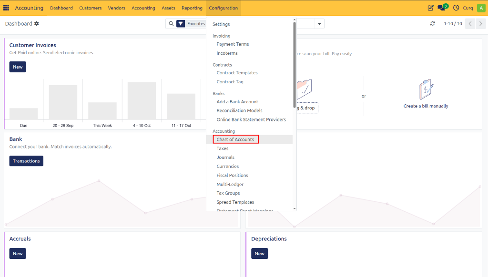
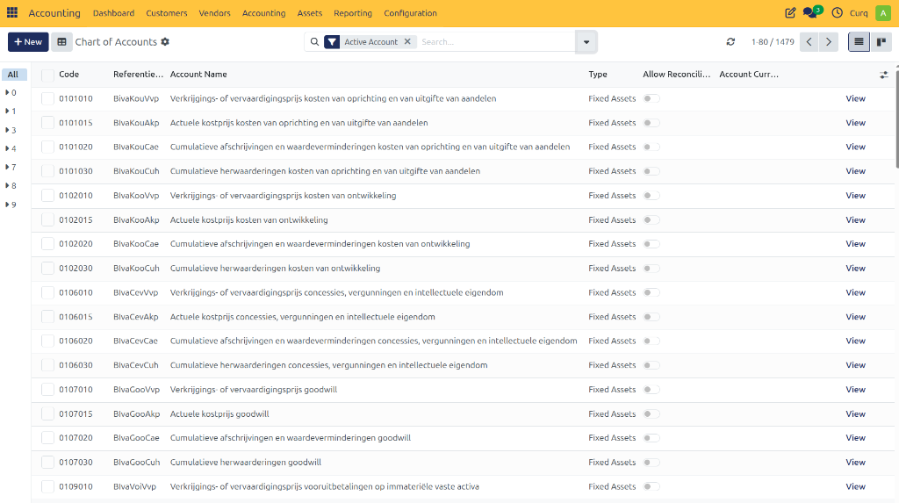

# Configure Chart of Accounts

The Chart of Accounts is a comprehensive list of financial accounts used to seamlessly record and organize your company's financial transactions.

CURQ automatically loads the **RGS Dutch Chart of Accounts (Reference General Ledger Scheme)** when the accounting module is set up for your company.

The Chart of Accounts typically includes:
- **General Ledger Accounts**
- **Accounts Receivable** (Debtors)
- **Accounts Payable** (Creditors)
- **Revenue Accounts**
- **Expense Accounts**
- **Asset Accounts**
- **Liability Accounts**
- **Other financial categories**

---

## View the Chart of Accounts

To explore the available accounts in your system, follow these steps:

1. Go to **Invoicing**.
2. Select **Configuration**.
3. Click on **Chart of Accounts**.

A full list of all available accounts will be displayed.

---

## Understanding the General Ledger

The **General Ledger** contains all ledger accounts of a company, including both balance sheet accounts and profit and loss accounts. Each financial transaction is recorded through journal entries, where multiple accounts are debited and credited.

In CURQ, a standardized chart of accounts based on the **RGS (Reference General Ledger Scheme)** is used.

Each ledger account belongs to a specific category. In CURQ, every account has a unique code and is assigned to one of the following categories:

- **Equity and Subordinated Loans**: Equity represents the funds invested by the shareholders to finance the company’s operations. Subordinated loans are funds provided by third parties to support the company’s activities. In the event of liquidation, these lenders are repaid before shareholders.
- **Fixed Assets**: Fixed assets are tangible or long-term assets used by the company to produce goods or services. These assets typically have a useful life of more than one year and include items such as buildings, machinery, factories, and equipment.
- **Current Assets**: Current assets are assets that can be converted into cash within one year. Examples include cash, bank balances, accounts receivable (debtors), inventory, marketable securities, and prepaid expenses.
- **Short-Term Liabilities**: Short-term liabilities are financial obligations that must be settled within one year. An example is the amount owed to suppliers (accounts payable).
- **Bank and Cash Accounts**: A bank account records financial transactions between the company and the bank. A cash account records all cash transactions, including cash receipts and cash payments.
- **Costs and Income**: 
  - **Costs** represent the operating expenses required to generate revenue, such as supplier payments, salaries, rent, and depreciation.
  - **Income** refers to the value received by the company for providing products or services during a specific period.

---

## Understanding the Balance Sheet

The **Balance Sheet** is a snapshot of a company's finances at a specific date (unlike the Profit and Loss Statement, which is an analysis over a period of time).

- **Assets** represent the company's capital and the goods it owns. Fixed assets include buildings and offices, while current assets include bank accounts and cash. Money owed by a customer is an asset. An employee is not an asset.
- **Liabilities** are past obligations that the company will have to pay in the future (e.g., utility bills, debts, unpaid suppliers). A distinction is made between current and long-term liabilities.
- **Equity** is the difference between all your company's assets and liabilities (long-term and short-term debt). On the balance sheet, equity is shown under liabilities; you can think of it as a debt the company owes to its owners.

What a company owns in assets is financed through debt to repay (debt) or equity (profits, capital).

A distinction is made between assets and costs:
- **An asset** is a resource with economic value that an individual, company, or country owns or controls in the expectation that it will generate future benefits. Assets are listed on a company's balance sheet. They are acquired or created to increase a company's value or improve its operations.
- **A cost item** is the operational expenses a company incurs to generate revenue. This includes costs incurred for the purchase price of sales, as well as costs such as R&D, personnel, and transportation.

---

## Understanding Profit and Loss

The **Profit and Loss statement (P&L)** shows the financial result of a company over a specific period. It indicates whether the company has made a profit or a loss during that time.

The profit or loss is calculated by subtracting the costs from the revenues. The final balance represents the company’s financial result for the period. The Profit and Loss statement is part of the annual financial statements, together with the Balance Sheet.

### Purpose of the Profit and Loss Statement

The Profit and Loss statement is required to determine the amount of tax that must be paid. The type of tax depends on the legal structure of the business.

- Companies such as a BV (limited company) must pay Corporate Income Tax.
- Sole proprietors and self-employed individuals pay Income Tax on their profits.

To calculate the correct tax amount, the company must clearly show how the profit or loss was generated. The tax authorities use the Profit and Loss statement as part of this verification.

### Profit Calculation Formula

The operating result after tax can be summarized as:

> **Operating income after tax** = Net turnover − Cost of goods sold − Other costs and revenues − Taxes

### Structure of the Profit and Loss Statement

#### Gross Revenue Result
- Net turnover
- Other revenues
- Cost of goods sold

> **Gross revenue** = Net turnover + Other revenues − Cost of goods sold

#### Costs
- Operating expenses
- Depreciation

> **Net revenue** = Gross revenue − Costs − Depreciation

#### Other Charges and Revenues
- Incidental gains and losses
- Participation results

#### Final Result
> **Operating income after tax** = Net revenue − Other charges and revenues − Taxes

---

## Double-Entry Accounting

CURQ uses the **double-entry accounting** system.

In this system, every transaction is recorded in at least two accounts: one **debit entry** and one **credit entry**. The total debit amount must always equal the total credit amount.

### Debit

The **Debit** side represents the **left side of the balance sheet**.
It includes company assets such as:

- Fixed assets
- Current assets
- Debtors (money owed by customers)
- Cash and bank balances

### Credit

The **Credit** side represents the **right side of the balance sheet**.
It includes:

- Equity (owner's capital)
- Liabilities such as loans and debts
- Creditors (amounts owed to suppliers)
