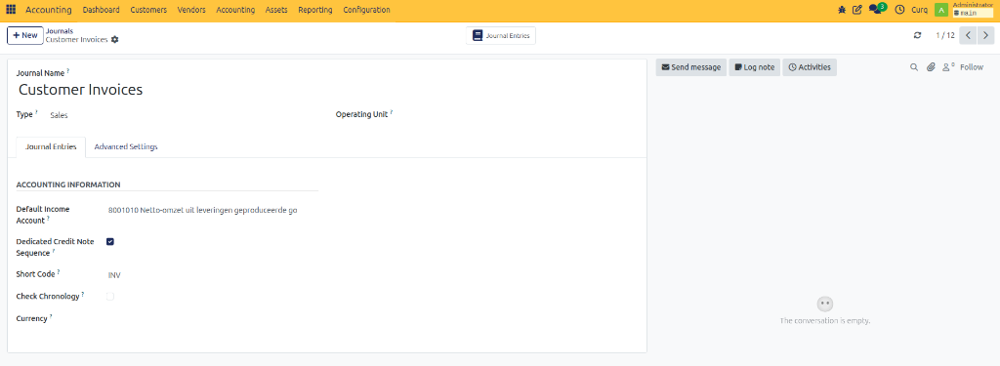
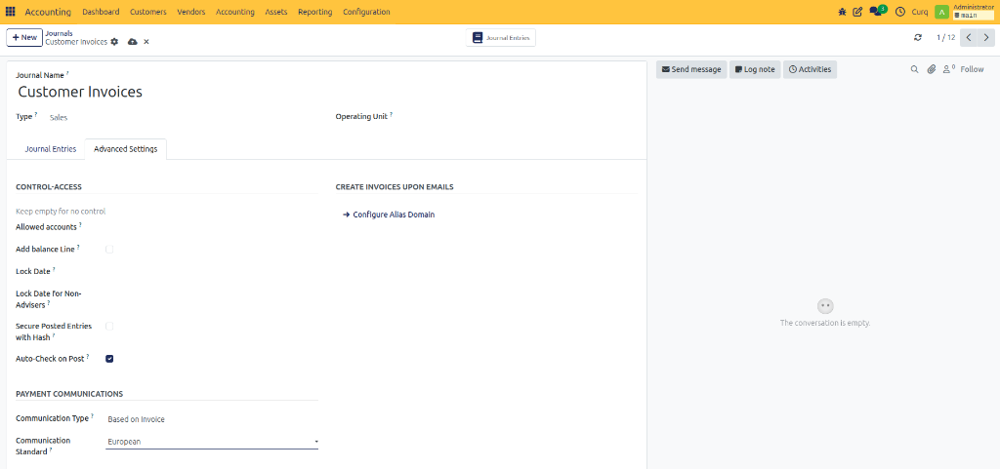

# Configure Sales Journal

## Overview

The Sales Journal is used to record all customer invoices and sales transactions. Every sales invoice created in CURQ is posted through a Sales Journal.

You can access Sales Journals by navigating to:

**Invoicing → Configuration → Journals**

Select an existing Sales Journal or create a new one.

---

## Journal Settings

| Field | Description |
| :--- | :--- |
| **Default Income Account** | The general ledger account used when creating sales invoices. If no specific income account is configured on the product, CURQ uses this account automatically. |
| **Dedicated Credit Invoice Sequence** | Enable this option if you want credit notes to use a separate numbering sequence from regular sales invoices. |
| **Short Code** | A unique identifier for the journal. All journal entries created in this journal use this prefix. Example: `INV`, `SALES`. |
| **Check Chronology** | Enable this option to ensure journal entries are posted in chronological order. This prevents invoices from being posted in incorrect accounting periods. |
| **Currency** | Defines the default currency for the journal. In most cases, this field can remain empty. Users can select a different currency directly on the invoice when needed. |

---

## Advanced Settings

| Field | Description |
| :--- | :--- |
| **Allowed Accounts** | Restrict this journal to specific accounts. Leave empty to allow all accounts. |
| **Add Balance Line** | Automatically adds a balancing line if the journal entry is not balanced. |
| **Lock Date** | Prevents users from creating or modifying entries before the specified date. |
| **Lock Date for Non-Advisers** | Restricts non-accounting users from editing entries before this date. |
| **Secure Posted Entries with Hash** | Protects posted entries from being modified by applying a security hash. |
| **Auto-Check on Post** | Automatically marks journal entries as checked when they are posted. |

### Create Invoices Upon Emails

| Field | Description |
| :--- | :--- |
| **Configure Alias Domain** | Allows invoices or journal-related records to be created from incoming emails using a configured email alias. |

### Payment Communications

| Field | Description |
| :--- | :--- |
| **Communication Type** | Defines how payment references are generated for invoices and payments. |
| **Communication Standard** | Specifies the payment reference format used, such as European standards for structured payment references. |
