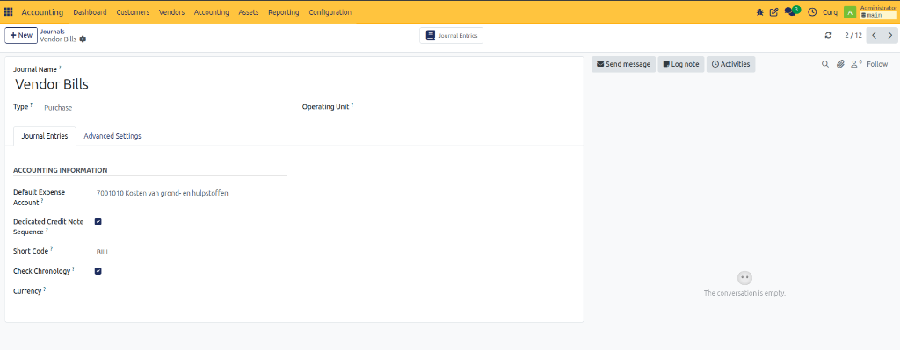
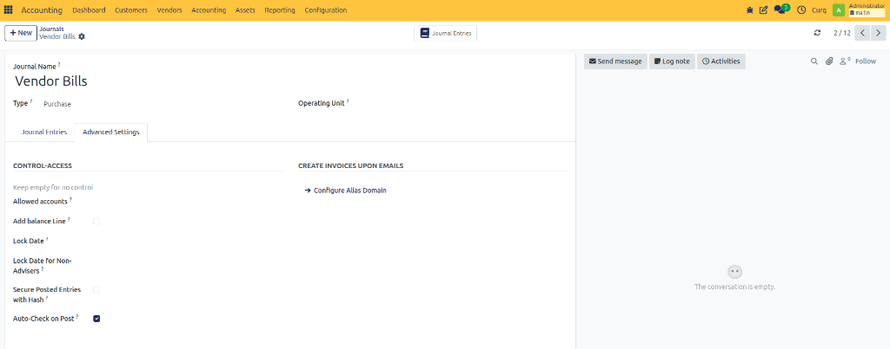

# Configure Purchase Journal

## Overview

The Purchase Journal is used to record supplier invoices and company expenses.

All vendor bills entered in CURQ are processed through a Purchase Journal.

Navigate to:

**Invoicing → Configuration → Journals**

and open a Purchase Journal.

---

## Journal Settings

| Field | Description |
| :--- | :--- |
| **Default Expense Account** | The general ledger account used when a purchase invoice line does not contain a specific expense account. CURQ automatically suggests this account during invoice creation. |
| **Dedicated Credit Invoice Sequence** | Enable this option to use a separate numbering sequence for supplier credit notes. |
| **Short Code** | A short identifier used as a prefix for journal entries. Examples: `PUR`, `BILL`. |
| **Check Chronology** | Ensures purchase invoices are posted in chronological order. This helps prevent postings in the wrong accounting period. |
| **Currency** | Defines the default currency used by the journal. In most cases, this field can remain empty. Users can choose another currency directly on the vendor bill. |

---

## Advanced Settings

### Control Access

| Field | Description |
| :--- | :--- |
| **Allowed Accounts** | Restrict this journal to specific accounts. Leave empty to allow all accounts. |
| **Add Balance Line** | Automatically adds a balancing line if the journal entry is not balanced. |
| **Lock Date** | Prevents users from creating or modifying entries before the specified date. |
| **Lock Date for Non-Advisers** | Restricts non-accounting users from editing entries before this date. |
| **Secure Posted Entries with Hash** | Protects posted entries from being modified by applying a security hash. |
| **Auto-Check on Post** | Automatically marks journal entries as checked when they are posted. |

### Create Invoices Upon Emails

| Field | Description |
| :--- | :--- |
| **Configure Alias Domain** | Allows invoices or journal-related records to be created from incoming emails using a configured email alias. |
