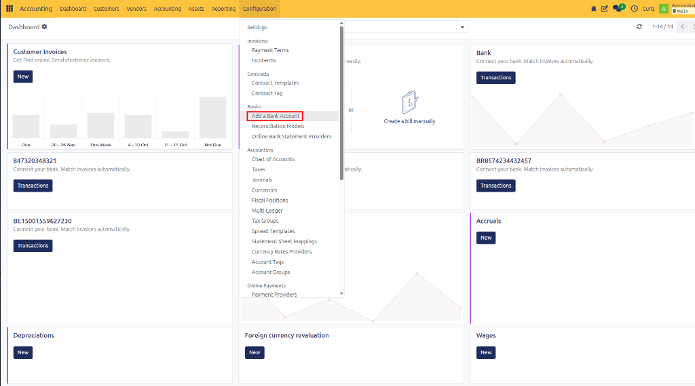
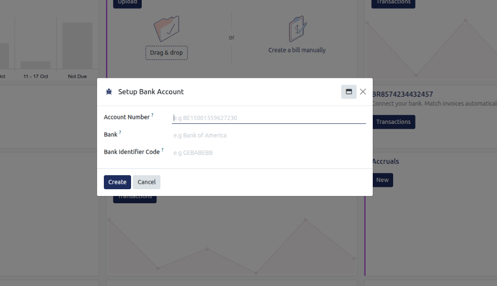
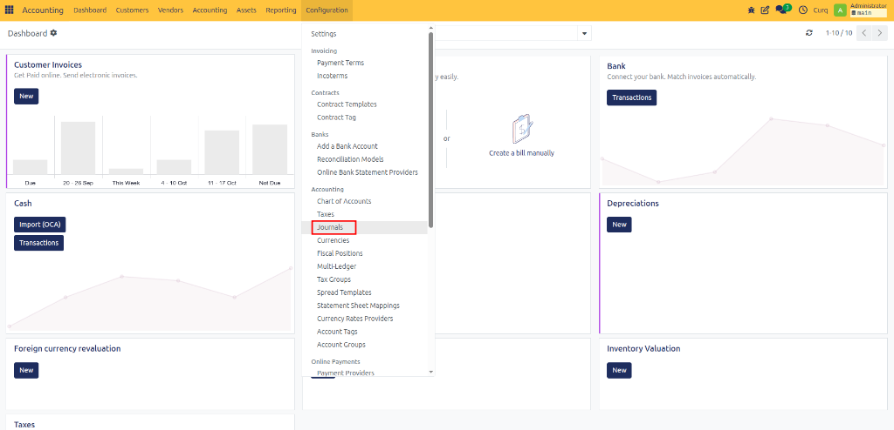
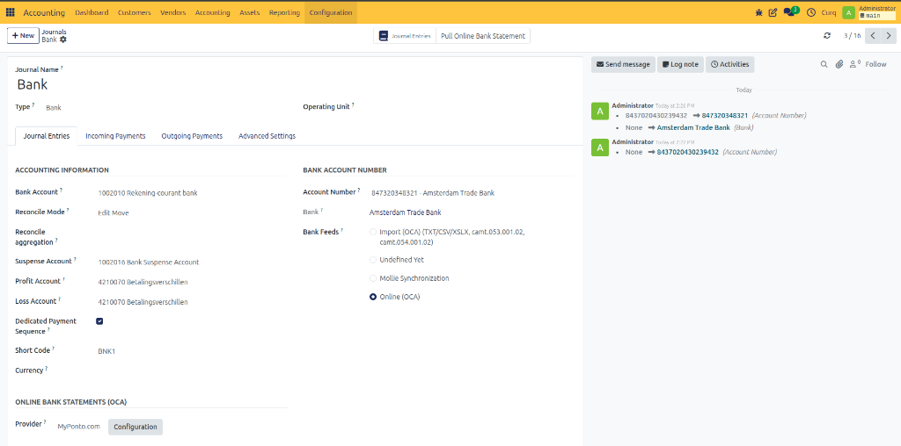
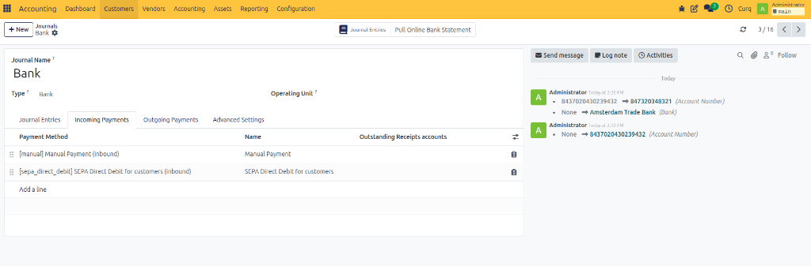
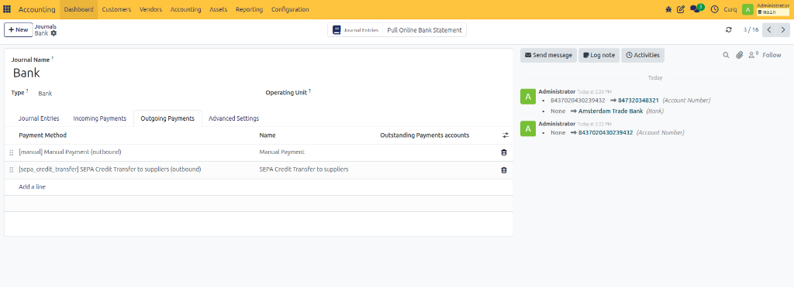
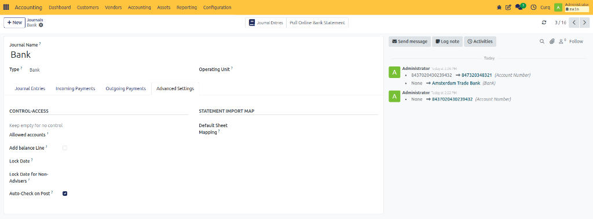

# Configure Bank Journal

## Overview

The Bank Journal is used to record all transactions related to a bank account.

Examples include:

- Customer payments
- Supplier payments
- Bank transfers
- Deposits
- Withdrawals
- Bank charges

## Add a Bank Account

First, you need to add a bank account before configuring its journal.

Navigate to:

**Invoicing → Configuration → Add a Bank Account**

This will open a setup wizard to link or create your bank account.

After adding the bank account, you can access and configure its journal by navigating to:

**Invoicing → Configuration → Journals**

---

## Journal Entries Tab

### Accounting Information

| Field | Description |
| :--- | :--- |
| **Bank Account** | The general ledger account linked to this bank journal. |
| **Reconcile Mode** | Determines how bank transactions are reconciled with accounting entries. |
| **Reconcile Aggregation** | Controls how transactions are grouped during reconciliation. |
| **Suspense Account** | Temporary account used for unreconciled bank transactions. |
| **Profit Account** | Account used to record reconciliation gains or positive differences. |
| **Loss Account** | Account used to record reconciliation losses or negative differences. |
| **Dedicated Payment Sequence** | Uses a separate numbering sequence for payments created from this journal. |
| **Short Code** | Unique code used to identify the journal. |
| **Currency** | Currency used for transactions in this journal. |

### Bank Account Number

| Field | Description |
| :--- | :--- |
| **Account Number** | The bank account number linked to the journal. |
| **Bank** | The financial institution associated with the account. |
| **Bank Feeds** | Method used to import bank transactions automatically or manually. |

### Online Bank Statements (OCA)

| Field | Description |
| :--- | :--- |
| **Provider** | Service provider used to retrieve bank statements automatically. |
| **Configuration** | Opens the bank feed configuration settings. |

---

## Incoming Payments Tab

This tab defines which payment methods customers can use when paying invoices.

| Field | Description |
| :--- | :--- |
| **Payment Method** | Method used to receive customer payments. |
| **Name** | Display name of the payment method. |
| **Outstanding Receipts Account** | Temporary account used until the incoming payment is reconciled. |

### Common Payment Methods

| Method | Description |
| :--- | :--- |
| **Manual Payment** | Payment entered manually by the user. |
| **SEPA Direct Debit for Customers** | Collect payments automatically from customer bank accounts using SEPA Direct Debit. |

---

## Outgoing Payments Tab

This tab defines how supplier and vendor payments are processed.

| Field | Description |
| :--- | :--- |
| **Payment Method** | Method used to send payments. |
| **Name** | Display name of the payment method. |
| **Outstanding Payments Account** | Temporary account used until the outgoing payment is reconciled. |

### Common Payment Methods

| Method | Description |
| :--- | :--- |
| **Manual Payment** | Payment is processed manually. |
| **SEPA Credit Transfer for Suppliers** | Creates SEPA payment files for supplier payments. |

> [!NOTE]
> **SEPA Credit Transfer** allows CURQ to generate payment files that can be uploaded to your bank.

---

## Advanced Settings Tab

### Control Access

| Field | Description |
| :--- | :--- |
| **Allowed Accounts** | Restricts the journal to specific accounts. Leave empty to allow all accounts. |
| **Add Balance Line** | Automatically adds a balancing line when required. |
| **Lock Date** | Prevents entries from being created or modified before the selected date. |
| **Lock Date for Non-Advisers** | Restricts non-accounting users from editing older entries. |
| **Auto-Check on Post** | Automatically marks entries as checked when posted. |

### Statement Import Map

| Field | Description |
| :--- | :--- |
| **Default Sheet Mapping** | Defines how columns from imported bank statement files are mapped to CURQ fields during import. |
