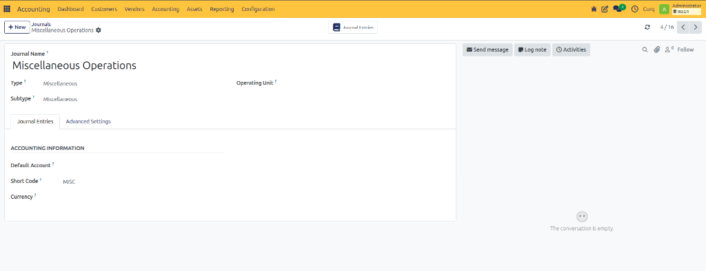
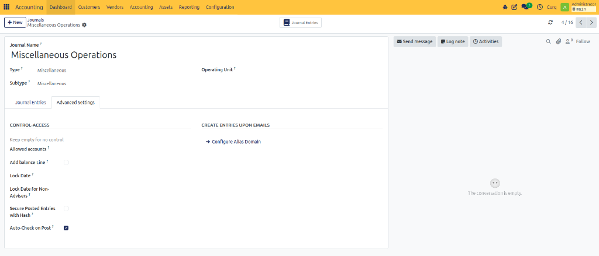

# Configure Miscellaneous Journal

## Overview

The Miscellaneous Operations journal is used to record accounting entries that are not related to sales invoices, vendor bills, bank transactions, or cash movements. It is commonly used for adjustments, corrections, accruals, depreciation, provisions, and year-end entries.

Navigate to:

**Invoicing → Configuration → Journals**

and select a Miscellaneous Journal.

---

## Journal Entries Tab

### Journal Information

| Field | Description |
| :--- | :--- |
| **Journal Name** | Name of the journal. |
| **Type** | Defines the journal category. For this journal, the type is Miscellaneous. |
| **Subtype** | Indicates the specific journal subtype. |
| **Operating Unit** | Assigns the journal to a specific operating unit or business division. |

### Accounting Information

| Field | Description |
| :--- | :--- |
| **Default Account** | Default account used when creating entries in this journal. |
| **Short Code** | Unique code used to identify the journal. |
| **Currency** | Currency used for journal entries. Leave empty to use the company currency. |

---

## Advanced Settings Tab

### Control Access

| Field | Description |
| :--- | :--- |
| **Allowed Accounts** | Restrict the journal to specific accounts. Leave empty to allow all accounts. |
| **Add Balance Line** | Automatically creates a balancing line when required. |
| **Lock Date** | Prevents entries from being created or modified before the selected date. |
| **Lock Date for Non-Advisers** | Restricts non-accounting users from editing older entries. |
| **Secure Posted Entries with Hash** | Protects posted entries from modification by applying a security hash. |
| **Auto-Check on Post** | Automatically marks entries as checked when posted. |

### Create Entries Upon Emails

| Field | Description |
| :--- | :--- |
| **Configure Alias Domain** | Allows journal entries to be created from incoming emails through a configured email alias. |

---

## Common Use Cases

### Correction Entries
Used to correct posting mistakes or accounting adjustments.

### Payroll Entries
Used when payroll data is entered manually into the accounting system.

### Accruals and Deferrals
Used to allocate income and expenses to the correct accounting period.

### Opening Balances
Used when migrating accounting data into CURQ.

### Write-Offs
Used to clear small differences or uncollectible balances.
