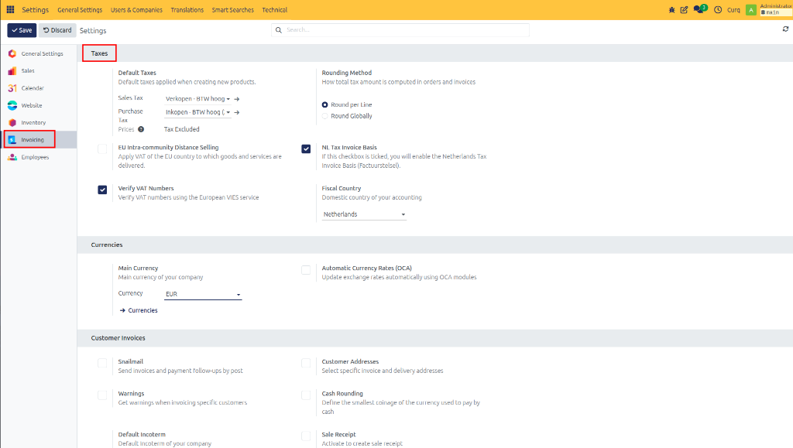

# Configure Taxes

## Overview

Accurate tax configuration is essential for correct financial reporting and tax declarations. CURQ provides several settings that help ensure taxes are calculated correctly for your business.

You can access the tax settings by navigating to:

**Settings → Invoicing → Taxes**

---

## Tax Settings

| Field | Description |
| :--- | :--- |
| **Default VAT** | Defines the default VAT code used on sales invoices, purchase invoices, and orders. This VAT code is automatically suggested when creating new transactions. |
| **Rounding Method** | This setting determines how VAT amounts are rounded. In most cases, VAT is calculated and rounded **per invoice line**. This is the recommended configuration for most businesses. |
| **EU Intra-Community Distance Selling** | Enable this option if your business regularly sells goods or services to customers in other European Union countries. Activating this setting enables OSS support, country-specific VAT rates, and fiscal positions for EU member states. |
| **NL Invoice System** | Enable this option if your company calculates VAT using the invoice system. This is typically required when invoices must be issued to customers. If your business uses a cash accounting system, this option may not be applicable. |
| **Verify VAT Numbers** | Enable this option to automatically validate customer VAT numbers using the VIES (VAT Information Exchange System) service. Benefits include verification of EU VAT numbers and reduced data entry errors. |
| **Fiscal Country** | Select the country whose tax regulations apply to your accounting. The fiscal country determines available tax configurations, VAT reporting requirements, and localization settings. |

> [!NOTE]
> If you are unsure which method to use for VAT reductions, the NL Invoice system, or OSS, it is highly recommended to consult your accountant.
