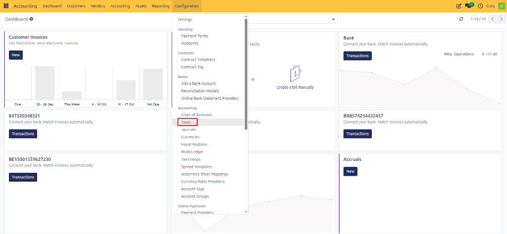
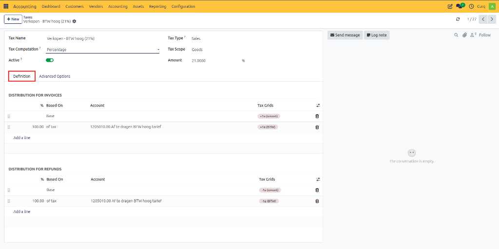
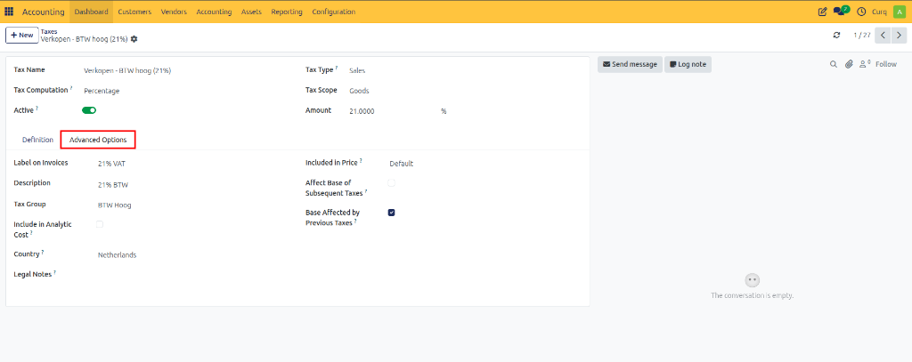

# Configure VAT Codes

## Overview

Determining the correct VAT treatment can be challenging. CURQ helps simplify this process through the use of VAT Codes and Fiscal Positions.

VAT Codes define how tax is calculated and reported. CURQ comes with a predefined set of VAT codes based on the selected localization. In most cases, these VAT codes are already configured and ready to use.

You can access VAT Codes via:

**Invoicing → Configuration → Taxes**

---

## VAT Configuration

When opening a VAT code, the following settings are available:

| Field | Description |
| :--- | :--- |
| **Tax Name** | Enter a clear and recognizable name for the VAT code. This name is displayed throughout CURQ on invoices, products, and accounting entries. |
| **Tax Calculation** | Select how the tax amount should be calculated. Options: • **VAT Group**: Combines multiple VAT codes into a single VAT rule. • **Fixed Amount**: Applies a fixed tax amount regardless of the transaction value. • **Percentage of Price**: Calculates VAT as a percentage of the transaction amount. • **Percentage of Price (Tax Included)**: Calculates VAT as a percentage of the total amount including VAT. |
| **Tax Type** | Determines where the VAT code can be used within CURQ, such as Sales or Purchases. |
| **Tax Scope** | Defines the type of products or services to which the VAT code can be applied. |
| **Amount** | Enter the tax percentage or fixed amount depending on the selected VAT calculation method. |

---

## Definition Tab

The **Definition** tab contains the accounting rules for the VAT code.

For each VAT code, at least the following lines should be configured:
- One line for the taxable base amount
- One line for the VAT amount

These rules determine:
- Which VAT box is used in tax reporting
- Which general ledger account receives the posting
- What percentage of the tax amount is posted

For credit notes, these postings are usually reversed.

---

## Advanced Options

Additional VAT settings can be configured under the **Advanced Options** tab.

### Tax Details

| Field | Description |
| :--- | :--- |
| **Label on Invoices** | Tax label displayed on customer invoices and vendor bills. |
| **Description** | Internal description of the tax. |
| **Tax Group** | Groups similar taxes together for reporting and VAT returns. |
| **Include in Analytic Cost** | Includes the tax amount in analytic accounting costs. |
| **Country** | Country where this tax is applicable. |
| **Legal Notes** | Additional legal or compliance information related to the tax. |

### Advanced Tax Options

| Field | Description |
| :--- | :--- |
| **Included in Price** | The tax is included in the product price instead of being added separately. |
| **Affect Base of Subsequent Taxes** | Includes this tax amount in the calculation base of later taxes. |
| **Base Affected by Previous Taxes** | Allows previous taxes to affect the calculation base of this tax. |

---

## Managing VAT Codes

CURQ provides a complete set of VAT codes as part of the standard configuration.

If certain VAT codes are not required for your business, they can be deactivated by disabling the **Active** option.

Deactivating a VAT code prevents it from being selected in new transactions while preserving historical accounting data.
