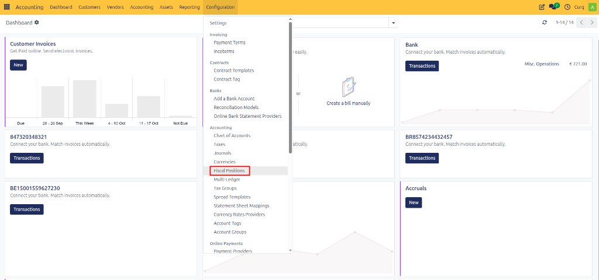
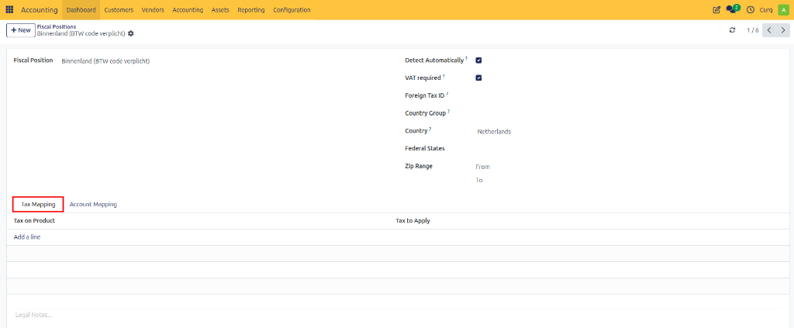
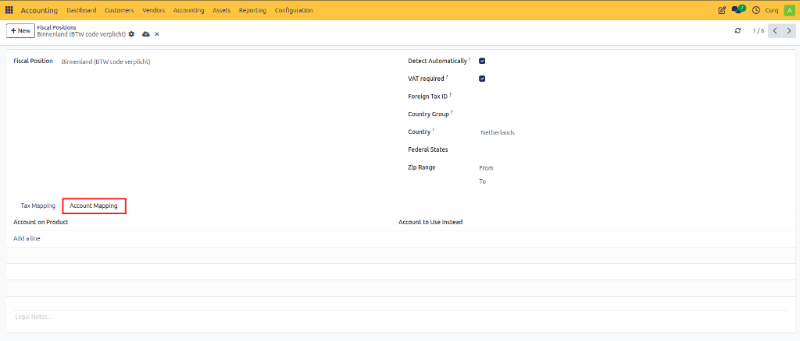
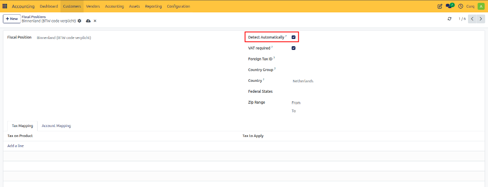
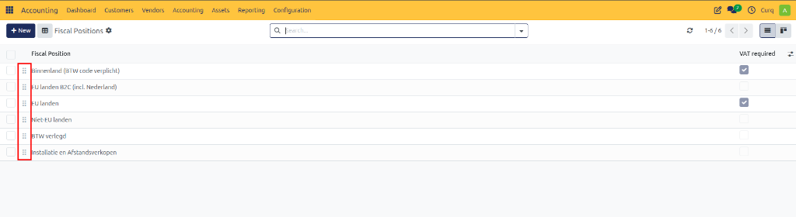
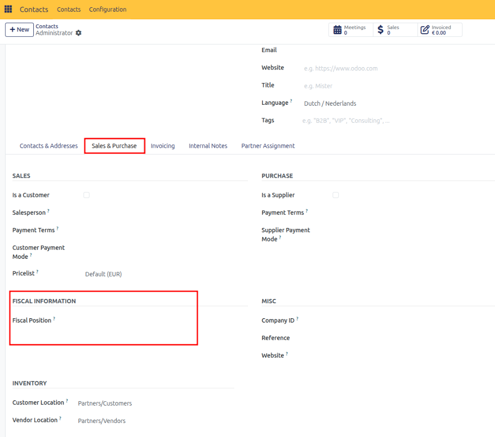
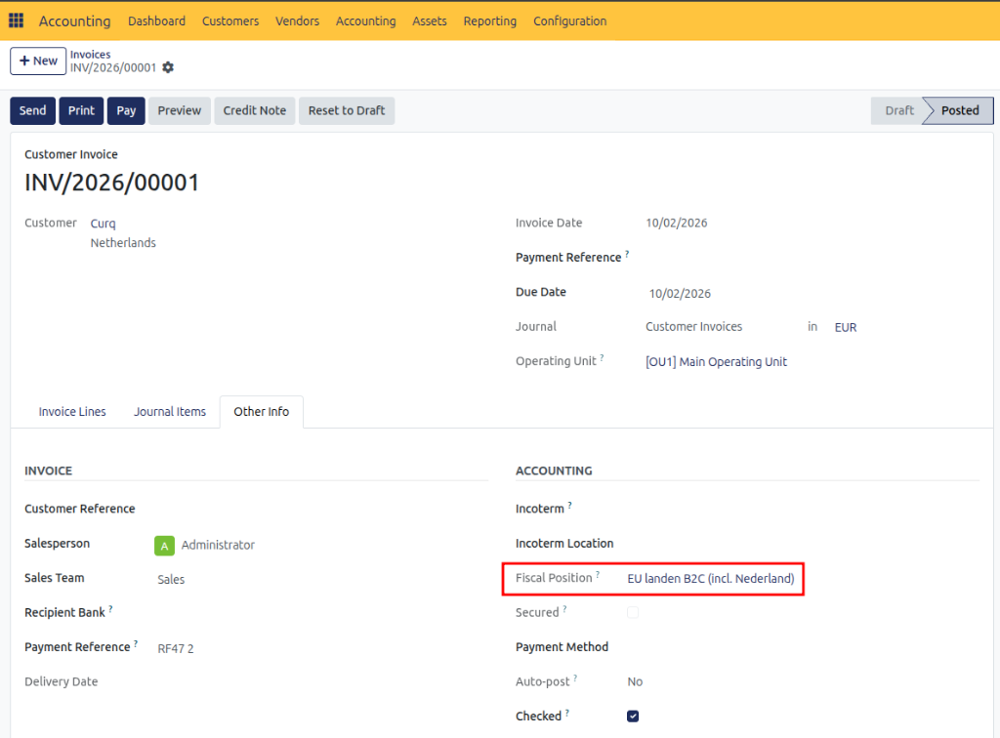

# Configure Fiscal Positions

## Overview

Fiscal Positions are used in CURQ to automatically apply the correct VAT codes and ledger accounts based on predefined tax rules. They are especially useful when dealing with customers or suppliers in different countries, as VAT regulations may vary depending on the customer's location and tax status.

You can access Fiscal Positions by navigating to:

**Invoicing → Configuration → Fiscal Positions**

CURQ includes a set of standard Fiscal Positions by default. These are designed to automatically apply the appropriate VAT treatment for domestic transactions, EU transactions, and other tax scenarios. Depending on your business requirements, these Fiscal Positions can be customized in consultation with your accountant.

---

## Tax Mapping

Fiscal Positions use a Tax Mapping table to replace one VAT code with another.

- The left side contains the default VAT code assigned to products or services.
- The right side contains the VAT code that should replace it when the Fiscal Position is applied.

When an order or invoice uses a Fiscal Position, CURQ first reads the VAT code defined on the product and then automatically replaces it with the mapped VAT code.

This ensures that the correct VAT is applied according to the customer's location, VAT status, or tax regulations.

---

## Account Mapping

Fiscal Positions can also translate general ledger accounts through the Account Mapping tab.

- The source account is the default ledger account normally used.
- The destination account is the ledger account that should replace it when the Fiscal Position is applied.

When a transaction is processed using the Fiscal Position, CURQ automatically posts the entry to the mapped account instead of the original account.

This functionality is useful when different tax jurisdictions require transactions to be recorded in different ledger accounts.

---

## Automatic Application

Fiscal Positions can be applied automatically based on predefined conditions. The configuration options located in the upper-right section of the Fiscal Position determine when the system should apply the Fiscal Position.

### Configuration Options

| Field | Description |
| :--- | :--- |
| **Automatic Detection** | Enables or disables automatic application of the Fiscal Position. |
| **VAT Required** | The customer or supplier must have a valid VAT number before the Fiscal Position can be applied automatically. |
| **Country Group** | Applies the Fiscal Position when the customer or delivery address belongs to a specified country group. |
| **Country** | Applies the Fiscal Position when the customer or delivery address is located in a specific country. |

If multiple Fiscal Positions match the same conditions, CURQ applies them according to their sequence in the Fiscal Position list. The order can be adjusted by dragging and rearranging the records.

---

## Manual Application

In some situations, you may want to override the Fiscal Position that CURQ selects automatically. This may be necessary when a customer falls under a special VAT regime or when an exception to the standard tax rules applies.

A Fiscal Position can be assigned:

- Directly on the customer or supplier record.
- Directly on an order.
- Directly on an invoice.

It is recommended to configure the Fiscal Position on the partner record whenever possible. When that partner is selected on a quotation, sales order, purchase order, or invoice, CURQ automatically applies the assigned Fiscal Position.

If a different Fiscal Position is required for a specific transaction, it can be selected manually from the **Other Info** tab on the order or invoice.

