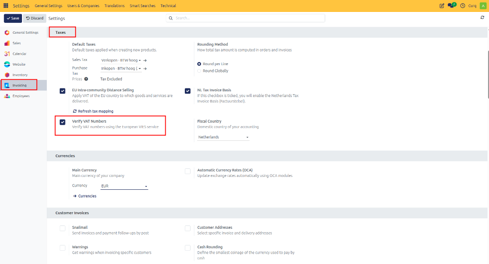
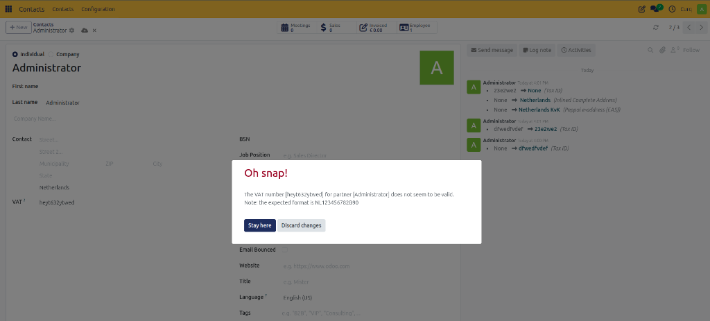

# VAT Number Verification (VIES)

## Overview

CURQ uses the VAT Information Exchange System (VIES), a service provided by the European Commission, to verify the validity of VAT numbers for companies within the European Union.

Before VAT numbers can be validated, the VIES verification feature must be enabled in the accounting settings.

---

## Enable VAT Number Verification

Navigate to:

**Settings → Invoicing → Taxes**

In the Taxes section, enable the following option:

- **Verify VAT Numbers**: Validates VAT numbers using the European VIES service.

After enabling this option, CURQ can automatically verify VAT numbers entered on contact records.

---

## Verify a VAT Number

Navigate to:

**Contacts → Open Contact**

The VAT Number field is available in the contact address information.

To perform a validation:

1. Enter the contact's **Country**.
2. Enter the **VAT Number**.
3. Save the contact.

CURQ automatically performs two checks:
- Validation of the VAT number format.
- Verification of the VAT number through the VIES service.

---

## Validation Result

After the verification is completed:

- A VIES validation indicator is displayed.
- If the VAT number is valid, the validation checkmark is shown.
- If the VAT number is invalid, CURQ displays an error message and prevents incorrect VAT information from being stored.

Using VIES validation helps ensure that customer and supplier VAT numbers are accurate and compliant with EU regulations.
