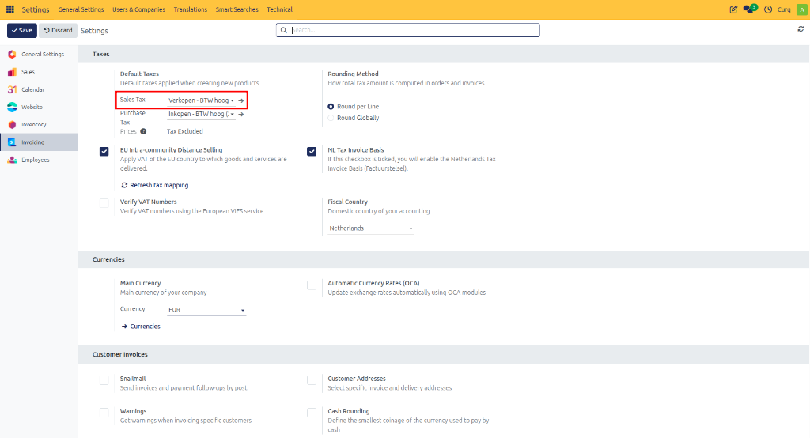
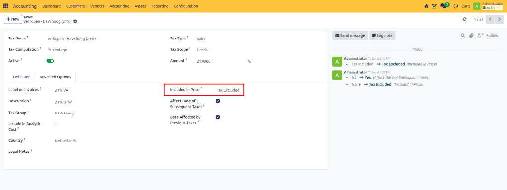
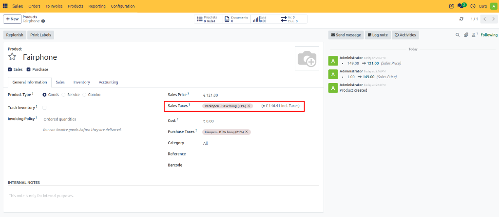

# Configure B2B VAT

## Overview

B2B (Business to Business) refers to transactions between businesses. Examples include wholesalers, manufacturers, consultants, and service providers selling products or services to other companies.

In a B2B environment, prices are generally displayed excluding VAT. Business customers often need to see the VAT amount separately for accounting and tax reporting purposes.

For example:

| Description | Amount |
| :--- | :--- |
| Product Price | €100 |
| VAT (21%) | €21 |
| Total Amount | €121 |

The customer sees both the product value and the VAT amount separately.

CURQ supports B2B VAT processing by automatically applying VAT-exclusive pricing to products, sales orders, and invoices.

---

## Configure B2B VAT Settings

### Step 1: Configure Default Sales VAT

Navigate to:

**Settings → Invoicing → Taxes**

Select a VAT code that excludes VAT as the default Sales VAT.

### Step 2: Configure Customer Invoice Display

Navigate to:

**Settings → Invoicing → Customer Invoices**

Set the invoice price display to:
**Tax Excluded**

### Step 2: Configure Tax Exclusion

Navigate to:

**Accounting → Configuration → Taxes**

Open the required tax and set **Included in Price** to **Tax Excluded**.

This ensures that the sales price entered on products and invoices excludes VAT.

---

## Product Pricing in B2B

When creating products:
- Enter the sales price excluding VAT.
- CURQ automatically calculates the VAT amount.
- The system also displays the total price including VAT.
- VAT-exclusive taxes are assigned automatically based on the configured settings.

### Example

| Description | Amount |
| :--- | :--- |
| Sales Price (Excluding VAT) | €100 |
| VAT (21%) | €21 |
| Total Price (Including VAT) | €121 |

With these settings:
- Product prices are displayed excluding VAT.
- Sales orders show separate VAT amounts.
- Customer invoices clearly display VAT breakdowns.
- Business customers can easily identify VAT amounts for tax reporting.

---
