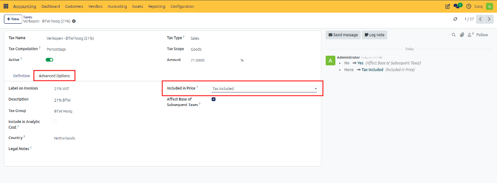
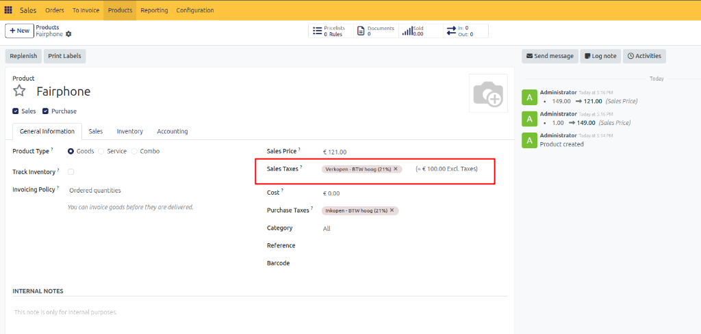

# Configure B2C VAT

## Overview

B2C (Business to Consumer) refers to transactions where a company sells products or services directly to individual consumers. Examples include online stores, retail shops, and service providers selling directly to private customers.

In a B2C environment, prices are generally displayed including VAT. Consumers are primarily interested in the final amount they need to pay, so VAT is included in the displayed price.

For example:

| Description | Amount |
| :--- | :--- |
| Product Price (Excluding VAT) | €100 |
| VAT (21%) | €21 |
| Total Price (Including VAT) | €121 |

The customer sees and pays €121.

CURQ supports B2C VAT processing and can automatically apply VAT-inclusive pricing throughout products, sales orders, and invoices.

---

## Configure B2C VAT Settings

### Step 1: Configure Default Sales VAT

Navigate to:

**Settings → Invoicing → Taxes**

Select a VAT code that includes VAT as the default Sales VAT.

### Step 2: Configure Customer Invoice Display

Navigate to:

**Settings → Invoicing → Customer Invoices**

Set the invoice price display to:
**Tax Included**

### Step 2: Configure Tax Inclusion

Navigate to:

**Accounting → Configuration → Taxes**

Open the required tax and set **Included in Price** to **Tax Included**.

This ensures that the sales price entered on products and invoices already contains VAT.

 
---

## Product Pricing in B2C

When creating products:
- Enter the sales price including VAT.
- CURQ automatically calculates the price excluding VAT.
- VAT-inclusive taxes are assigned automatically based on the configured settings.

### Example

| Description | Amount |
| :--- | :--- |
| Sales Price (Including VAT) | €121 |
| VAT (21%) | €21 |
| Price Excluding VAT | €100 |

With these settings:
- Product prices are displayed including VAT.
- Sales orders show VAT-inclusive amounts.
- Customer invoices show VAT-inclusive amounts.
- Consumers always see the final payable amount.

---
