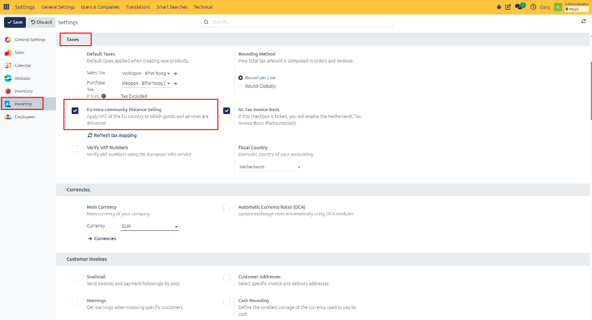
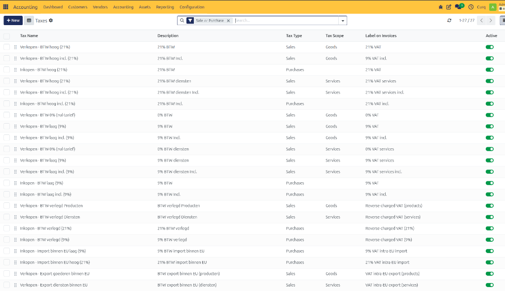
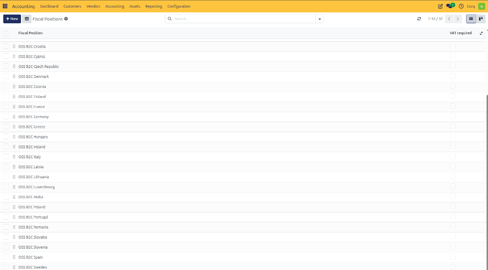

# Configure EU Distance Selling

## Overview

Distance selling within the European Union (EU) refers to the sale of goods and services from a business in one EU Member State to consumers (B2C) located in another EU Member State. These transactions commonly occur through online stores, mail orders, telephone sales, or other remote sales channels.

For cross-border B2C sales within the EU, VAT is generally charged based on the customer's country of residence. This means that the VAT rate of the destination country must be applied and reported accordingly.

To simplify VAT administration, businesses can use the One-Stop Shop (OSS) Union Scheme, which allows VAT for all eligible EU distance sales to be reported through a single VAT return rather than registering separately in each EU country.

The OSS scheme applies to customers who do not submit VAT returns, such as:
- Private individuals
- Businesses providing only VAT-exempt services
- Non-business legal entities

However, threshold rules apply. Once the applicable threshold is exceeded, VAT obligations may change, and businesses should consult their accountant or local tax authority for guidance.

---

## Activating EU Intra-Community Distance Selling

CURQ supports EU distance selling by automatically creating the required VAT codes and Fiscal Positions for EU countries.

To enable this functionality, navigate to:

**Settings → Invoicing → Taxes**

Enable the option:
**EU Intra-Community Distance Selling**

Once activated, CURQ automatically generates the required VAT configuration for EU distance sales.

---

## Generated VAT Codes

After enabling EU distance selling, CURQ automatically creates VAT codes for supported EU countries.

Navigate to:

**Invoicing → Configuration → Taxes**

The generated VAT codes can be identified by:
- The applicable VAT percentage
- The corresponding country code

These VAT codes can be used immediately. However, it is recommended to review the generated configuration with your accountant or bookkeeper to ensure it aligns with your company's tax requirements.

---

## Generated Fiscal Positions

CURQ also automatically creates Fiscal Positions that support OSS-based VAT handling.

Navigate to:

**Invoicing → Configuration → Fiscal Positions**

The generated Fiscal Positions can be recognized by the label:
**OSS B2C**

Each Fiscal Position is linked to a specific EU country and automatically applies the appropriate VAT rate based on the customer's location.

This ensures that:
- Correct VAT rates are applied automatically.
- EU distance sales remain compliant with OSS requirements.
- Manual VAT selection is minimized.

---

## Reporting

CURQ does not provide a dedicated Distance Selling or OSS report.

However, all relevant VAT information is stored within the accounting entries, including:
- VAT Codes
- VAT Categories
- Fiscal Positions
- Tax Amounts

This information can be used to generate reports required for VAT declarations and OSS reporting.

Businesses should consult their accountant or tax advisor regarding the specific reporting requirements applicable to their jurisdiction.
