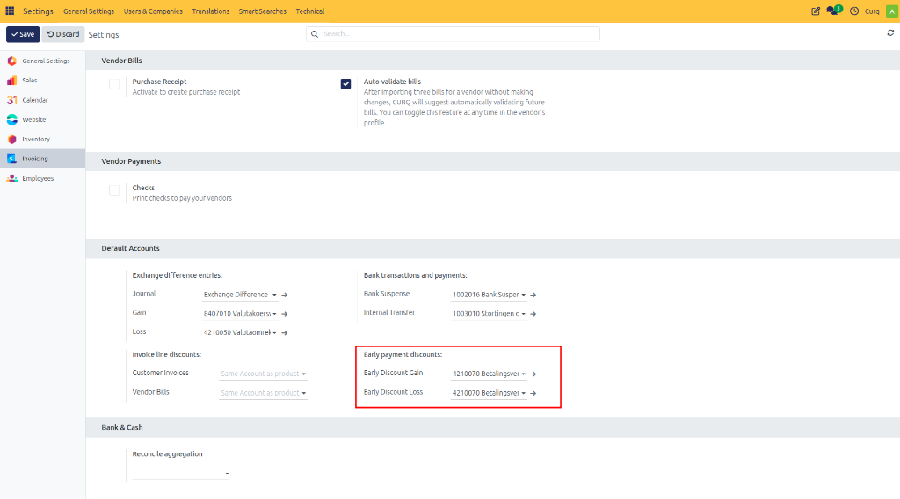
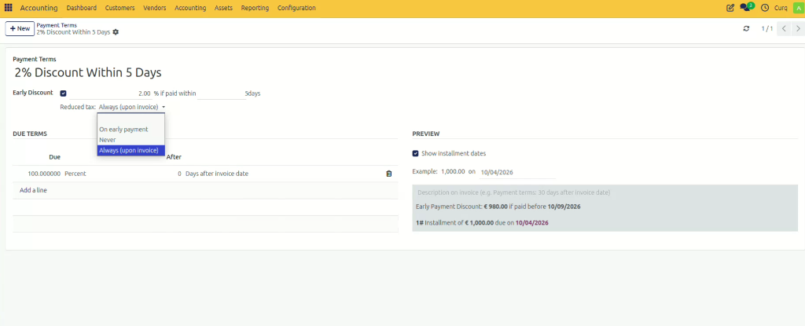

# Configure Payment Terms and Discounts

## Overview

Payment terms define when an invoice must be paid. Payment can be due immediately, after a specific number of days, after one month, at the end of the month, or according to a custom payment schedule. They help organizations clearly communicate payment expectations and automate invoice due dates.

Payment terms can also include **payment discounts**, which are reductions applied to an invoice amount to encourage early payment. Payment discounts can help improve cash flow, while purchase discounts reduce purchasing costs and provide immediate financial benefits.

---

## Access Payment Terms

To manage payment terms, navigate to the Invoicing/Accounting module.

**Configuration → Payment Terms**

From this page, you can view, create, edit, or remove payment terms used on customer invoices and vendor bills.

*[Image placeholder: Payment Terms list view]*

Several standard payment terms are available by default. To create a new payment term, click **[New]** in the upper-left corner.

*[Image placeholder: New Payment Term button]*

---

## Configure Default Accounts (For Discounts)

Before using payment discounts, verify that the appropriate general ledger accounts used to write off payment differences are configured correctly. In CURQ, these accounts are preconfigured by default.

**Settings → Invoicing → Default Accounts**

> [!WARNING]
> Only modify these accounts in consultation with your accountant.

---

## Create a Payment Term

On the New Payment Term page, enter the required information.

### General Information

- **Payment Terms Name:** Enter a descriptive name for the payment term. 
  *Examples:* Immediate Payment, Net 30 Days, 30 Days End of Month, 30 Days 2% Early Payment Discount.
- **Description on the Invoice:** Enter the text that should appear on invoices when this payment term is selected. This helps customers understand the payment conditions.
- **Display Terms on Invoice:** Enable this if you want the payment conditions to be printed on the invoice document.

### Configure Payment Conditions

Under the **Conditions** section, click **Add Rule** to define how the payment should be calculated.

- **Due Type:** Select the type of amount that becomes due:

| Due Type | Description |
| :--- | :--- |
| **Balance** | The remaining amount of the invoice. Usually used as the final payment line. |
| **Percentage** | A percentage of the invoice total. |
| **Fixed Amount** | A fixed monetary amount. |

- **Value:** Enter the percentage or fixed amount when applicable.
- **Payment Period:** Specify when the payment is due by defining:
  - Number of Days
  - Number of Months
  - End of Month option (When enabled, the payment becomes due at the end of the specified month)
- **Days After End of Month:** If End of Month is selected, you can define additional days after month-end before the payment becomes due.

### Early Payment Discounts

Payment terms can also include an early payment discount. To apply payment discounts, enable the **Early Discount** option and configure:
- **Discount Percentage:** The percentage discount offered.
- **Discount Days:** The number of days during which the discount is valid.

**Example:**
A company offers a 2% discount if payment is made within 5 days, and the full invoice amount is due within 30 days. In this scenario, customers who pay within the first five days receive a 2% discount. After the discount period expires, the full invoice amount remains payable until the final due date.

*[Image placeholder: Payment Term with Discount Percentage and Discount Days]*

### Payment Discounts and VAT

Tax authorities provide specific guidelines regarding VAT treatment when early-payment discounts are offered. In CURQ, the VAT handling method is configured directly on the Payment Term itself.

When configuring the **Early Discount** on a Payment Term, you can use the **Reduced tax** dropdown to select how VAT is handled:

Depending on your accounting requirements, you can choose one of the following options:

1. **Never**
   VAT is never reduced. The VAT calculation is always based on the full invoice amount, regardless of whether the customer receives a payment discount.
   *(Example: Invoice €100 → VAT Base €100)*

2. **Always (On Invoice)**
   VAT is always reduced. The VAT calculation is based on the discounted amount, whether or not the customer actually uses the payment discount.
   *(Example: Invoice €100, Discounted €98 → VAT Base €98)*

3. **With Early Payment**
   VAT is reduced only when the customer pays within the discount period. If paid early, VAT is calculated on the discounted amount. If paid late, VAT is calculated on the full invoice amount.
   *(Example: Early Payment → VAT Base €98, Late Payment → VAT Base €100)*

---

## Example Preview

At the bottom of the payment term form, the **Example** section displays a preview of how the payment term will be applied to an invoice. 

The preview shows:
- Invoice amount
- Due dates
- Installment amounts (if applicable)
- Early payment discounts
- Remaining balances

This allows you to verify that the payment term behaves as expected before saving it.

*[Image placeholder: Example section]*

**Example Scenario:**
For a payment term configured as:
- Due in 30 days
- 2% discount if paid within 5 days

The preview may show:
- *Invoice Amount:* €100.00
- *Due Date:* 30 days after invoice date
- *Amount Due:* €100.00
- *Amount Due if paid within 5 days:* €98.00

---

## Save the Payment Term

After configuring the payment conditions, click **[Save]**.

The payment term can now be selected on invoices and will automatically calculate due dates and any applicable discounts based on the configured rules.
