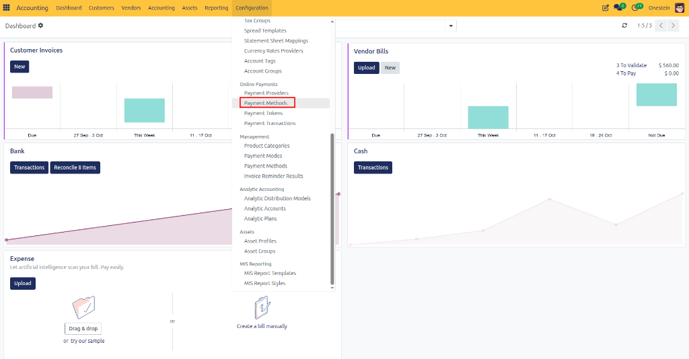
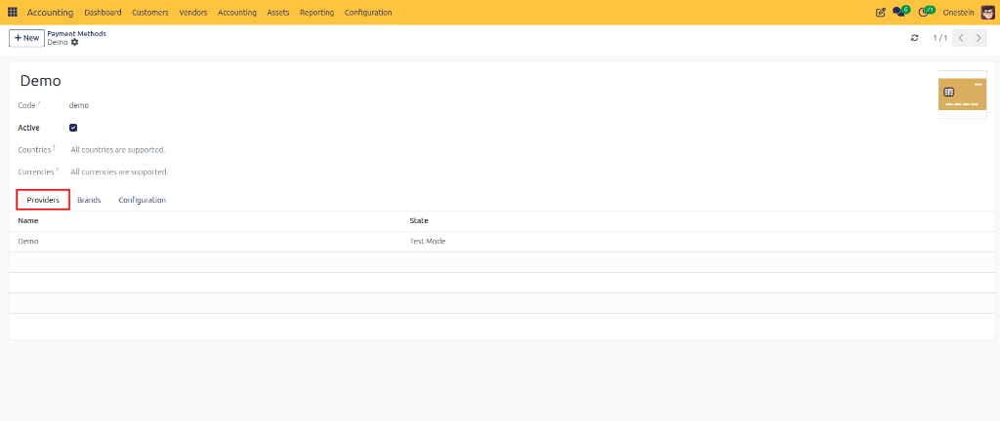
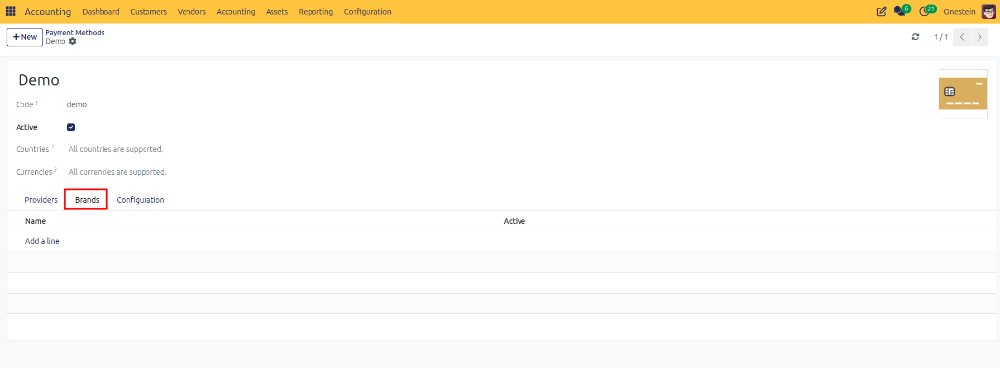
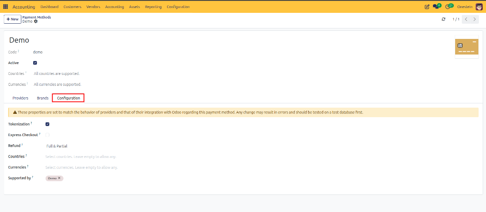

# Configure Payment Methods

## Overview
Payment Methods define how customers can pay invoices and how businesses can make payments to suppliers. They are used together with payment providers, bank journals, and online payment integrations to process transactions efficiently.

Examples of payment methods include:
- Manual Payment
- Credit Card
- Bank Transfer
- SEPA Direct Debit
- Online Payment Providers (such as Stripe or Mollie)

Payment methods help control payment processing, refunds, recurring payments, and customer checkout experiences.

## Access Payment Methods

Navigate to:

**Accounting → Configuration → Payment Methods**

The Payment Method form contains three sections:
- General Information
- Providers
- Configuration

---

## General Information

### Field Descriptions

| Field | Description |
| :--- | :--- |
| **Code** | Unique internal identifier for the payment method. |
| **Active** | Enables or disables the payment method. |
| **Countries** | Countries where this payment method can be used. Leave empty to allow all countries. |
| **Currencies** | Currencies supported by this payment method. Leave empty to allow all currencies. |

---

## Providers Tab

The Providers tab displays all payment providers that support this payment method.

Examples:
- Stripe
- Mollie
- PayPal
- Adyen

### Fields

| Field | Description |
| :--- | :--- |
| **Name** | Provider name. |
| **State** | Current provider status (Test Mode, Enabled, Disabled, etc.). |

> **Example:** A payment method may be connected to a provider running in Test Mode during setup and testing before it is used in production.

---

## Brands Tab

Some payment methods support multiple brands.

Examples:
- Visa
- Mastercard
- American Express
- Maestro

The Brands tab allows you to manage which brands are available for the payment method.

### Fields

| Field | Description |
| :--- | :--- |
| **Name** | Brand name. |
| **Active** | Indicates whether the brand is available for use. |

---

## Configuration Tab

The Configuration tab controls advanced payment behavior.

### Field Descriptions

| Field | Description |
| :--- | :--- |
| **Tokenization** | Allows customers to securely save their payment details for future transactions. |
| **Express Checkout** | Enables a faster checkout process with fewer payment steps. |
| **Refund** | Defines whether full refunds, partial refunds, or no refunds are supported. |
| **Countries** | Restricts the payment method to specific countries. Leave empty to allow all countries. |
| **Currencies** | Restricts the payment method to specific currencies. Leave empty to allow all currencies. |
| **Supported By** | Lists the payment providers that support this payment method. |

### Tokenization

Tokenization allows payment information to be stored securely by the payment provider.

**Benefits:**
- Faster repeat purchases
- Subscription payments
- Improved customer experience
- Secure payment storage

Customers do not need to re-enter card details for every purchase.

### Express Checkout

Express Checkout provides a simplified payment flow.

**Benefits:**
- Faster checkout process
- Fewer clicks for customers
- Reduced cart abandonment
- Improved conversion rates

Examples include one-click payment options and quick payment buttons.

### Refund Options

Payment methods may support different refund capabilities.

| Option | Description |
| :--- | :--- |
| **Unsupported** | Refunds cannot be processed through this payment method. Any refund must be handled manually outside the payment provider. |
| **Full Only** | Only full refunds of the original payment amount are allowed. Partial refunds are not supported. |
| **Full & Partial** | Both full and partial refunds can be processed through the payment provider. |

> **Example:** A customer pays €100 and returns goods worth €25. A partial refund of €25 can be processed.
