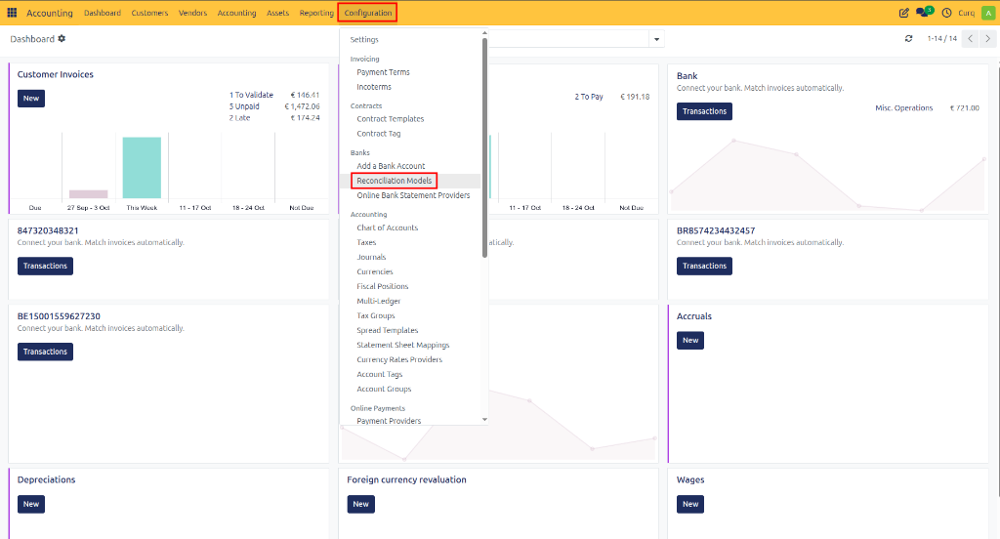
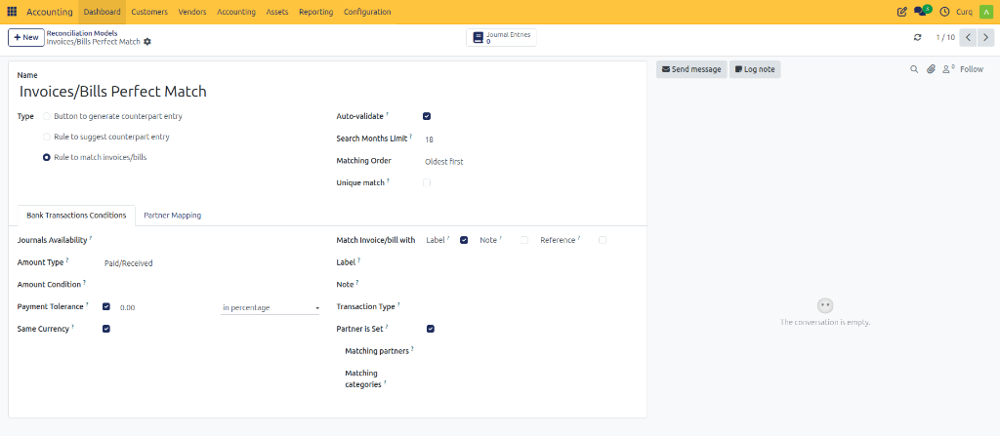

# Reconciliation Models

Reconciliation models help automate the bank reconciliation process in CURQ. They allow the system to automatically match transactions, create counter entries, and reconcile invoices based on predefined rules. CURQ includes several standard reconciliation models by default, which can be accessed through:

**Navigation:**
`Invoicing → Configuration → Reconciliation Rules`

By using reconciliation models, you can significantly reduce manual processing and ensure consistent reconciliation of recurring transactions.

---

## Types of Reconciliation Models

A reconciliation model can be configured for one of three purposes:
1. **Manual Reconciliation Button** – Create a button that allows users to manually apply a predefined counter account during reconciliation.
2. **Automatic Counter Entry** – Automatically generate a counter entry when specific conditions are met.
3. **Automatic Invoice Matching** – Automatically find and reconcile customer or supplier invoices. This option is enabled by default in CURQ.

### Manual Counter Entry Button
This type of reconciliation model creates a button within the reconciliation screen. When selected, the transaction is immediately posted to a predefined ledger account.

For example, a reconciliation model can create a Bank Charges button that automatically posts bank fees to the appropriate expense account without requiring manual account selection.

The configured button becomes available directly in the reconciliation screen:

*[Image placeholder: Manual Counter Entry Button]*

This approach is particularly useful for recurring transactions such as:
- Bank charges
- Interest expenses
- Payment provider fees
- Subscription costs
- Utility expenses

### Automatic Counter Entry
A reconciliation model can also automatically propose a counter entry when specific conditions are met.

For example, the model can be configured to:
- Search for the word "Subscription" in the transaction note.
- Verify that the customer is "Test Customer".

Only when both conditions are satisfied will CURQ automatically suggest the predefined ledger account.

The result is that transactions matching the defined criteria immediately display the correct accounting proposal during reconciliation.

*[Image placeholder: Automatic Counter Entry Proposal]*

This method is useful for recurring transactions that follow predictable patterns and always require the same accounting treatment.

### Perfect Match Invoice Reconciliation
The Perfect Match model automatically reconciles bank transactions against open sales or purchase invoices.

CURQ compares:
- Customer or supplier name
- Payment reference
- Invoice number
- Transaction amount

When these values match an outstanding invoice, CURQ automatically proposes the invoice for reconciliation.

The matching invoice is immediately suggested in the reconciliation screen, allowing the transaction to be processed with minimal user intervention.

This model is enabled by default and is one of the most effective ways to automate daily bank reconciliation.

---

## Handling Payment Differences

Small payment discrepancies can occur due to rounding differences, bank fees, or customer payment behavior.

CURQ allows you to configure a **Payment Tolerance** within a reconciliation model. When the difference falls within the defined tolerance, the remaining amount can be automatically written off to a designated ledger account.

For example, if the tolerance is set to €0.05, any difference below five cents can be automatically posted to a payment difference account.

*[Image placeholder: Payment Tolerance Configuration]*

This reduces manual intervention for insignificant payment variances.

---

## Reconciliation Model Fields

The following fields are available when configuring reconciliation models.

### Journal Availability
Determines which journals the reconciliation model applies to.
Examples:
- Bank journals
- Cash journals
- Payment provider journals

If no journals are selected, the model applies to all journals.

### Amount Type
Specifies whether the rule should apply to:
- Incoming payments
- Outgoing payments
- Both incoming and outgoing transactions

This allows separate handling of customer receipts and supplier payments.

### Payment Tolerance
Defines the acceptable difference between the payment amount and the invoice amount.
When the difference falls within the specified tolerance, CURQ can automatically write off the remaining balance to a predefined account.

### Automatic Confirmation
When enabled, CURQ immediately confirms and processes the proposed reconciliation without requiring user approval.

> [!WARNING]
> Enable this option only when you are confident that the reconciliation model has been configured correctly.

### Search Limit (Months)
Restricts how far back CURQ searches for matching invoices or transactions.
This improves performance and prevents unintended matches with older records.

### Same Currency
Ensures that the reconciliation model only applies when the transaction currency matches the currency of the invoice or accounting entry.

### Reconcile Invoice/Bill With
Determines how CURQ searches for matching invoices or bills.
Available matching methods include:
- **Label** – Uses the transaction description.
- **Note** – Uses transaction notes.
- **Reference** – Uses payment references or invoice numbers.

These options can be combined to improve matching accuracy.

### Label
Defines text that must be found within the transaction description before the rule is applied.
Example:
- Subscription
- Insurance
- Membership Fee

### Note
Defines text that must be found within the transaction note before the rule is applied.
This provides additional filtering criteria when transaction descriptions alone are insufficient.

### Transaction Type
Specifies the type of transaction to which the rule applies.
This allows separate reconciliation behavior for different transaction categories.

### Partner Is Set
Ensures that the reconciliation model only applies when a customer or supplier has already been identified on the transaction.

### Matching Partners
Limits the rule to specific customers or suppliers.
This is useful when certain partners always require the same reconciliation treatment.

### Matching Categories
Restricts the reconciliation model to transactions assigned to specific categories.
This provides additional control over when the rule should be applied.

---

## Partner Mapping

The **Partner Mapping** tab allows CURQ to automatically assign customers or suppliers to bank transactions before reconciliation begins.

Partner mapping reduces manual work and minimizes reconciliation errors by automatically identifying the correct business partner based on transaction information.

For example, you can create rules that search for:
- Specific reference numbers
- Customer names
- Keywords in transaction descriptions
- Text contained in transaction notes

When a transaction matches the defined criteria, CURQ automatically assigns the corresponding partner.

### Creating a Partner Mapping Rule
1. Open the **Partner Mapping** tab.
2. Enter the text to search for in the **Label** field.
3. Optionally enter text to search for in the **Note** field.
4. Select the **Partner** that should be assigned.
5. Save the rule.

When future transactions match the configured conditions, CURQ automatically links them to the selected customer or supplier.

This feature is particularly useful for recurring payments, direct debits, subscription collections, and transactions where the customer reference follows a predictable pattern.
