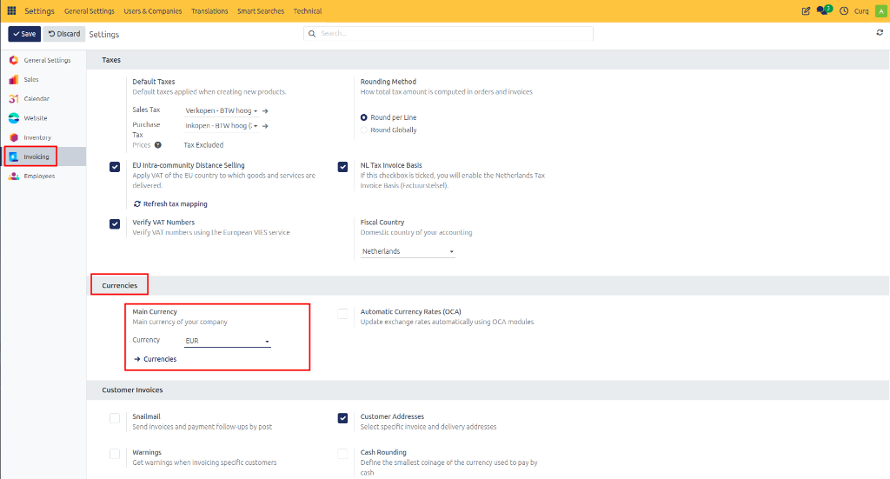
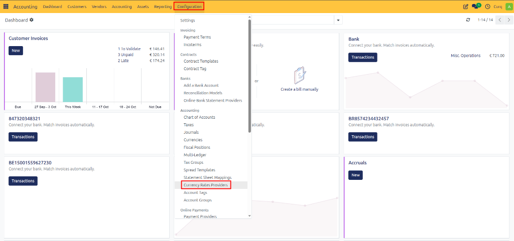
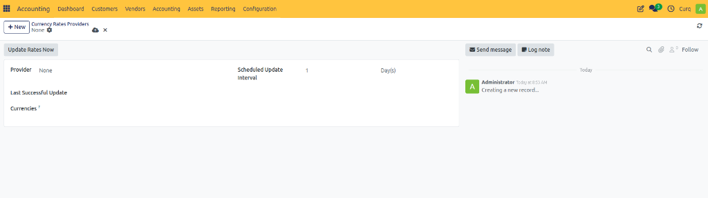
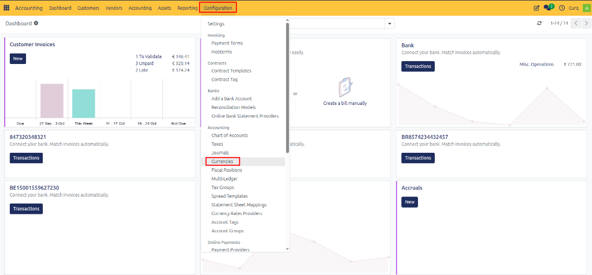
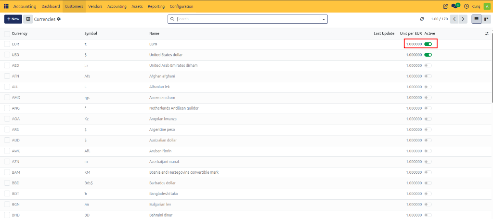
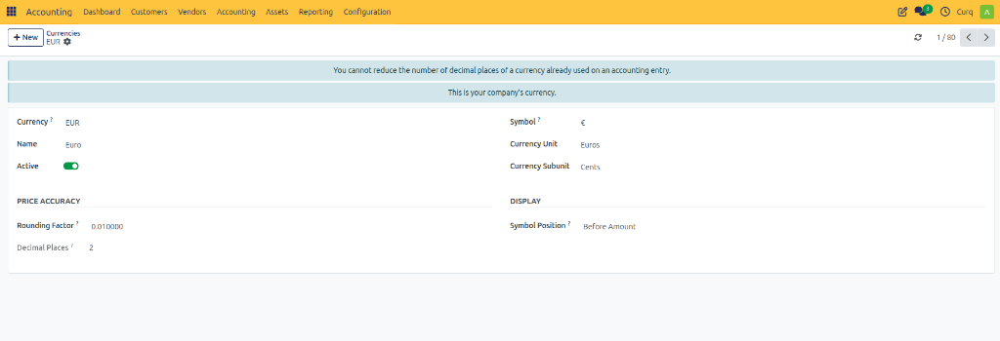

# Configure Multi-Currency

## Overview

CURQ supports working with multiple currencies, allowing companies to invoice customers, process supplier transactions, and manage accounting records in different currencies. Exchange rates can be maintained manually or updated automatically through a configured exchange rate provider.

---

## Currency Configuration

To configure the company currency settings, navigate to:

**Invoicing/Accounting → Configuration → Settings**

Under the **Currency** section, you can define the currency settings used throughout the system.

### Main Currency
The Main Currency is the default currency used by your company. This currency is automatically selected based on the company location during initial setup, but it can be changed if required.

All accounting transactions and exchange rate calculations are based on this currency.

### Automatic Exchange Rates
Enable **Automatic Exchange Rates** if you want CURQ to update exchange rates automatically. 
When enabled:
- Exchange rates are updated automatically based on the configured provider.
- Currency rates are refreshed according to the configured update interval.
- Manual maintenance of exchange rates is minimized.

---

## Configure Exchange Rate Providers

After selecting the main currency, you must configure an exchange rate provider.

Navigate to:

**Configuration → Currency Rates Providers**

Click **[New]** to create a new provider configuration. You can select an exchange rate provider such as the **European Central Bank (ECB)** or other supported exchange rate services.

### Provider Settings

When creating an exchange rate provider, configure the following:

- **Provider:** Select the source that supplies exchange rate information.
- **Update Interval:** Define how often exchange rates should be updated. Common options include Daily, Weekly, and Monthly. *(By default, exchange rates are updated once per day).*
- **Currencies to Update:** Select the currencies that should receive automatic updates from the provider. It is recommended to include all active currencies used by your company.

Once configured, CURQ automatically retrieves and updates exchange rates according to the defined schedule.

---

## Manage Currencies

To view and manage currencies, click the **Currencies** button in the Currency settings section. 
Alternatively, navigate to:

**Configuration → Currencies** *(under the Accounting section)*

The currency overview displays all currencies available in the system.

### Currency Overview

The currency list includes:
- Currency Name
- Currency Code
- Current Exchange Rate
- Active Status

The company's main currency is automatically active and has an exchange rate of `1.00000` because it serves as the reference currency for all exchange rate calculations. Other currencies are calculated relative to this base currency.

---

## Activate Additional Currencies

To use additional currencies:
1. Open the desired currency.
2. Enable the **Active** option.
3. Save the record.

Once activated, the currency becomes available for customer invoices, vendor bills, sales orders, purchase orders, and financial transactions.

If automatic exchange rates are enabled, CURQ updates the exchange rate automatically. If automatic updates are not enabled, exchange rates must be maintained manually.

---

## Currency Details

When you open a currency, the currency detail page provides additional information. 

### Main Fields

- **Currency Code:** The international currency code (e.g., EUR, USD, GBP).
- **Currency Name:** The full name of the currency (e.g., Euro, US Dollar, British Pound).
- **Active:** Indicates whether the currency can be used within CURQ.
- **Currency Unit:** The primary unit of the currency (e.g., Euro, Dollar, Pound).
- **Subunit:** The subdivision of the currency (e.g., Cent, Penny).

### Exchange Rate Information

The lower section of the currency form displays the exchange rate history. This includes:

- **Exchange Rate Date:** The date on which the exchange rate was recorded or updated.
- **Units per Main Currency:** Shows how many units of the selected currency equal one unit of the company's main currency.
  *(Example: `1 EUR = 1.10 USD` — The system displays the USD value per EUR.)*
- **Main Currency per Unit:** Shows the reverse exchange rate.
  *(Example: `1 USD = 0.91 EUR` — This allows users to view the conversion rate in both directions.)*

---

## Manually Update Exchange Rates

If automatic exchange rates are not enabled, exchange rates can be maintained manually.

Open the desired currency and click **Add Rule** (or click to add a new line in the rates list) to create a new exchange rate entry.

For each exchange rate record, you can specify:
- **Effective Date**
- **Exchange Rate**
- **Conversion Values**

When a new rule is created:
- The current date is automatically suggested.
- The latest exchange rate is copied as a starting value.
- The rate can be adjusted manually before saving.

Manual exchange rate entries are useful when automatic updates are not available, historical exchange rates need to be recorded, or company-specific exchange rates are required.

---

## Example Scenario

Assume the company's main currency is EUR and transactions must also be processed in USD:
1. Set **EUR** as the Main Currency.
2. Activate **USD** in the currency list.
3. Configure an exchange rate provider such as the **European Central Bank**.
4. Enable **Automatic Exchange Rates**.
5. CURQ automatically updates the EUR/USD exchange rate each day.

When a customer invoice is created in USD, CURQ uses the current exchange rate to calculate the corresponding accounting values in EUR.
