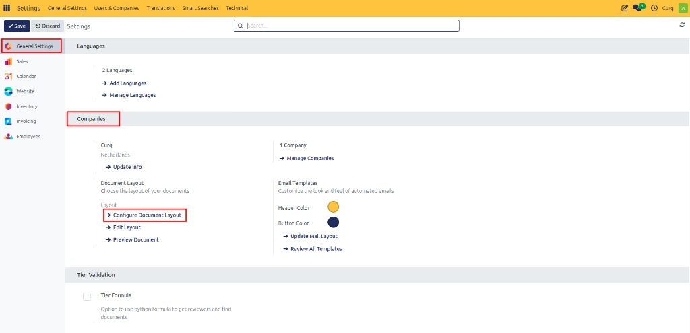
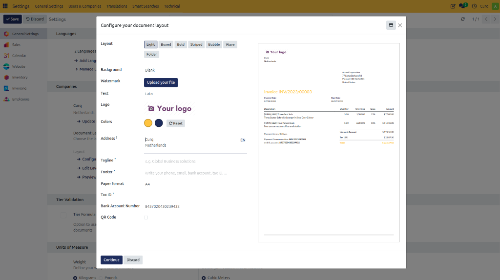

# Configure Document Layout

## Overview

Configuring your company branding, such as logos, colors, and document layouts, ensures that every invoice and business document is aligned with your corporate identity. A clear and professional layout reflects your company's identity and helps reduce payment issues by providing customers with complete and well-structured information.

If your branding was not configured during the initial setup, you can update it at any time.

---

## Customize Corporate Identity

Navigate to:

**Settings → General Settings → Companies**

Select **Configure Document Layout**.

This screen allows you to customize how invoices and other business documents appear.

### Document Layout Options

| Field | Description |
| :--- | :--- |
| **Layout** | Select the overall document design template. |
| **Background Layout** | Choose a predefined background or upload your own. |
| **Font** | Select the font used throughout the document. |
| **Company Logo** | Upload your company logo. |
| **Colors** | CURQ automatically suggests colors based on your logo, but they can be adjusted manually. |
| **Company Address** | Displays the company address on documents. |
| **Company Slogan / Tagline** | Enter an optional slogan displayed near the logo. |
| **Footer** | Add information such as Phone number, Website, Email address, Chamber of Commerce number, VAT number, and Bank account number. |
| **Tax ID** | Displays the company tax identification number. |
| **Bank Account Number** | Defines the account displayed on invoices. |
| **Paper Format** | Select the paper size used for printing. |
| **QR Code** | If enabled, a payment QR code is printed on invoices. |

A live preview is displayed on the right side of the screen. You can also download a sample PDF to see exactly how customers will receive your documents.
