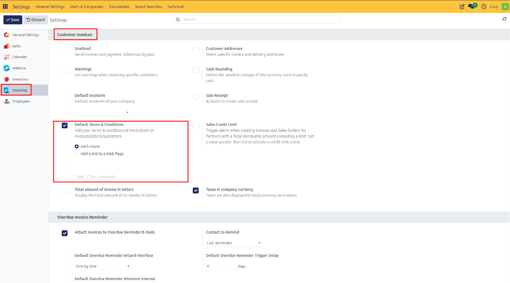
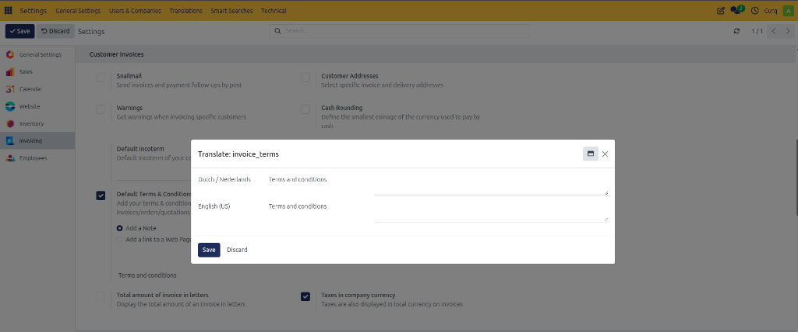
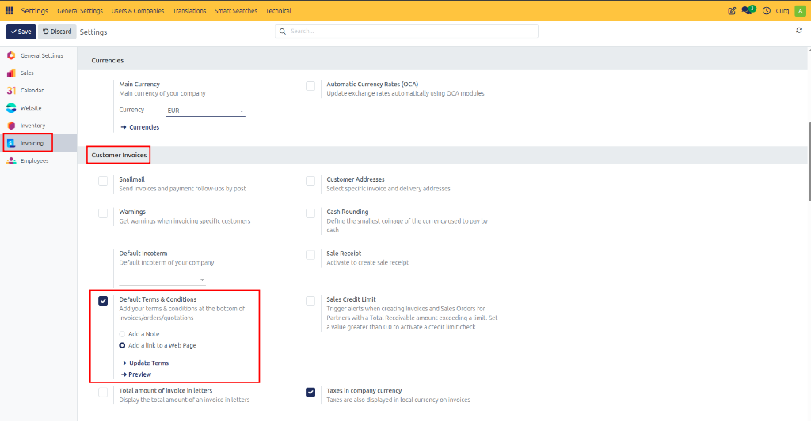
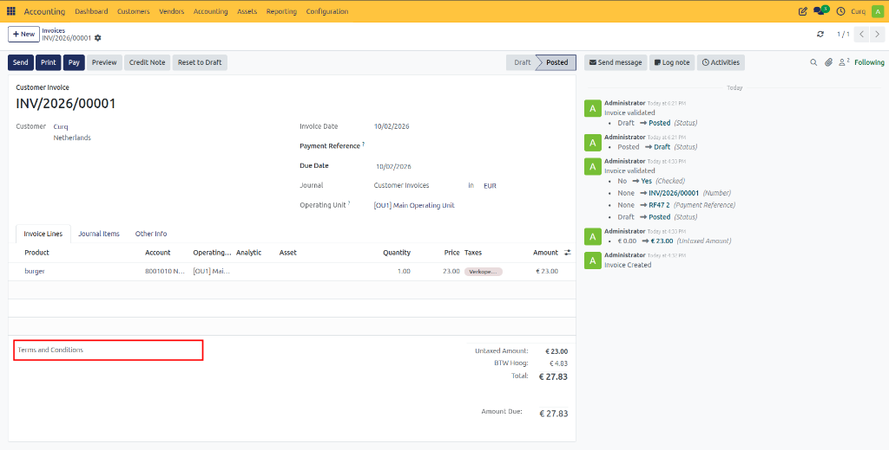
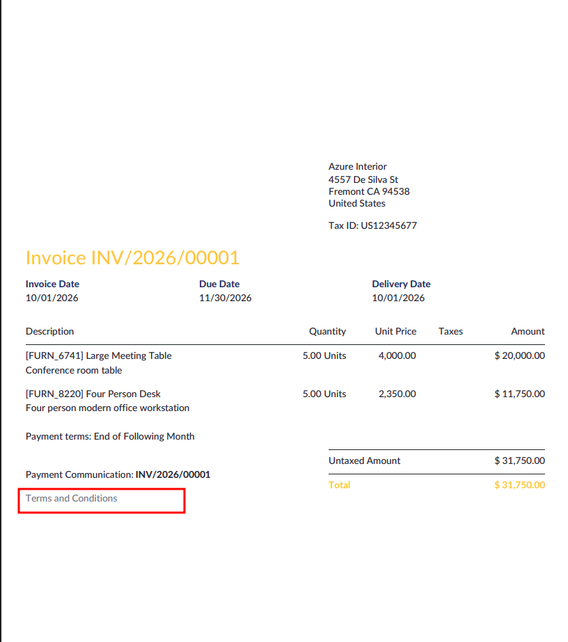

# Configure General Terms and Conditions

## Overview

Clearly defined General Terms and Conditions help establish the rules governing business transactions between your company and your customers. These terms typically cover important topics such as returns, refunds, warranties, payment conditions, liability, and after-sales service.

By documenting these conditions clearly, both parties understand their rights and responsibilities, helping to reduce misunderstandings and disputes.

A common approach is to include the terms and conditions as standard text or provide a link to a webpage containing the full terms. These can be displayed on quotations, sales orders, and customer invoices, ensuring customers always have access to the relevant information.

Including terms and conditions consistently across business documents helps maintain a professional and uniform company policy. It is recommended to review and update them regularly to ensure compliance with legal requirements and current business practices.

---

## Configure General Terms and Conditions

You can configure the default terms and conditions by navigating to:

**Settings → Invoicing → Customer Invoices → Default Terms and Conditions**

CURQ provides two methods for displaying terms and conditions on customer documents.

### Add Terms and Conditions as Text

This option allows you to enter the terms and conditions directly into CURQ.

**Features:**
- The text is automatically displayed on:
  - Quotations
  - Sales Orders
  - Customer Invoices
- If your company operates in multiple countries, you can maintain translations in different languages by selecting the appropriate language or country code.
- For lengthy legal documents, it is recommended to:
  - Keep the displayed text concise.
  - Provide a link to a webpage containing the complete terms.
  - Alternatively, distribute the full terms as an attachment.

### Add a Link to a Web Page

If you use the CURQ Website module, you can publish your terms and conditions on your company website.

Within the website editor, create or edit a dedicated Terms and Conditions page.

Once configured:
- CURQ automatically generates the page URL.
- The link is displayed on:
  - Quotations
  - Sales Orders
  - Customer Invoices

This approach allows customers to access the latest version of your terms and conditions online.

---

## Terms and Conditions on Sales Invoices

When creating a sales invoice, CURQ automatically inserts the configured default terms and conditions.

The text can still be modified for individual invoices when specific conditions need to be applied to a particular customer or transaction.

For example, you may wish to add:
- Project-specific conditions
- Special payment agreements
- Customer-specific warranty terms

---

## Terms and Conditions on Printed Documents

When an invoice is printed or exported as a PDF, the terms and conditions appear below the invoice totals.

This ensures that customers receive the relevant legal and commercial information together with the invoice, providing transparency and consistency across all sales documents.
