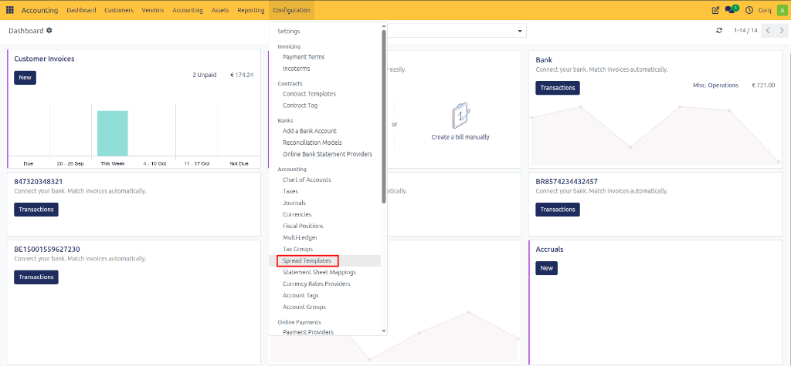
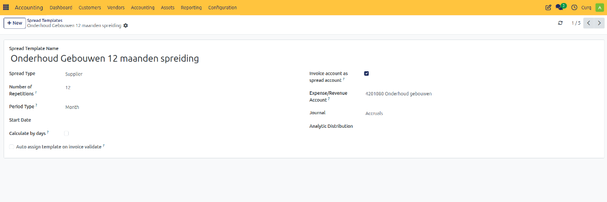
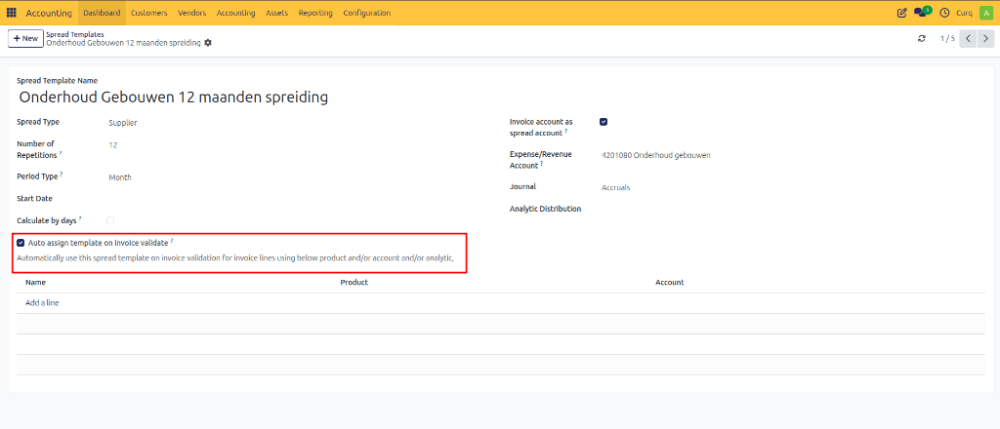

# Configure Revenue Spread Templates

## Overview

Deferred revenue refers to payments received for goods or services that have not yet been delivered or completed. In accounting terms, these amounts are recorded as a liability until the related goods or services are provided.

This commonly occurs with:
- Subscriptions
- Advance payments for services
- Maintenance contracts
- Long-term service agreements
- Products or services delivered over multiple periods

Although the customer pays upfront, the revenue should only be recognized when the goods or services are delivered. This ensures that revenue recognition accurately reflects business activity and provides reliable financial reporting.

Once the goods or services have been delivered, the deferred revenue is gradually transferred from the balance sheet account to the appropriate revenue account.

CURQ supports Revenue Spreading, allowing companies to distribute revenue across multiple accounting periods. This provides a more accurate financial overview and ensures compliance with accounting principles.

### Example

Suppose you invoice a customer €1,200 for a one-year subscription and receive payment in advance.

If the entire €1,200 is recognized as revenue in the first month, it would incorrectly appear that all revenue was earned during that month.

Instead, the revenue can be spread evenly across the subscription period:

| Month | Revenue Recognized |
| :--- | :--- |
| January | €100 |
| February | €100 |
| March | €100 |
| ... | ... |
| December | €100 |

The full €1,200 is initially recorded in a deferred revenue account and gradually recognized as revenue throughout the year.

> [!NOTE]
> Deferred revenue is also commonly referred to as Revenue Recognition, Accrual Accounting, or Deferred Income.

---

## Configure Revenue Spread Templates

Spread templates allow you to create predefined rules for distributing revenue or expenses over time.

Navigate to:

**Invoicing → Configuration → Spread Templates**

A spread template defines how revenue or costs should be recognized over multiple periods. Once configured, CURQ automatically calculates and generates the required accounting entries.

### Template Fields

| Field | Description |
| :--- | :--- |
| **Spread Template Name** | Enter a meaningful name for the template (e.g., Annual Subscription Revenue, Monthly Maintenance Revenue, Deferred Service Revenue). |
| **Spread Type** | Specify the type of spread: Sales Revenue, Purchase Expense, Revenue Related, or Cost Related. |
| **Number of Repetitions** | Defines how many periods the revenue or expense will be spread across (e.g., 12 for a yearly subscription spread monthly). |
| **Period Type** | Choose the frequency of recognition: Monthly, Quarterly, or Yearly. |
| **Start Date** | Defines when the spread begins. This field may be left blank when creating the template. |
| **Calculate Per Day** | When enabled, CURQ calculates amounts based on the actual number of days in each period instead of dividing the amount equally. |
| **Balance Sheet Account (Spread Account)** | The temporary account where the revenue or expense is parked until it is recognized. |
| **Revenue / Expense Account** | The account that receives the periodic revenue or expense entries. |
| **Journal** | Select the journal used to create spread entries. |
| **Analytic Information** | Optionally assign analytic accounts or dimensions for reporting purposes. |

### Automatically Assign Template

Enable this option if the spread template should be applied automatically when validating invoices.

Additional rules can be configured based on:
- Product
- Revenue Account
- Invoice Type

This allows CURQ to automatically create revenue spreads without manual intervention.

