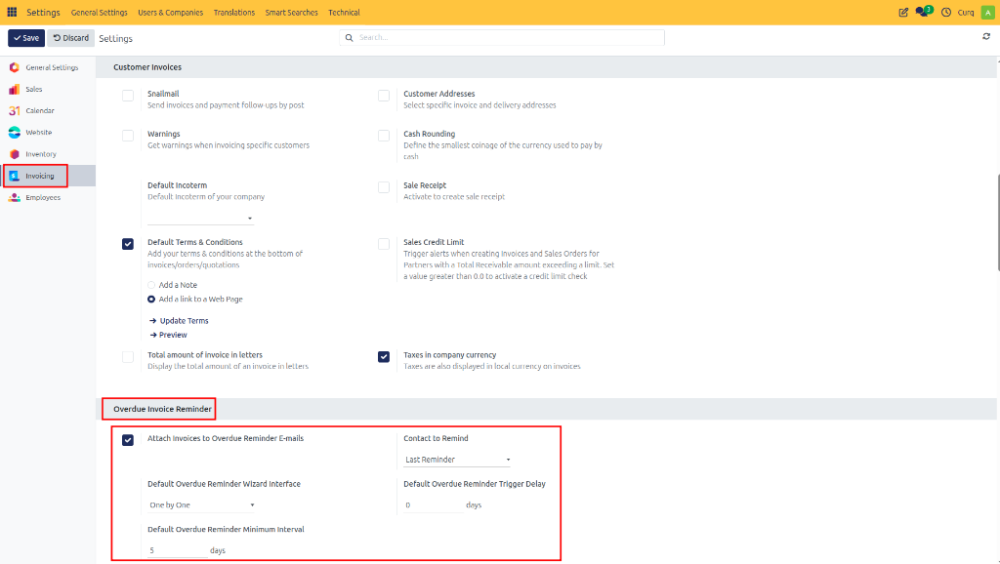
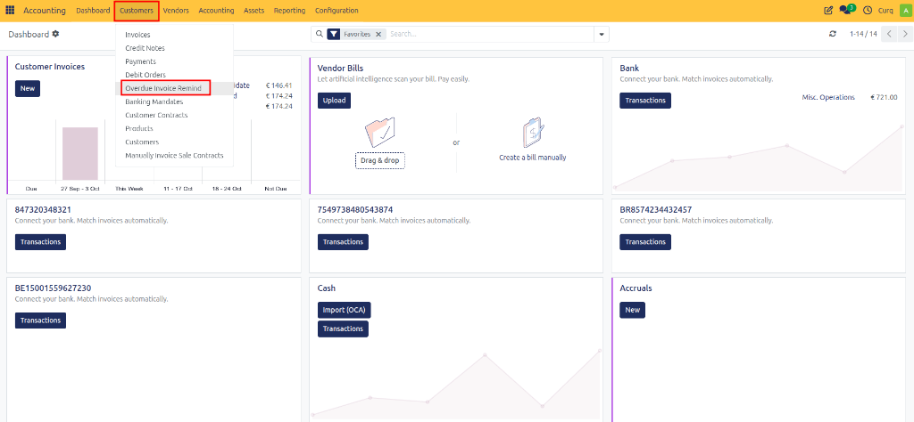
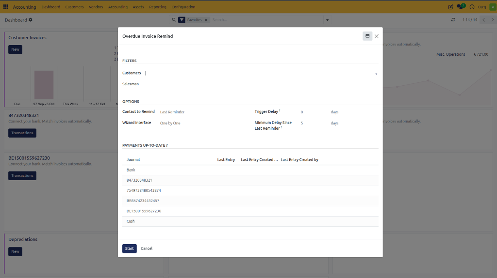
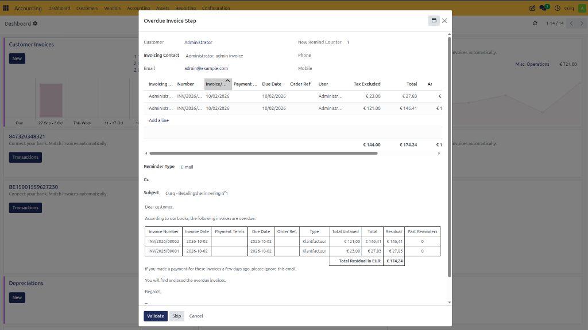
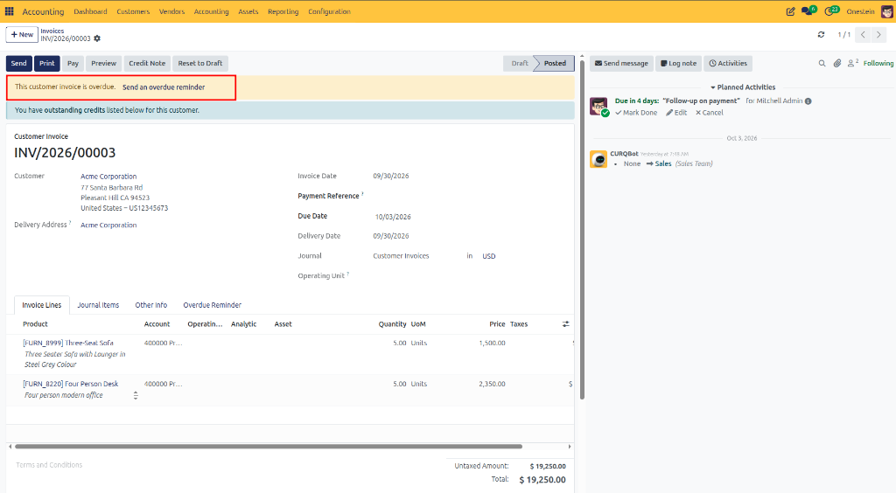

# Configure and Manage Payment Reminders

## Overview

Payment reminders help you follow up on overdue customer invoices and improve cash collection. CURQ provides a flexible reminder system that allows you to configure default reminder settings, send reminder emails, track reminder history, and customize reminder messages based on the reminder sequence.

---

## Configure Payment Reminder Settings

You can configure the default reminder settings by navigating to:

**Settings → Invoicing → Payment Reminders**

These settings determine how payment reminders are generated and sent.

### Reminder Configuration Options

| Option | Description |
| :--- | :--- |
| **Attach Invoices to Reminder Emails** | Enable this option if you want CURQ to automatically attach copies of the outstanding invoices when sending reminder emails. This allows customers to easily review and pay the invoices without searching for the original documents. |
| **Contact to Remind** | Select which contact should receive payment reminders. Available options include: Contact from the last reminder sent, Contact from the last invoice sent, or Default billing contact. This ensures reminders are sent to the most appropriate recipient. |
| **Default Reminder Wizard Interface** | Choose how the reminder wizard should behave: Process customers one by one, or Process all customers at once. This setting determines the default workflow when generating reminders. |
| **Default Reminder Trigger Delay** | Specify the number of additional days after the invoice due date before it becomes eligible for reminders. This provides a grace period before reminder emails are sent. |
| **Default Minimum Reminder Interval** | Define the minimum number of days between consecutive reminders for the same invoice. This prevents customers from receiving reminders too frequently. |

---

## Send Payment Reminders

Overdue invoices can be followed up through the Payment Reminder wizard.

Navigate to:

**Invoicing → Customers → Payment Reminders**

This opens a wizard that guides you through the reminder process.

### Select Customers and Filters

Within the wizard, you can choose which customers should receive reminders. If no customer is selected, CURQ automatically includes all eligible customers with overdue invoices.

**Filters:**
Under the Filters section, you can narrow down the results by:
- Customer
- Salesperson

This allows you to target specific groups of invoices.

**Options:**
Under the Options section, you can override the default settings for:
- Contact to Remind
- Wizard Interface
- Trigger Delay
- Minimum Reminder Interval

These settings apply only to the current reminder run.

### Payments Up-To-Date?

The Payments Up-To-Date? section displays information about the most recent bank payment processing date. This helps you verify whether:
- Bank statements have been imported.
- Customer payments have been processed.
- Reminder emails are based on the latest payment information.

After configuring the filters and options, click **[Start]** to begin the reminder process.

---

## Review Reminder Results

After the wizard runs, CURQ displays the reminder results grouped by customer.

For each customer, you can:
- Review outstanding invoices.
- Remove invoices from the reminder list if necessary.
- Verify reminder details before sending.
- Customize the email message.

This allows you to personalize communications where required.

### Send Reminder Emails

Once the reminders have been reviewed, click **[Validate]** to send the reminder emails.

CURQ will:
- Send the reminder email.
- Attach invoices if configured.
- Update the reminder status automatically.
- Record reminder activity on the invoice.

---

## Payment Reminder Tracking

When a reminder is sent, CURQ assigns a Reminder Sequence Number to the invoice. The sequence number is visible in the invoice list view and helps track reminder history.

| Sequence | Reminder Type |
| :--- | :--- |
| **1** | First Reminder |
| **2** | Second Reminder |
| **3** | Third Reminder |
| **...** | Additional Follow-Ups |

Each invoice contains a Payment Reminder section where you can monitor reminder activity. Here you can:
- View the reminder status.
- See how many reminders have been sent.
- Review reminder history.
- Add internal notes.
- Record follow-up actions such as phone calls or customer communications.

Invoices that have passed their due date are clearly marked as overdue, providing complete visibility into the collection process.

---

## Reminder Email Templates

CURQ supports reminder email templates that automatically adjust the message based on the reminder sequence.

- **First Reminder**: The first reminder typically contains a friendly payment request and serves as a courtesy notification.
- **Second Reminder**: The second reminder usually contains stronger wording and emphasizes that payment is overdue.
- **Additional Reminders**: Subsequent reminders can be configured to become progressively more urgent.

You can customize reminder messages by:
- Editing the email template.
- Modifying the email content before sending.
- Creating different communication styles for different reminder levels.

This flexibility allows you to adapt reminder communications to your company's collection policy.
