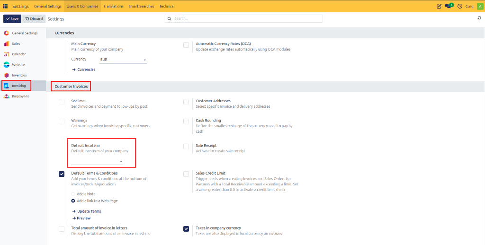
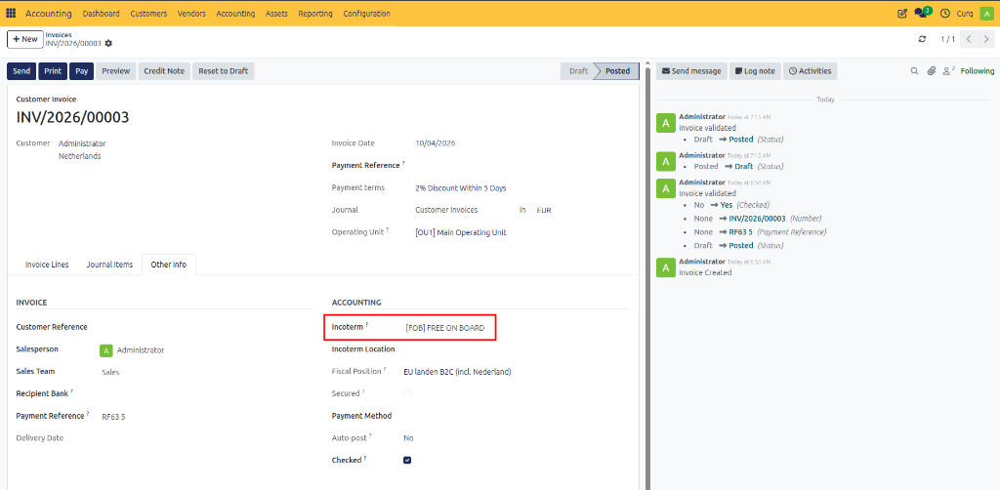
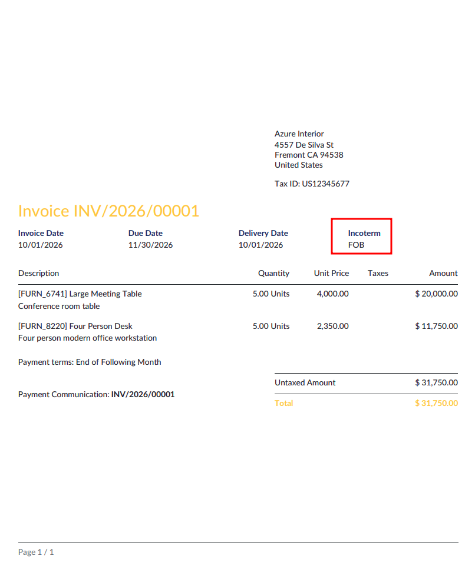
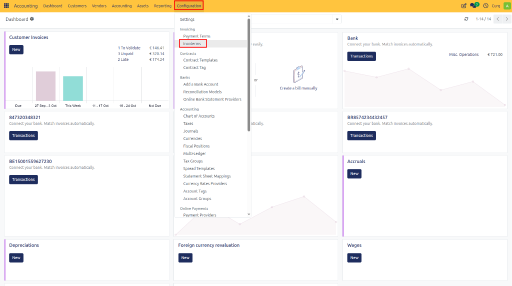
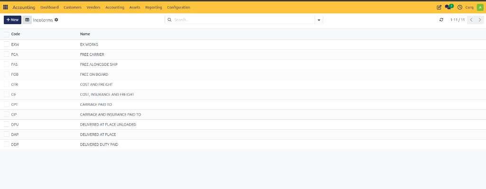

# Configure Incoterms

## Overview

Incoterms (International Commercial Terms) are internationally recognized trade terms published by the International Chamber of Commerce (ICC). They define the responsibilities of buyers and sellers during international transactions, including the transfer of goods, allocation of costs, transportation responsibilities, insurance requirements, and the transfer of risk.

By using standardized Incoterms, businesses can avoid misunderstandings and clearly define which party is responsible for transportation, customs procedures, insurance, and delivery costs at each stage of the shipping process.

A key purpose of Incoterms is to establish the exact point at which responsibility and risk transfer from the seller to the buyer. This helps ensure transparency and consistency in international trade agreements.

CURQ supports the 11 Incoterms 2020 rules, allowing businesses to include delivery terms directly on invoices and maintain consistent trade agreements across transactions.

---

## Settings and Usage on Invoices

You can define a default Incoterm in:

**Settings → Invoicing → Customer Invoices**

The selected Incoterm is automatically applied when creating new customer invoices.

When creating an invoice, the Incoterm can be found under the **Other Info** tab in the Delivery Conditions section. Users can override the default value and select a different Incoterm when required.

The selected delivery term is displayed on the printed invoice, ensuring that both parties clearly understand the agreed delivery responsibilities.

---

## Available Incoterms (2020)

CURQ includes all 11 Incoterms 2020. If additional delivery terms are required or existing terms need to be modified, they can be managed through:

**Invoicing → Configuration → Incoterms**

### Incoterms List

| Incoterm | Description |
| :--- | :--- |
| **EXW – Ex Works** | The seller makes the goods available at their premises or another agreed location (factory, warehouse, etc.). The buyer assumes all costs, risks, transportation arrangements, insurance, and customs formalities from that point onward. |
| **FCA – Free Carrier** | The seller delivers the goods to a carrier designated by the buyer and bears all costs and risks until delivery to that carrier. |
| **CPT – Carriage Paid To** | The seller delivers the goods to the carrier and pays transportation costs to the agreed destination. Risk transfers to the buyer once the goods are handed over to the carrier. |
| **CIP – Carriage and Insurance Paid To** | The seller delivers the goods to the carrier, pays transportation costs to the destination, and provides cargo insurance covering the shipment until the agreed destination. |
| **DAP – Delivered at Place** | The seller delivers the goods to a specified destination and bears all costs and risks up to that point. The buyer is responsible for unloading and import customs procedures. |
| **DPU – Delivered at Place Unloaded** | The seller delivers and unloads the goods at the agreed destination. All costs and risks remain with the seller until unloading is completed. |
| **DDP – Delivered Duty Paid** | The seller bears all costs, risks, duties, taxes, customs clearance, and transportation expenses until the goods are delivered to the agreed destination. |
| **FAS – Free Alongside Ship** | The seller delivers the goods alongside the vessel at the designated port of shipment. Risk transfers to the buyer once the goods are placed alongside the ship. |
| **FOB – Free On Board** | The seller delivers the goods on board the vessel at the port of shipment and bears all costs and risks until the goods are loaded onto the ship. |
| **CFR – Cost and Freight** | The seller delivers the goods on board the vessel and pays freight charges to the destination port. Risk transfers to the buyer once the goods are loaded onto the ship. |
| **CIF – Cost, Insurance and Freight** | The seller delivers the goods on board the vessel, pays freight charges to the destination port, and provides insurance coverage for the shipment during transit. |
