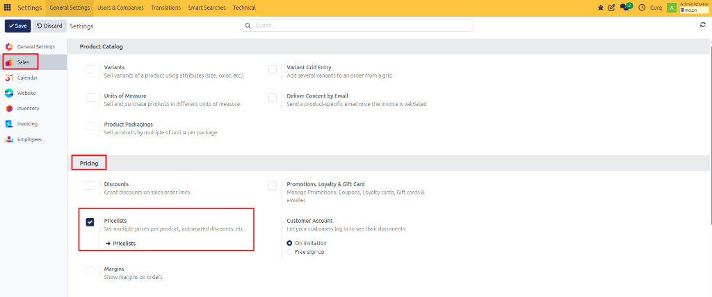
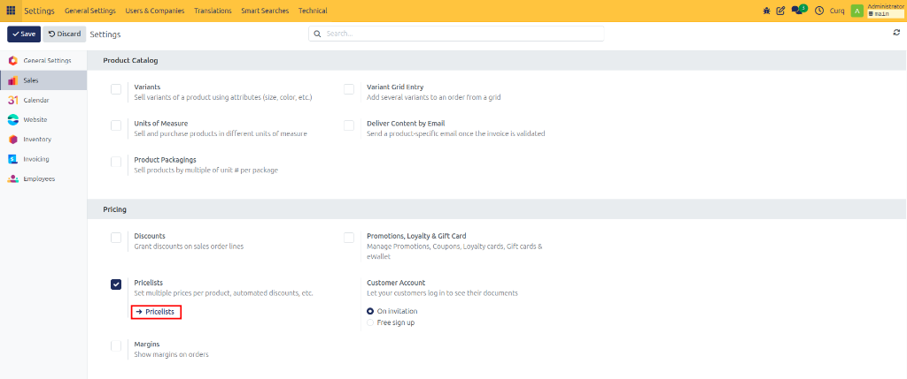
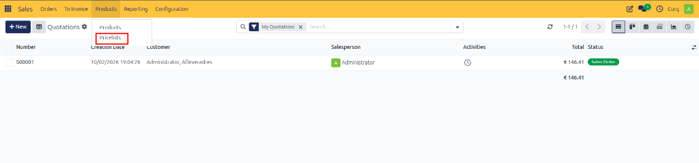
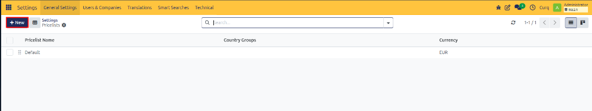
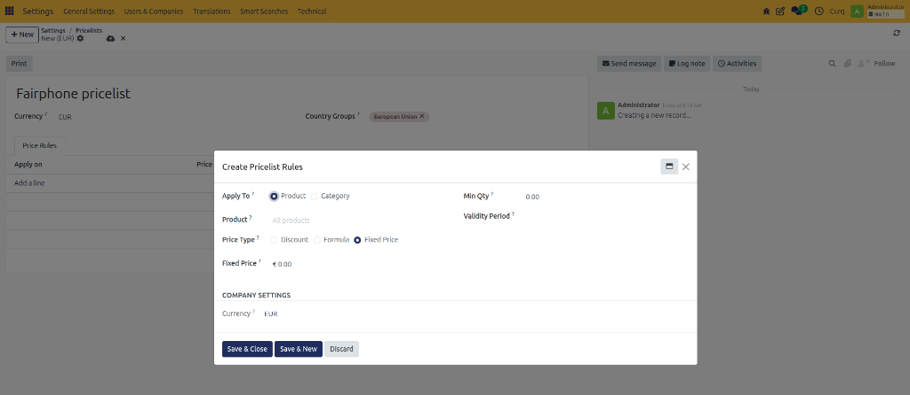
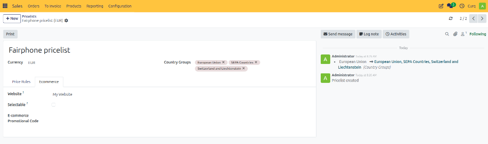
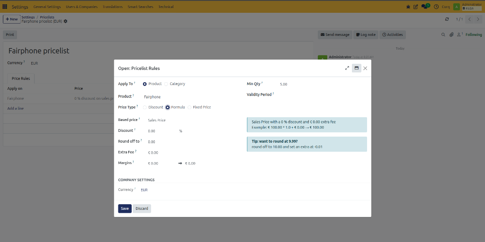
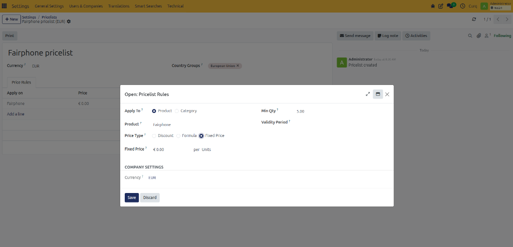

# Configure Price Lists

## Overview

Price lists are useful when different customers or customer groups need different prices. For example, you can use price lists for:
- Loyalty discounts
- Black Friday promotions
- Customer-specific prices
- Quantity-based discounts
- Country-specific prices
- Temporary promotional pricing

Before using price lists, the feature must first be enabled in the Sales settings.

---

## Enable Price Lists

Navigate to:

**Sales → Configuration → Settings**

Under the **Pricing** section, enable **Price Lists**. 

*(You can also open the price list page directly from the settings screen by clicking the **Pricelists** link.)*

 

Two pricing options are available:
1. **Multiple Prices per Product** – Used to set different fixed prices for specific products.
2. **Advanced Pricing** – Used to create more complex pricing rules, such as discounts, formulas, quantity rules, or date-based pricing.

---

## Create a Price List

Once enabled, you can access price lists from:

**Products → Price Lists**

Click **[New]** to create a new price list. When creating a new price list, enter a clear name and select the currency that should be used.

The company’s default currency is selected automatically, but you can change it if required.

Under **Price Rules**, you can define the products and pricing conditions to which the price list applies.

---

## Multiple Prices per Product

The **Multiple Prices per Product** option is useful when you want to quickly assign different prices to specific products. For example, you can use it for temporary promotions, customer-specific prices, volume pricing, or seasonal discounts.

To add a pricing rule, click **Add Rule**, then configure the following fields:

- **Product:** Select the product to which the pricing rule should apply.
- **Minimum Quantity:** Enter the minimum quantity the customer must purchase before the new price becomes applicable. 
  *(Example: Minimum Quantity: 10, Price: €8.50. The new price will only apply when the customer purchases 10 or more units.)*
- **Price:** Enter the new fixed price for the product.
- **Start Date and End Date:** Define the period during which the pricing rule should be valid. If no start or end date is entered, the rule remains active until it is modified or removed.

### Price List Configuration

Additional settings are available under the Configuration (or Ecommerce) tab:

- **Country Groups:** Select the country groups for which the price list should apply (e.g., Europe, North America, SEPA Countries, Custom country groups). This allows you to offer different prices based on customer location.
- **Website:** Select the website on which the price list should be available. This is useful when your company operates multiple websites or online shops.
- **Selectable:** Enable this option if customers should be able to select the price list themselves in the webshop.
- **E-commerce Promo Code:** Enter a promotional code that customers can use to activate the price list in the webshop. *(Example: `BLACKFRIDAY` — When the customer enters this code, the related price list becomes available.)*

---

## Advanced Pricing

The **Advanced Pricing** option is used when more complex pricing rules are required. This can include:
- Percentage discounts
- Formula-based prices
- Category-wide discounts
- Quantity-based pricing
- Margin-based pricing
- Pricing based on another price list

The price list form is similar to the Multiple Prices per Product option. The main difference appears when you click **Add Rule**, where additional pricing options become available.

### Price Calculation

The Price Calculation or Operation field determines how the new price is calculated. Three options are available:

#### 1. Fixed Price
Replaces the existing product price with a specific amount.
*(Example: Original price: €100. Fixed price: €85. The customer pays €85 when the rule applies.)*

#### 2. Discount
Applies a percentage adjustment to the existing price.
*(Example: Original price: €100. Discount: 10%. New price: €90.)*
You can also enter a negative percentage to increase the price *(e.g., Discount: -10% results in €110)*.

#### 3. Formula
Calculates prices using multiple parameters.

- **Based On:** Determines which price CURQ uses as the starting point for the calculation.
  - *Sales Price:* Starts from the sales price configured on the product.
  - *Cost Price:* Starts from the cost price of the product (purchase price, production cost, internal product cost).
  - *Other Price List:* Based on another existing price list, allowing for multiple pricing layers (e.g., one price list calculates a selling price from cost, and another applies a customer discount).
- **Discount:** Enter a percentage to be deducted from the base price (a negative percentage increases the price).
- **Extra Cost:** Enter a fixed amount that should be added to or subtracted from the calculated price. *(Example: `-0.01` can be used to make a calculated price end in `.99`.)*
- **Rounding Method:** Determines how CURQ rounds the calculated price (e.g., whole numbers, decimal values, multiples of five or ten). Rounding combined with Extra Cost can create commercial prices such as `€9.99` or `€49.95`.
- **Margins:** Define minimum and maximum margins based on the product’s cost price to ensure calculated prices remain within acceptable profit limits.

### Conditions

Pricing rules can include conditions that determine when and where the rule applies.

- **Apply To:**
  - *All Products:* Applies to every product.
  - *Product Category:* Applies to all products within a selected category (e.g., Trousers).
  - *Product:* Applies to one specific product (e.g., Classic Jeans).
  - *Product Variant:* Applies to a specific variant of a product (e.g., Classic Jeans – Dark Blue – Size L).
- **Minimum Quantity:** Defines the minimum quantity the customer must purchase before the pricing rule becomes active.
- **Validity:** Enter the start and end dates during which the rule should apply.

---

## Save the Pricing Rule

After entering the required information:
- Click **Save & Close** to save the rule and return to the price list.
- Click **Save & New** to save the rule and immediately create another pricing rule.

This allows you to efficiently create multiple pricing rules within the same price list.
