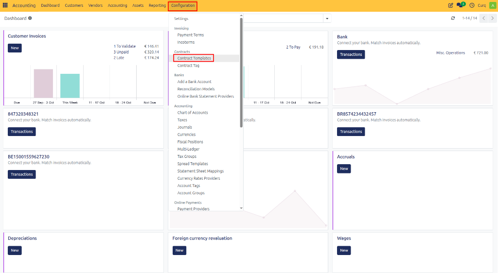
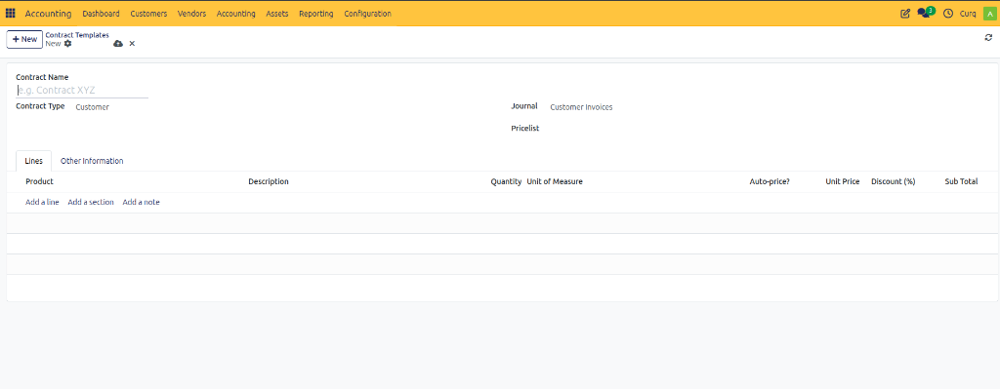
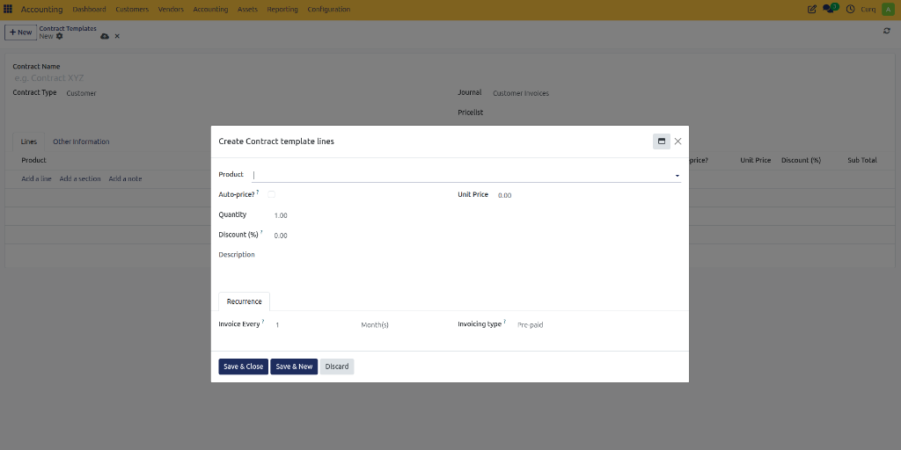
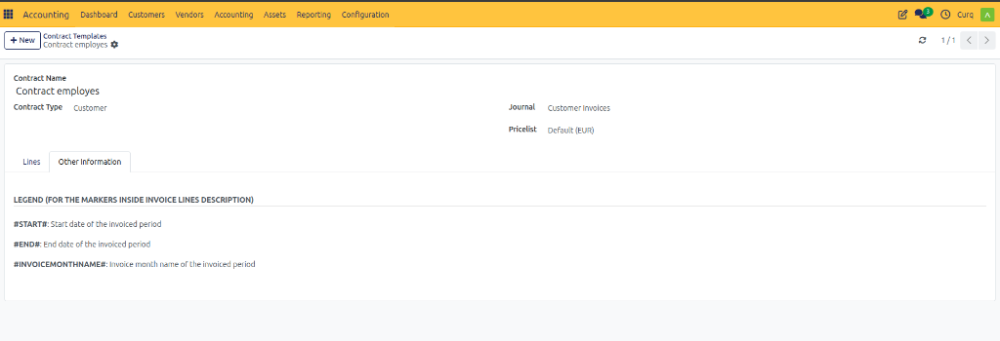

# Configure Contract Templates

## Overview

Contract templates help standardize and simplify the creation of recurring contracts. By using templates, you can predefine settings such as journals, price lists, subscription products, and invoicing rules. When creating a new contract, selecting a template automatically fills in the predefined fields, ensuring consistency and reducing manual work.

To create a contract template, navigate to:

**Configuration → Contracts → Contract Templates**

---

## Creating a Contract Template

Click **[New]** to create a template and complete the required information.

## Contract Template Fields

### Contract Header

| Field | Description |
| :--- | :--- |
| **Contract Name** | Name of the contract template. This name helps identify the template when creating contracts. |
| **Contract Type** | Defines whether the template is used for Customer or Vendor contracts. |
| **Journal** | Accounting journal used for invoices generated from this contract. |
| **Pricelist** | Pricelist used to determine product pricing in the contract. |

---

## Lines Tab

The Lines tab contains the products or services that will be invoiced repeatedly under the contract.

### Line Fields

| Field | Description |
| :--- | :--- |
| **Product** | Product or service included in the contract. |
| **Description** | Description that appears on generated invoices. |
| **Quantity** | Quantity to invoice each billing period. |
| **Unit of Measure** | Unit used for the quantity (Units, Hours, Months, etc.). |
| **Auto-price** | Automatically updates the price based on the selected pricelist. |
| **Unit Price** | Price charged for one unit of the product or service. |
| **Discount (%)** | Percentage discount applied to the line. |
| **Sub Total** | Total amount for the line after quantity and discount calculations. |

---

## Create Contract Template Lines

When adding a new line, the following fields are available.

### Product Information

| Field | Description |
| :--- | :--- |
| **Product** | Product or service that will be billed. |
| **Auto-price** | Uses the pricelist to automatically calculate the unit price. |
| **Unit Price** | Price per unit of the product or service. |
| **Quantity** | Number of units to invoice. |
| **Discount (%)** | Discount applied to the line item. |
| **Description** | Text that will appear on the invoice line. |

### Recurrence Settings

These settings control how often the line is invoiced.

| Field | Description |
| :--- | :--- |
| **Invoice Every** | Defines the billing interval. |
| **Month(s)** | Time unit used for recurring invoicing. |
| **Invoicing Type** | Determines when invoices are created. |

#### Invoicing Types

| Type | Description |
| :--- | :--- |
| **Pre-paid** | Invoice is generated before the service period starts. |
| **Post-paid** | Invoice is generated after the service period ends. |

> **Example**
> - **Invoice Every:** 1 Month
> - **Invoicing Type:** Pre-paid
> 
> **Result:** An invoice is created at the beginning of every month.

---

## Other Information Tab

The Other Information tab contains placeholders that can be used inside invoice line descriptions.

### Available Markers

| Marker | Description |
| :--- | :--- |
| **#START#** | Start date of the invoiced period. |
| **#END#** | End date of the invoiced period. |
| **#INVOICEMONTHNAME#** | Name of the invoiced month. |

---