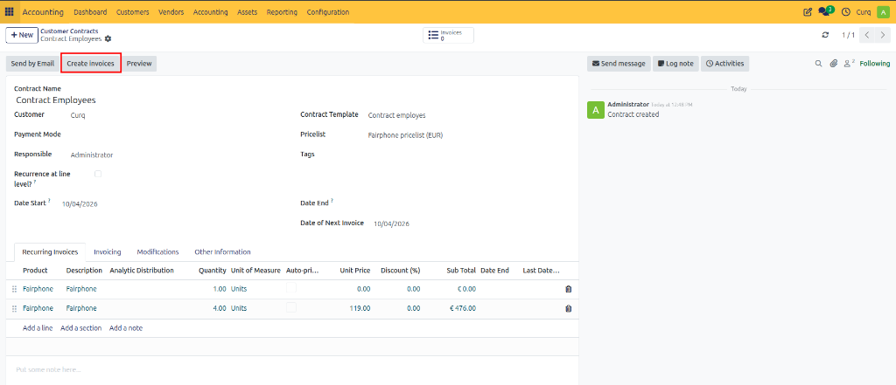
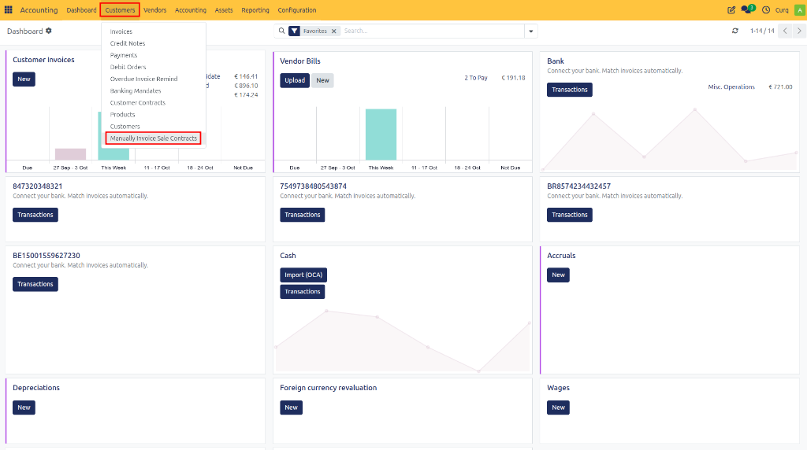
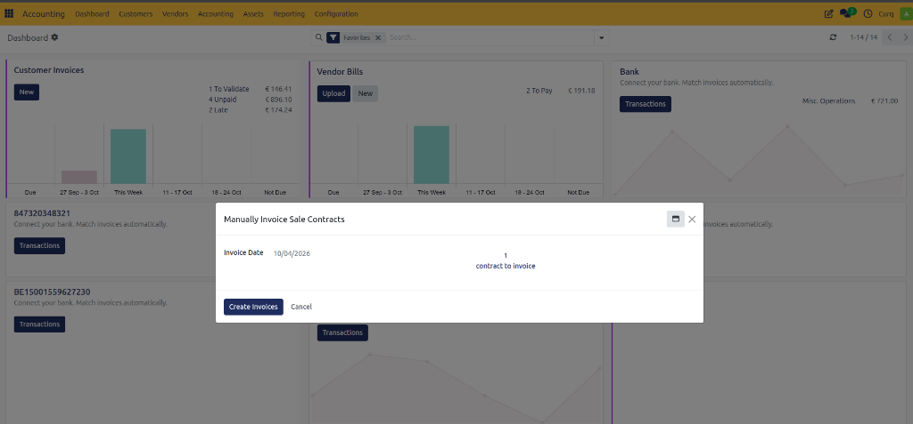
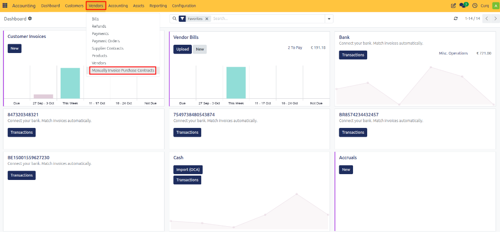
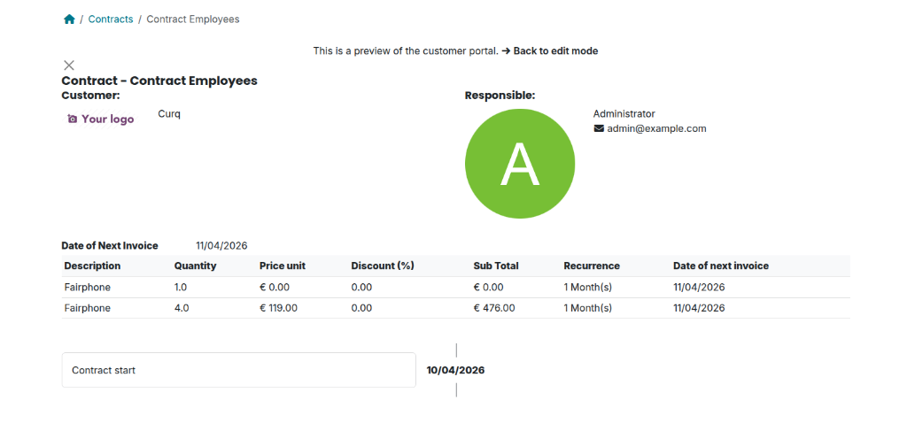

# Invoicing Sales and Purchase Contracts

## Overview

After all contract or subscription details have been configured, you can generate invoices based on the contract terms. CURQ supports both manual and automatic invoice generation, ensuring that recurring invoices are created according to the defined billing schedule.

---

## Generating the First Invoice

Once the contract has been completed, the first invoice can be generated immediately.

There are two ways to create invoices:

### Create Invoices Button
Open the contract and click the **Create Invoices** button.

This option generates an invoice directly from the contract and is typically used when the first invoice needs to be issued immediately after creating the contract.

### Manual Invoicing
You can also generate invoices through the **Manual Invoicing Sales Contracts** menu.

This option processes all contracts that are currently eligible for invoicing and creates the required invoices in a single action. This is particularly useful when multiple contracts need to be invoiced at the same time.

---

## Automatic Invoice Generation

CURQ automatically creates recurring invoices through the scheduled action: **Generate Recurring Invoices from Contracts**

This automated process runs daily and checks all active contracts for invoiceable subscription periods. When a contract reaches its next billing date, CURQ automatically generates the corresponding invoice according to the contract settings.

This ensures that recurring subscriptions continue to be invoiced without manual intervention.

### Manual Execution in Debug Mode
Users with access to Developer (Debug) Mode can manually trigger the recurring invoicing process.

This is useful for:
- Testing contract configurations
- Verifying invoicing schedules
- Creating invoices immediately without waiting for the scheduled action
- Troubleshooting recurring invoice generation

By manually executing the process, invoices are generated instantly for all contracts that meet the invoicing criteria.

---

## Viewing Generated Invoices

Invoices created from contracts remain linked to the originating contract.

Using the **Show Recurring Invoices** option, you can view all invoices generated from a specific contract, making it easy to track billing history and subscription activity.

---

## Customer Portal View

Customers can view their subscriptions through the Customer Portal. The portal provides access to important subscription information, including:
- Contract details
- Active subscription products and services
- Billing periods
- Generated invoices
- Subscription status

This allows customers to monitor their subscriptions without contacting an administrator.

### Customer Self-Service Subscription Management

If enabled in the contract configuration, customers can also manage their subscriptions directly from the portal. Depending on the settings, customers may be able to:
- View subscription information
- Review recurring invoices
- Check renewal dates
- Terminate subscriptions themselves

This self-service functionality reduces administrative workload while giving customers greater control over their subscriptions.
