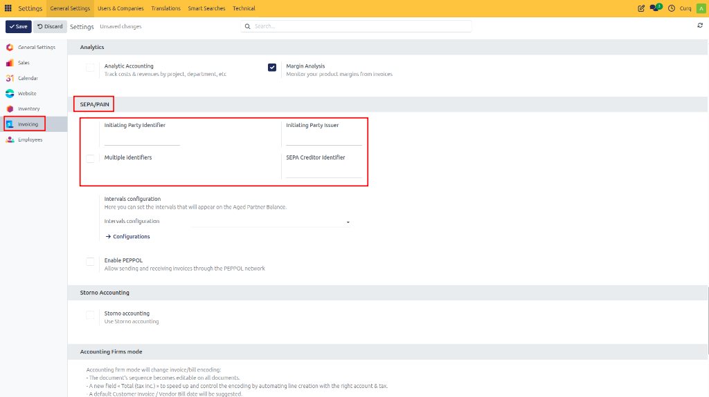
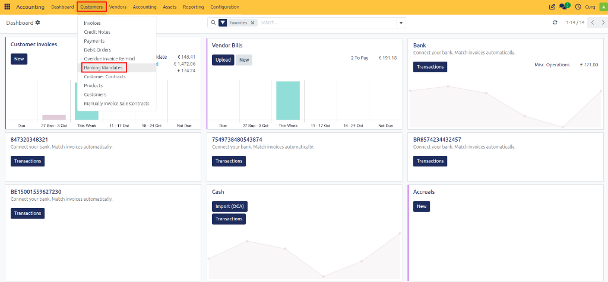
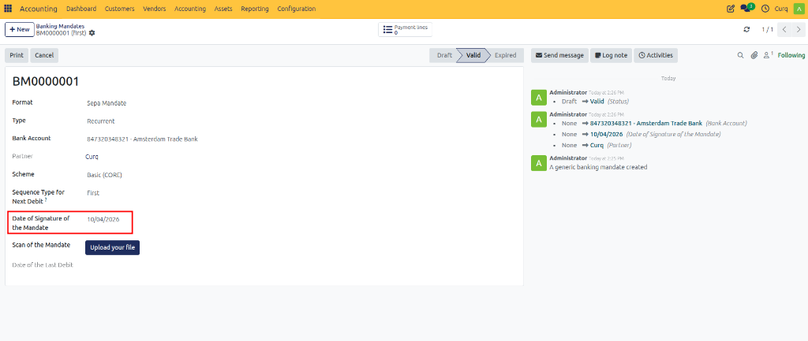
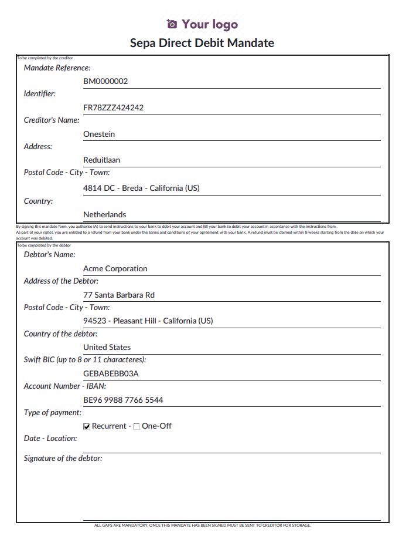
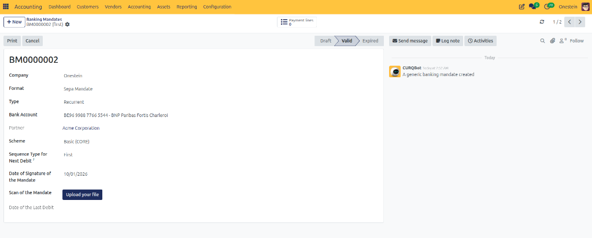
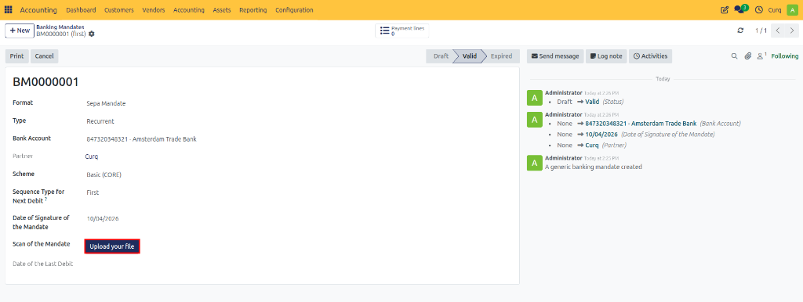
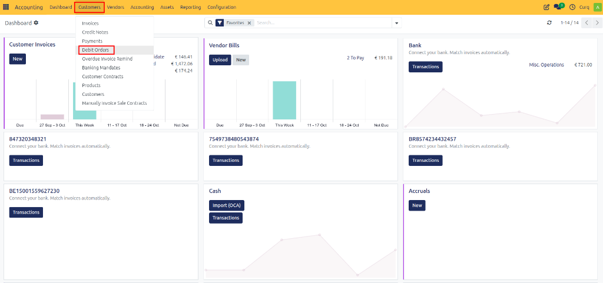
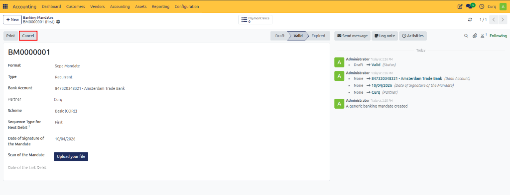

# Batch Payments: SEPA Direct Debit (SDD)

## Overview

SEPA (Single Euro Payments Area) is a European payment initiative that standardizes and simplifies euro bank transfers across participating countries. With SEPA Direct Debit (SDD), customers can authorize your company to collect payments directly from their bank account through a signed mandate. This is particularly useful for recurring payments such as subscriptions, maintenance contracts, memberships, and service agreements.

Within CURQ, you can manage customer mandates, automatically prepare invoices for collection, generate SEPA XML payment files, and reconcile collected payments once they are received in your bank account.

---

## Enable SEPA Direct Debit

Before using SEPA Direct Debit, the feature must be activated in the Accounting settings.

**Navigation:**
`Accounting → Configuration → Settings`

Enable SEPA Direct Debit and enter your company's Creditor Identifier. This identifier is required for processing SEPA collections and identifies your organization as the collecting party.

Once enabled, CURQ can generate SEPA-compliant XML files for your bank.

---

## Create and Validate a Customer Mandate

A customer must provide a valid SEPA mandate before you can collect payments from their bank account.

**Navigation:**
`Invoicing → Customers → Bank Mandates`

Create a new mandate and complete the customer and banking information.

### Mandate Details
When creating a mandate, complete the following fields:

| Field | Description |
| :--- | :--- |
| **Format** | Select SEPA. |
| **Type** | Choose whether the mandate is One-Time, Recurring, or Generic. For subscriptions and recurring services, select Recurring. |
| **Bank Account** | Select the customer's bank account that will be used for collections. |
| **Scheme** | Choose CORE or B2B. CORE is supported by all banks. B2B is intended for business-to-business collections and generally prevents chargebacks by the debtor. |
| **Sequence Type** | Used for recurring mandates. The default value First indicates the first collection in a recurring series. |
| **Date of Signature** | Enter the date on which the customer signed the mandate. |

### Print and Sign the Mandate
After entering the mandate details, click **Print** to generate the authorization document.

The customer must sign this document to authorize future collections.

### Upload the Signed Mandate
Once the signed document has been returned:
1. Open the mandate record.
2. Upload the signed document using the Upload button or the Scan of the Mandate field.
3. Click **Validate** to activate the mandate.

After validation, the mandate becomes active and can be used for direct debit collections.

### Confirmed Mandate
A validated mandate contains all authorization details and is ready for use in invoice collection.

---

## Create a Sales Invoice with Direct Debit

Ensure that the customer has Direct Debit configured as the default payment method.

When a sales invoice is created for a customer with an active mandate, CURQ automatically:
- Retrieves the mandate information.
- Links the mandate to the invoice.
- Prepares the invoice for future collection.

The active mandate will be visible directly on the invoice.

*[Image placeholder: Invoice with Mandate]*

As soon as the invoice is validated, CURQ prepares the payment for inclusion in a SEPA Direct Debit batch.

---

## Create a Direct Debit Collection Batch

Once invoices are ready for collection, create a SEPA collection batch.

**Navigation:**
`Accounting → Customers → Debit Orders`

### Step 1: Create a Debit Order
Create a new debit order and select: **Create Payment Lines from Entries**

This option allows you to select invoices that are ready for collection. You can apply filters such as:
- Due date
- Customer
- Journal
- Payment method

### Step 2: Add Eligible Transactions
Click: **Add All Transactions**
Then select: **Create Transactions**

CURQ automatically includes all invoices that meet the collection criteria and have a valid SEPA mandate.

*[Image placeholder: Add Eligible Transactions]*

The debit order now contains all transactions that will be included in the SEPA collection file.

*[Image placeholder: Payment Order Transactions]*

---

## Generate the SEPA XML File

After reviewing the debit order:
1. Confirm the debit order.
2. CURQ generates a SEPA Direct Debit XML file.
3. Download the generated XML file.
4. Upload the file to your banking application.

Once the bank file has been successfully imported, update the debit order status to: **File Uploaded to the Bank**

This provides confirmation that the collection process has been completed and prevents accidental duplicate uploads.

---

## Automatic Collection Processing

When a customer invoice is validated and an active mandate exists on the invoice date:
- CURQ automatically prepares the payment for collection.
- The invoice becomes available for inclusion in a debit order.
- No manual payment registration is required.

The only remaining step is generating and uploading the SEPA XML file to your bank.

---

## Reconcile the Collection Batch

After the bank processes the collection and credits the funds to your bank account, reconcile the incoming bank transaction with the debit order.

During reconciliation, CURQ:
- Matches the bank transaction with the debit order.
- Clears the outstanding payment entries.
- Updates the invoice payment status.
- Correctly records the payment in the accounting journals.

This ensures that both the invoice and the bank statement are fully reconciled.

---

## Cancel a Direct Debit Mandate

If a customer withdraws authorization or the mandate is no longer valid:
1. Open the mandate record.
2. Click **Cancel**.

The mandate will be deactivated and can no longer be used for future collections.

> [!WARNING]
> Existing invoices already included in a submitted collection file are not automatically cancelled. Review any pending debit orders before cancelling a mandate.
