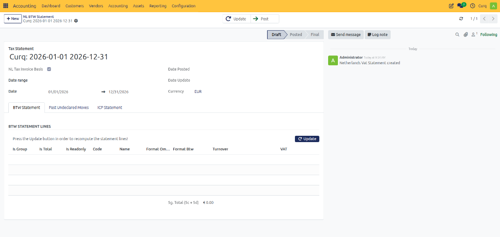
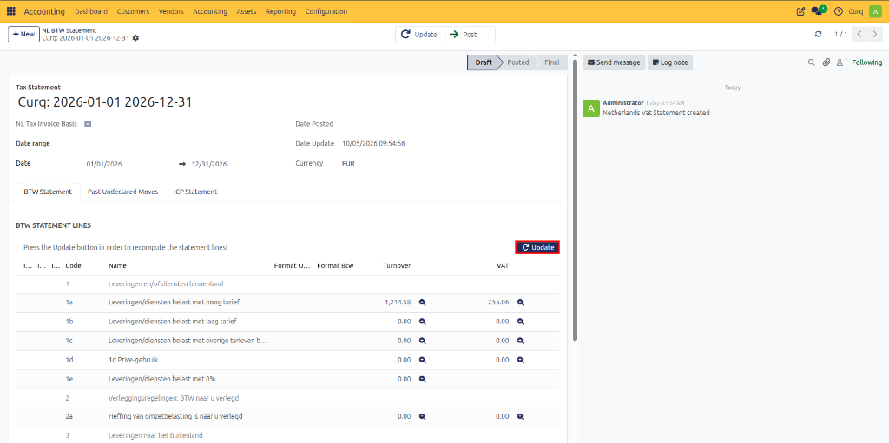
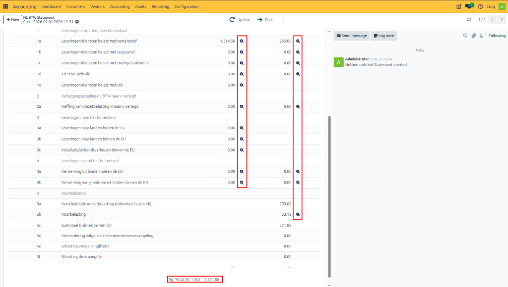
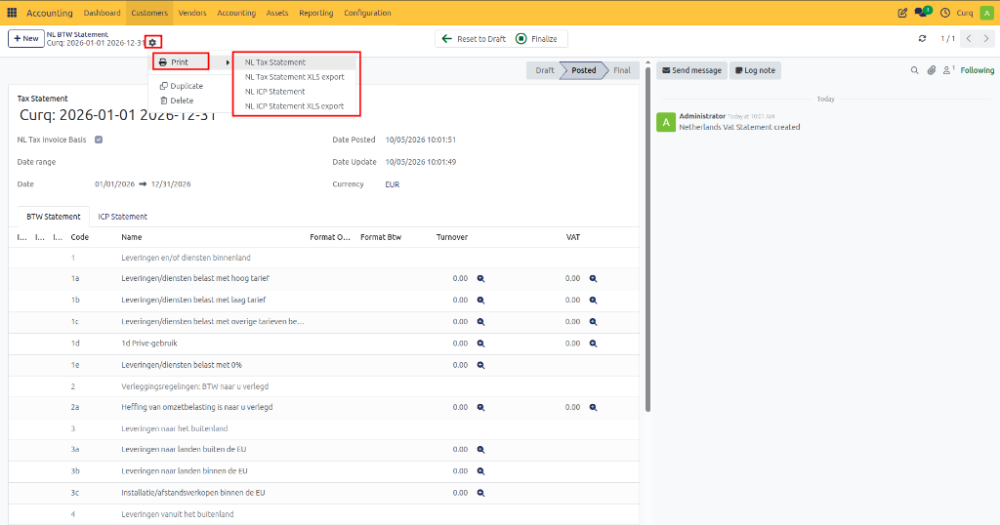
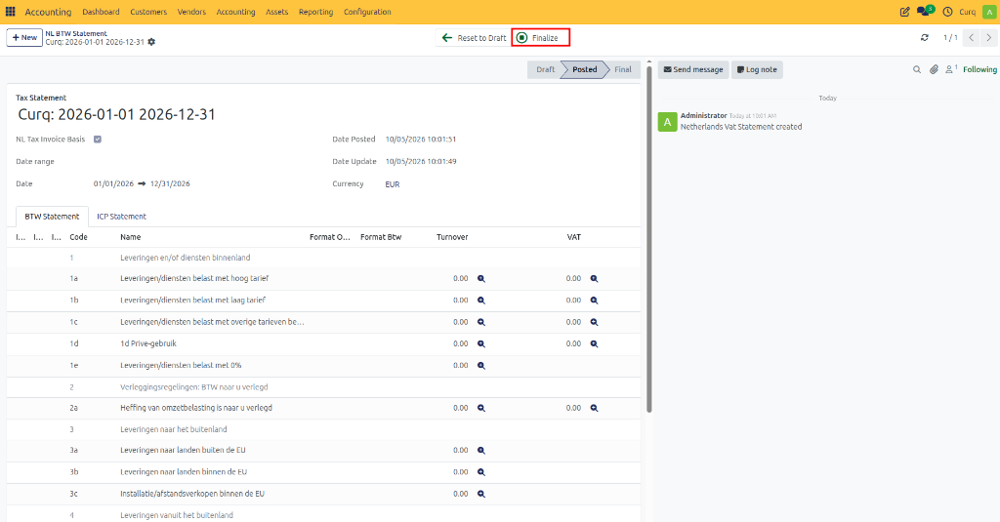

# VAT Return

Companies with a registered VAT number are required to submit VAT returns to the tax authorities periodically, usually on a monthly or quarterly basis, depending on local regulations and company turnover.

A VAT return provides detailed information about a company's taxable sales and purchases, including:
- Output VAT collected on sales.
- Input VAT paid on purchases.
- The resulting VAT payable or VAT refundable.

Accurate VAT reporting is essential for complying with legal requirements, maintaining financial transparency, and ensuring that tax obligations are met correctly. Proper VAT administration also helps avoid penalties and supports efficient business operations, including international trade activities.

> [!NOTE]
> Additional information about VAT (sales tax) can be found on the website of the relevant tax authority.

---

## Creating a VAT Return

In CURQ, VAT returns can be created through:
`Accounting → Reports → NL BTW Statement`

When creating a VAT return, complete the following fields:

- **VAT Return**
  Enter the name of the VAT return. The default name can be modified if required.
- **Period**
  Select the reporting period for the VAT return from the available options.
- **Dates**
  Optionally specify a custom start date and end date for the reporting period.
- **Posting Date**
  This field is automatically completed when the return is marked as Submitted. It indicates the date on which the VAT return was recorded as submitted in CURQ.
- **Amendment Date**
  Displays the most recent date on which changes were made to the VAT return.

> [!IMPORTANT]
> Marking a return as submitted in CURQ does not automatically send it to the tax authorities. The actual submission must still be completed manually through the tax authority's portal.

---

## Generating the VAT Return

After entering the required information:
1. Click **Update**.
2. CURQ automatically gathers data from the accounting records.
3. The VAT boxes are populated with the calculated amounts.
4. If the return already contains data, the values will be refreshed and updated.

The VAT return is now ready for review.

---

## Reviewing the VAT Return

The calculated amounts are displayed in the VAT declaration boxes.

To review the underlying details:
1. Click the magnifying glass icon next to a VAT box.
2. View the detailed breakdown of the calculated amount.
3. Review the journal entries and transactions included in the calculation.

This allows you to verify the accuracy of the return before submission.

---

## Printing and Exporting

The VAT return can be printed or exported for further review.

Using the **Print** button, you can:
- Print the VAT return.
- Export the VAT return to Excel.
- Save a copy for audit or reporting purposes.

---

## Submitting the VAT Return

Once the VAT return has been reviewed and verified:
1. Click **Submit** to mark the return as submitted within CURQ.
2. Log in to the tax authority's website and submit the VAT return manually.
3. After successful submission, return to CURQ.
4. Click **Final** (or Definitive) to finalize the VAT return.

Finalizing the return records it permanently in CURQ and confirms that the reporting period has been completed.

---

## Benefits of Using VAT Returns in CURQ

CURQ helps streamline the VAT reporting process by:
- Automatically calculating VAT amounts from accounting entries.
- Providing detailed drill-down information for verification.
- Supporting print and Excel export options.
- Maintaining a complete audit trail of submitted and finalized returns.
- Helping organizations comply with VAT reporting requirements accurately and efficiently.

By regularly reviewing and submitting VAT returns through CURQ, companies can maintain accurate tax records, improve financial transparency, and ensure compliance with applicable tax regulations.
