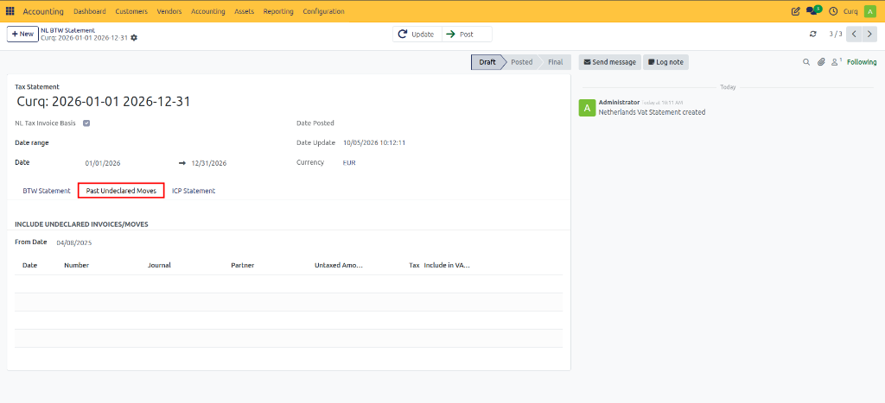

# VAT Supplementary Return

A VAT Supplementary Return (VAT correction) is used to correct a VAT return that has already been submitted to the tax authorities. If errors, omissions, or late transactions are discovered after a VAT return has been finalized, a supplementary return allows these corrections to be reported properly.

Common reasons for submitting a supplementary return include:
- Incorrect amounts entered in the original VAT return.
- Incorrect VAT rates applied to transactions.
- Missing sales or purchase invoices.
- Transactions that were not recorded before the original return was submitted.

Submitting a supplementary return helps ensure that your VAT reporting remains accurate and up to date, while reducing the risk of penalties or compliance issues.

> [!NOTE]
> More information about correcting VAT returns can be found on the website of the Tax and Customs Administration under Correcting a VAT Return.

---

## Including Historical Invoices in the Next VAT Return

Although a formal VAT supplementary return must ultimately be submitted to the tax authorities, CURQ provides functionality to include historical invoices in a subsequent VAT return.

This is useful when:
- An invoice is received after a VAT period has already been finalized.
- A supplier sends an invoice late.
- Transactions are discovered after the VAT return has been submitted.
- Additional invoices are posted with dates belonging to a previously closed VAT period.

Instead of modifying a finalized VAT return, CURQ allows these transactions to be included in the next VAT return period.

### Example Scenario
Consider the following situation:
- The January 2024 VAT Return has already been finalized.
- The next reporting period is February 2024.
- After finalizing the January return, additional invoices dated January 2024 are entered into the system.

In this case, the historical invoices can be included in the VAT return for February 2024.

---

## Creating the VAT Return

Navigate to:
`Accounting → Reports → NL BTW Statement`

Create a VAT return for the current reporting period (for example, February 2024).

*[Image placeholder: VAT Return creation screen]*

---

## Retrieving Historical Transactions

After creating the VAT return:
1. Click **Update** to calculate the VAT declaration.
2. Open the **Historical Undeclared Transactions** (Past Undeclared Moves) tab.

This tab displays transactions that were recorded after the previous VAT return was finalized and therefore have not yet been included in any VAT declaration.

---

## Including Historical Invoices

CURQ provides several options for handling historical transactions.

### Include All Transactions
Use the **Include All Transactions** button to add all eligible historical invoices to the current VAT return.

### Include Individual Transactions
If only specific invoices should be included:
1. Review the list of historical transactions.
2. Click **Add Transaction** next to the required invoice.

### Remove Transactions
If an invoice was added by mistake, it can be removed from the VAT return directly from the same screen.

### Using the From Date Filter
The **From Date** field determines from which date CURQ should search for historical undeclared transactions.
Adjust this date if necessary to control which historical invoices are displayed.

---

## Updating the VAT Return

After selecting the transactions to include:
1. Return to the main VAT Return tab.
2. Click **Update** again.

CURQ recalculates the VAT declaration and includes the selected historical invoices in the totals. The VAT boxes will now reflect both the current period transactions and the selected historical adjustments.

---

## Reviewing and Submitting the Return

Before submission:
1. Review the updated VAT figures.
2. Verify the underlying transactions using the available drill-down options.
3. Confirm that all required historical invoices have been included.

Once verified:
1. Submit the VAT return to the tax authorities through the appropriate tax portal.
2. Return to CURQ.
3. Mark the VAT return as **Submitted** and then **Final** when the process has been completed.

---

## Benefits of Historical Transaction Processing

The historical transaction functionality in CURQ helps organizations:
- Include late-arriving invoices without modifying finalized VAT periods.
- Maintain accurate VAT reporting.
- Correct reporting omissions efficiently.
- Keep accounting records aligned with tax submissions.
- Reduce the need for manual VAT recalculations.

By using the Historical Undeclared Transactions feature, businesses can ensure that previously missed invoices are correctly reflected in future VAT returns while maintaining a clear audit trail of all adjustments.
