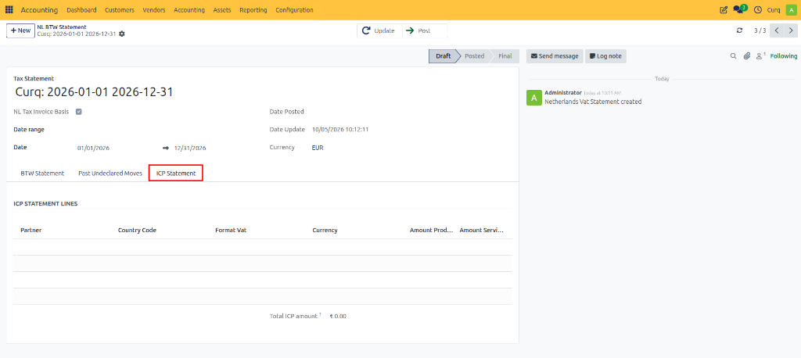

# ICP Declaration

An Intra-Community Transactions (ICP) Declaration is a report that businesses must submit when supplying goods or services to VAT-registered companies in other European Union (EU) member states.

The purpose of the ICP declaration is to inform the tax authorities about cross-border business transactions within the EU and to ensure that VAT is reported and applied correctly.

The declaration typically includes information about:
- **Intra-Community Deliveries (ICL)** – Goods supplied to businesses in other EU countries.
- **Intra-Community Services (ICS/ICD)** – Services provided to businesses located in other EU member states.

By reporting these transactions, tax authorities can verify that VAT has been accounted for correctly in both the supplier's and customer's countries.

Submitting ICP declarations accurately and on time is not only a legal requirement but also helps businesses:
- Comply with EU VAT regulations.
- Avoid penalties and corrective filings.
- Maintain accurate records of international trade.
- Ensure proper VAT treatment of cross-border transactions.

> [!NOTE]
> Additional information about ICP declarations can be found on the website of the Tax and Customs Administration under ICP Declaration.

---

## Creating an ICP Declaration

The ICP declaration in CURQ is generated based on the information contained in a submitted VAT return.

### Prerequisite
Before generating an ICP declaration:
1. Create and review the VAT return.
2. Mark the VAT return as **Submitted** (Sent).

Once the VAT return has been submitted, the ICP-related data becomes available.

### Accessing the ICP Declaration
Navigate to the **ICP Statement** tab within the VAT Return.

---

## Updating the Declaration

To retrieve the latest data:
1. Open the **ICP Statement** tab.
2. Click **Update**.

CURQ automatically gathers and calculates all eligible intra-community transactions recorded during the reporting period.

The declaration will include the information required for submission to the tax authorities, such as:
- Customer VAT numbers.
- Intra-community deliveries.
- Intra-community services.
- Reportable transaction amounts.

---

## Reviewing ICP Data

After updating the declaration, review the generated information carefully to ensure:
- All relevant EU transactions are included.
- Customer VAT numbers are correct.
- Reported amounts match the underlying invoices and accounting records.

The information displayed can then be used when completing the ICP declaration through the tax authority's reporting portal.

---

## Printing and Exporting

CURQ allows you to generate documentation for review and submission purposes.

Using the **Print** button, you can:
- Print the ICP declaration.
- Export the declaration to Excel.
- Save a copy for audit and reporting purposes.

---

## Confirming the Declaration

After submitting the ICP declaration to the tax authorities:
1. Return to the ICP declaration in CURQ.
2. Confirm the declaration within the system.

This provides an internal record that the ICP declaration has been completed and submitted.
