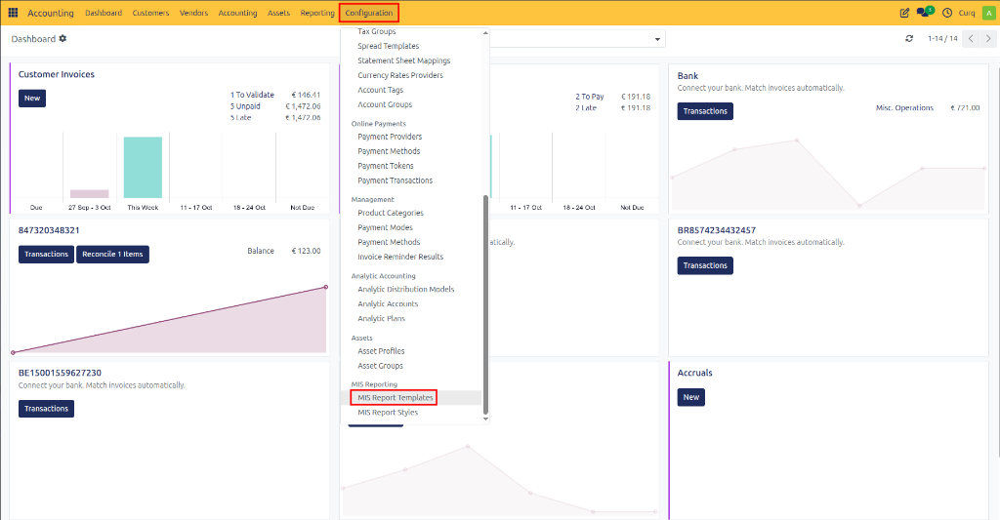
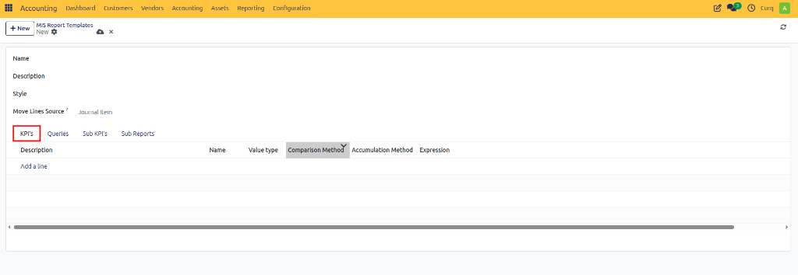
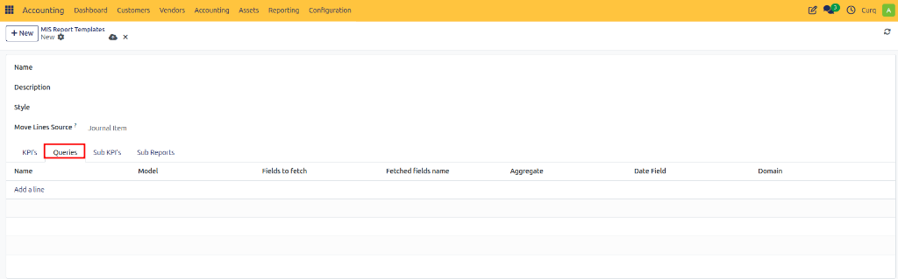
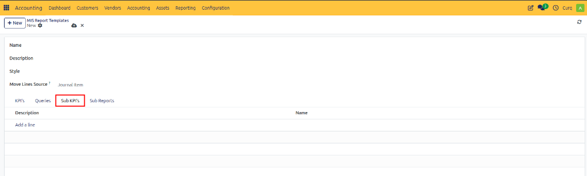
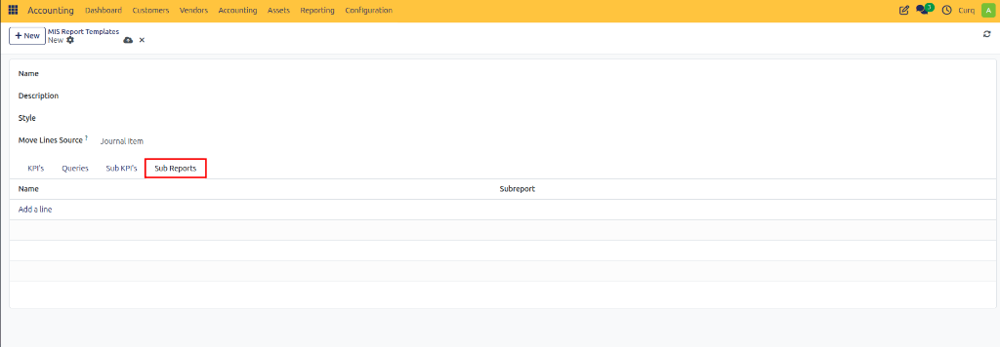

# Configure MIS Report Templates

## Overview
A MIS (Management Information System) Report Template serves as the foundation for creating management and financial reports within CURQ. It defines the structure, calculations, and presentation of report data by determining which financial information should be included, how values are calculated, and which Key Performance Indicators (KPIs) are displayed. The template also controls how data is grouped, accumulated, and compared across different periods, allowing organizations to analyze performance trends effectively. Additionally, MIS Report Templates can incorporate budgeting information for variance analysis and include subreports to provide more detailed insights, making them a powerful tool for financial reporting and business decision-making.

Navigate to:
**Accounting → Configuration → MIS Reporting Templates**

---

## General Fields

| Field | Description |
| :--- | :--- |
| **Name** | Name of the MIS report template. |
| **Description** | Explanation of the report purpose. |
| **Style** | Defines how the report is displayed and formatted. |
| **Move Lines Source** | Source of accounting data used in calculations. Usually Journal Items. |

---

## KPI's Tab
KPIs are the metrics displayed in the report.

### Fields

| Field | Description |
| :--- | :--- |
| **Description** | Internal explanation of the KPI. |
| **Name** | KPI name shown in the report. |
| **Value Type** | Determines whether the KPI shows an amount, percentage, quantity, etc. |
| **Comparison Method** | Defines how values are compared (Previous Period, Budget, Forecast, etc.). |
| **Accumulation Method** | Defines how values are accumulated over time (Sum, Average, End Balance, etc.). |
| **Expression** | Formula used to calculate the KPI. |
| **Budgetable** | Allows budgets to be linked to this KPI. |

---

## Queries Tab
Queries define where KPI data comes from. A query fetches accounting data from Odoo models.

### Fields

| Field | Description |
| :--- | :--- |
| **Name** | Query name. |
| **Model** | Odoo model used as data source. |
| **Fields to Fetch** | Fields retrieved from the model. |
| **Fetched Fields Name** | Alias names used in formulas. |
| **Aggregate** | How values are summarized (Sum, Average, Count, etc.). |
| **Date Field** | Field used for period filtering. |
| **Domain** | Filter conditions applied to the data. |

---

## Sub KPI's Tab
Sub KPIs are child metrics that belong to a main KPI. They help break down totals into detailed components.

### Fields

| Field | Description |
| :--- | :--- |
| **Description** | Explanation of the sub KPI. |
| **Name** | Sub KPI name displayed under the parent KPI. |

---

## Sub Reports Tab
Sub Reports allow multiple MIS reports to be combined into one report.

### Fields

| Field | Description |
| :--- | :--- |
| **Name** | Display name of the sub report. |
| **Subreport** | Linked MIS report template. |
