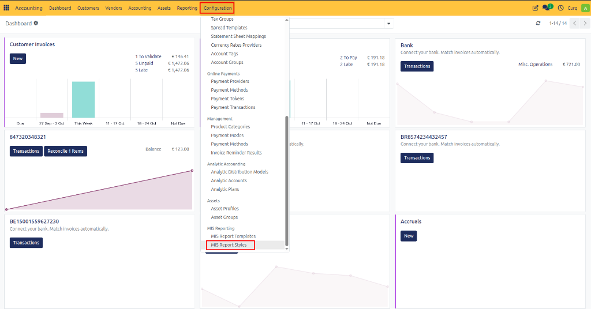
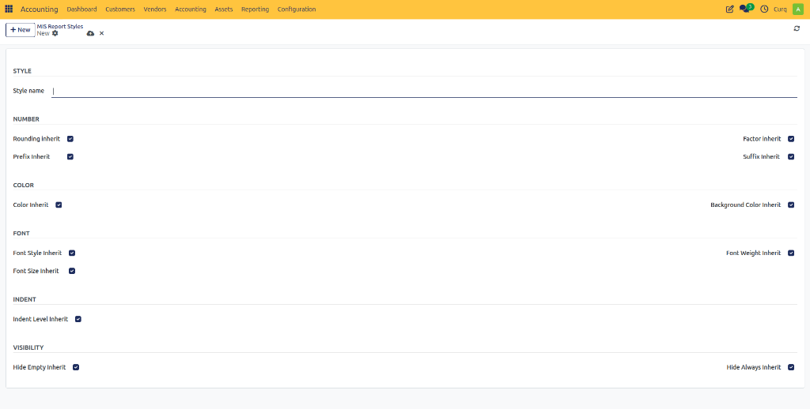

# Configure MIS Report Styles

## Overview
MIS Report Styles define the visual appearance and formatting of KPIs, sections, and values displayed in MIS reports. Styles allow you to control how information is presented by configuring number formatting, colors, fonts, indentation, and visibility options. By creating different styles, you can highlight important KPIs, emphasize totals, distinguish report sections, and improve the overall readability of management reports.

A style can be applied to individual KPIs, groups of KPIs, or report sections to ensure a consistent and professional report layout.

Navigate to:
**Accounting → Configuration → MIS Report Styles**

---

## Style Section

| Field | Description |
| :--- | :--- |
| **Style Name** | The name of the style. Use a descriptive name such as Revenue Highlight, Report Header, Total Line, or Warning KPI. |

---

## Number Formatting
These settings control how numerical values are displayed.

| Field | Description |
| :--- | :--- |
| **Rounding Inherit** | Inherits the rounding configuration from the parent style. |
| **Factor Inherit** | Inherits the scaling factor from the parent style (for example displaying values in thousands or millions). |
| **Prefix Inherit** | Inherits the value prefix from the parent style, such as € or $. |
| **Suffix Inherit** | Inherits the value suffix from the parent style, such as %, K, or M. |

---

## Color Settings
These settings define the text and background colors used in reports.

| Field | Description |
| :--- | :--- |
| **Color Inherit** | Uses the text color from the parent style. |
| **Background Color Inherit** | Uses the background color from the parent style. |

---

## Font Settings
These settings control the appearance of report text.

| Field | Description |
| :--- | :--- |
| **Font Style Inherit** | Inherits font style settings such as normal or italic. |
| **Font Weight Inherit** | Inherits font weight settings such as bold or regular. |
| **Font Size Inherit** | Inherits the font size from the parent style. |

---

## Indentation
Indentation helps organize report data into hierarchical levels.

| Field | Description |
| :--- | :--- |
| **Indent Level Inherit** | Inherits the indentation level from the parent style. |

---

## Visibility Settings
These settings determine whether certain report lines are shown or hidden.

| Field | Description |
| :--- | :--- |
| **Hide Empty Inherit** | Inherits the rule for hiding rows with no value or activity. |
| **Hide Always Inherit** | Inherits the rule that permanently hides specific report elements. |
