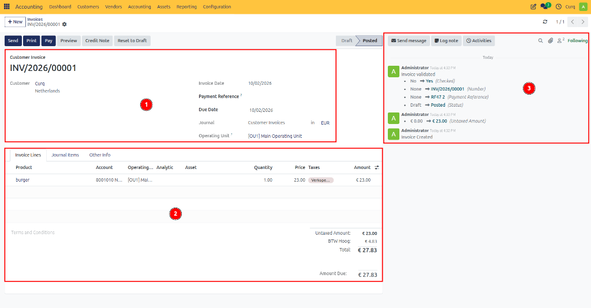
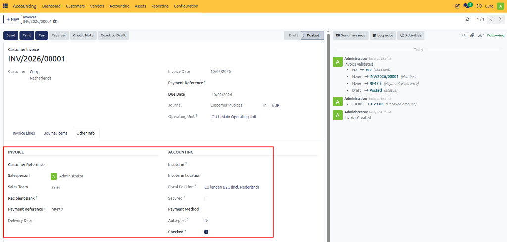
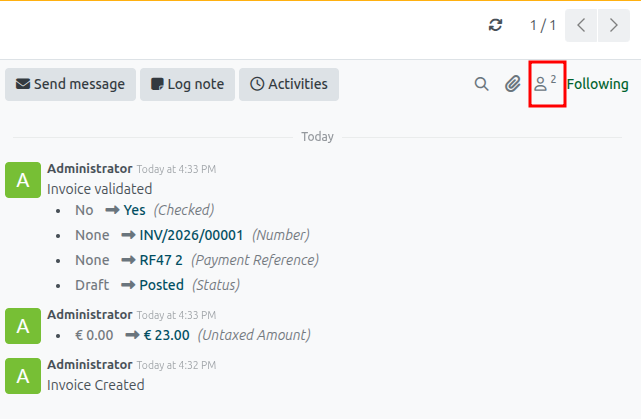
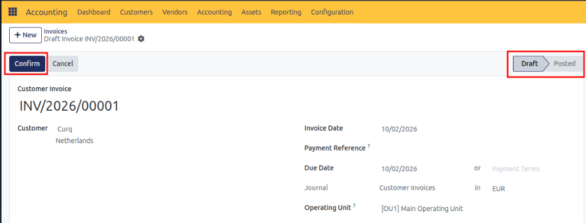
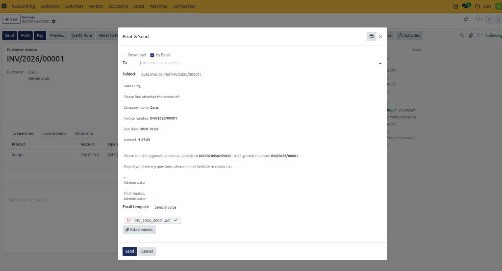
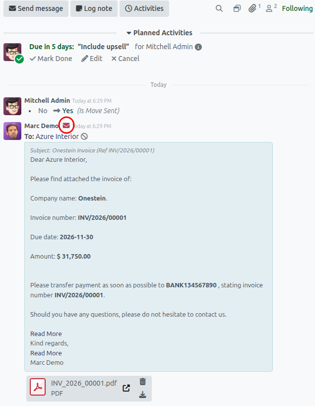

# Create Sales Invoices

## Overview

Creating invoices is an essential part of accurate bookkeeping. A clear and professional invoice reflects your company's identity and helps reduce payment issues by providing customers with complete and well-structured information.

With CURQ, you can easily create, customize, and send sales invoices. By configuring your company branding, such as logos, colors, and document layouts, every invoice can be aligned with your corporate identity.

---

## Create a Sales Invoice

Depending on your CURQ configuration, invoices can be created manually or generated automatically from sources such as Sales Orders or Website Orders.

To create a sales invoice manually, navigate to:

**Invoicing → Customers → Invoices**

This screen provides an overview of all customer invoices and their statuses.

To create a new invoice:
1. Click **New**.
2. Complete the invoice details.
3. Confirm the invoice.
4. Send the invoice to the customer.

If invoices were created in another system, you can import them using the **Upload** button.

The invoice form consists of three main sections:

### 1. Invoice Header Information

This section contains the primary invoice details.

| Field | Description |
| :--- | :--- |
| **Customer** | Select the customer receiving the invoice. If a delivery address is configured, it is automatically populated. |
| **Invoice Date** | Defines the invoice date. If left empty, CURQ uses the current date. |
| **Payment Reference** | Generated automatically when the invoice is confirmed. |
| **Payment Terms** | Defines the agreed payment conditions. CURQ automatically calculates the due date based on the selected payment terms. |
| **Due Date** | The latest date by which payment must be received. |
| **Journal** | Normally set to **Customer Invoices**. A journal is used to group accounting transactions by category. |

### 2. Invoice Lines

Invoice lines contain the products or services being invoiced.

| Field | Description |
| :--- | :--- |
| **Product** | Select a product or service. Products are optional but recommended because they automatically populate accounting and tax information. |
| **Description** | The description displayed on the invoice. This is automatically filled when a product is selected but can be modified. |
| **Account** | The General Ledger account to which revenue is posted. This can be configured automatically through products. |
| **Quantity** | Number of units sold. |
| **Unit Price** | Price per unit. |
| **Taxes** | CURQ automatically suggests the most appropriate VAT code based on the configuration. Only change this if a different tax rate applies. |
| **Subtotal** | Calculated as Quantity × Unit Price. |

#### Terms and Conditions
General terms can be displayed below the invoice lines. If your terms are published online, you may also provide a website reference.

#### Totals
The invoice totals are displayed on the right side and include:
- Untaxed Amount
- VAT Amount
- Total Amount

#### Journal Items Tab
The **Journal Items** tab displays the accounting entries generated by the invoice. This information is primarily intended for accountants and financial administrators.

#### Other Info Tab
The **Other Info** tab contains additional operational and accounting information.

| Field | Description |
| :--- | :--- |
| **Customer Reference** | Stores customer-specific references such as Purchase Order numbers, Project references, or Department names. This information is also printed on the invoice. |
| **Salesperson** | Employee responsible for the sale. Used for reporting and performance tracking. |
| **Sales Team** | Associated sales team. |
| **Recipient Bank** | Used when collecting payments through direct debit. |
| **Payment Reference** | Unique payment identifier. |
| **Delivery Date** | Date on which goods or services were delivered. |
| **Delivery Conditions** | Defines delivery agreements. |
| **Incoterms** | International Commercial Terms used for international trade. |
| **Incoterm Location** | Specifies the location associated with the selected Incoterm. |
| **Fiscal Position** | Determines the VAT and tax rules applied to the invoice. |
| **Payment Method** | Expected payment method. |
| **Automatic Posting** | Allows invoices to be posted automatically at a future date. This is especially useful for recurring invoices such as monthly subscriptions. |
| **To Be Checked** | Marks the invoice for review by another user or accountant. |
| **Secured** | Indicates whether the invoice is protected according to accounting regulations. |

### 3. Invoice Activity and Communication

The lower section of the invoice contains the activity log (chatter). All important actions performed on the invoice are tracked here.

- **Send Message**: Send an email directly to the customer.
- **Log Note**: Create an internal note visible only to company users.
- **Activities**: Schedule tasks, reminders, meetings, or follow-up actions.
- **Followers**: Contacts and employees can follow the invoice and receive notifications when changes occur.

---

## Confirm the Invoice

When the invoice is complete, click:
**Confirm**

Once confirmed:
- The invoice is posted to the accounting system.
- Accounting entries are generated automatically.
- The invoice status changes to **Posted**.

---

## Print or Modify an Invoice

After posting, additional actions become available.

- **Print**: Use the **Print** button to generate a PDF version of the invoice.
- **Reset to Draft**: If corrections are required, click **Reset to Draft**. This allows modifications before reconfirming the invoice.

---

## Send the Invoice

To send the invoice to the customer:
Click **Send & Print**.

If no customer email address is available, CURQ will prompt you to enter one.

Before sending, you can:
- Review the email
- Modify the message
- Personalize the content
- Select the correct document attachment

CURQ sends the invoice as a PDF attachment.

### Save as Template
If you create a customized email message, you can save it as a reusable template by selecting **Save as New Template**.

### Track Sent Emails
After an invoice is sent:
- The email activity is logged automatically.
- The sent message appears in the invoice chatter.
- The envelope icon shows the delivery status.

By opening the envelope status, you can review delivery information and take corrective action if necessary.

This provides a complete audit trail of invoice creation, approval, communication, and accounting activity within CURQ.
