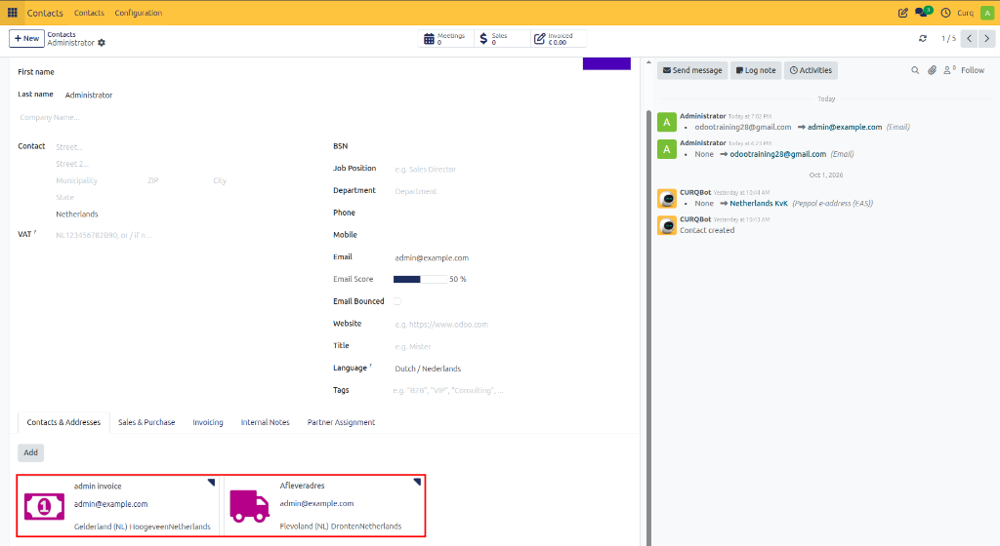
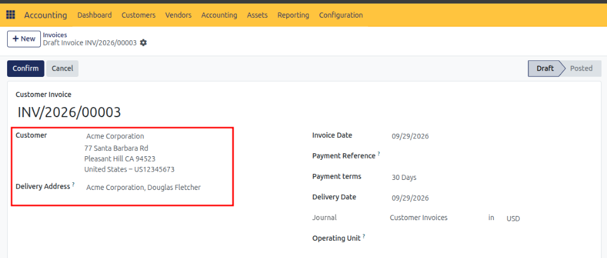
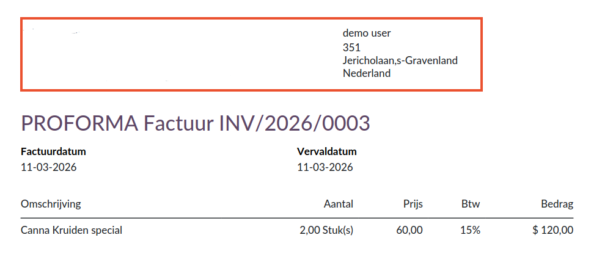
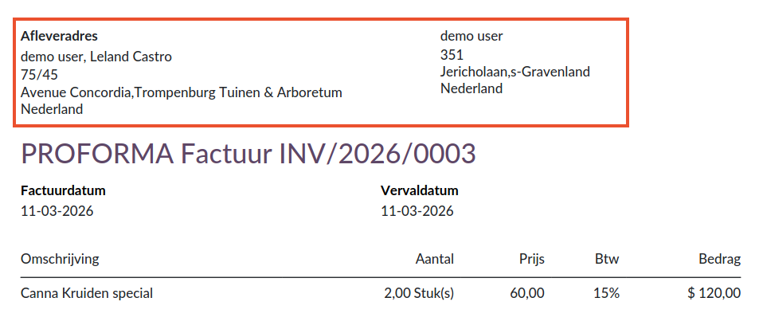

# Sales Invoices: Delivery Address and Billing Address

## Overview

CURQ allows you to manage customers with multiple addresses and contact details. Many companies use separate addresses for invoicing, deliveries, warehouses, or administrative departments. CURQ supports these scenarios by allowing different Billing Addresses and Delivery Addresses to be assigned to a contact.

The configured addresses can be viewed from the contact record under:

**Contacts → Contacts & Addresses**

A Delivery Address is identified by the truck icon, while a Billing Address is identified by the banknote icon.

> [!NOTE]
> For information on creating and managing contact addresses, refer to the Contacts documentation.

---

## Sales Orders

If you use the Sales module, billing and delivery addresses can also be managed directly through sales orders. The selected addresses are automatically carried forward to related documents, such as deliveries and invoices.

> [!NOTE]
> For more information, refer to the Sales Orders documentation.

---

## Sales Invoices

When creating a sales invoice, you must select a customer. The selected customer determines which billing and delivery addresses are used on the invoice.

### Billing Address

The selected customer address is used as the Billing Address and appears on the invoice as the invoice recipient.

**Recommendations:**
- If the customer has only one address, select the main contact.
- If the customer has multiple addresses, it is recommended to select the dedicated Billing Address instead of the general contact address.
- Invoices and invoice-related communications are sent to the billing contact.

### Delivery Address

The Delivery Address is automatically populated based on the selected customer record.

If no separate delivery address is configured, CURQ automatically uses the main contact address. A different delivery address can also be selected manually when required.

**Common Use Cases for Separate Delivery Addresses:**
- Deliveries to a warehouse
- Deliveries to a branch office
- Third-party logistics providers
- Dropshipping scenarios

For example:
- The invoice is sent to a customer such as Bol.com.
- The goods are delivered directly to the end consumer.

In this case, the Billing Address and Delivery Address are different.

---

## Invoice Examples

### Billing Address and Delivery Address Are the Same

If no separate delivery address is configured, CURQ uses the same address for both billing and delivery purposes.

### Billing Address and Delivery Address Are Different

When a separate delivery address is specified, CURQ displays both addresses on the invoice.

This provides clarity regarding:
- Who receives the invoice
- Where the goods or services are delivered

---

## Benefits of Using Separate Addresses

Using separate billing and delivery addresses helps ensure:
- Accurate invoice processing
- Correct delivery information
- Better support for B2B customers
- Efficient warehouse and logistics management
- Support for dropshipping and third-party deliveries

By maintaining accurate address information in customer records, CURQ can automatically apply the correct billing and delivery details throughout the sales and invoicing process.
