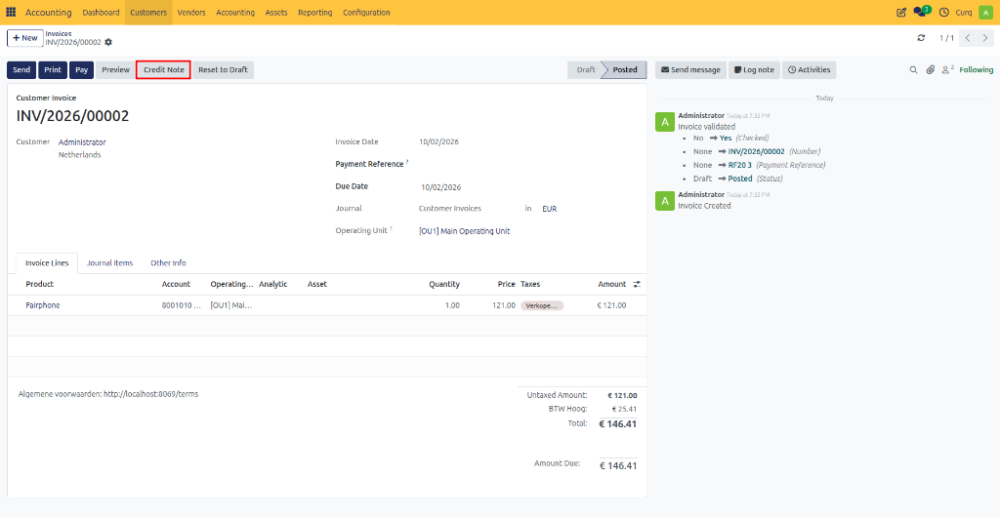
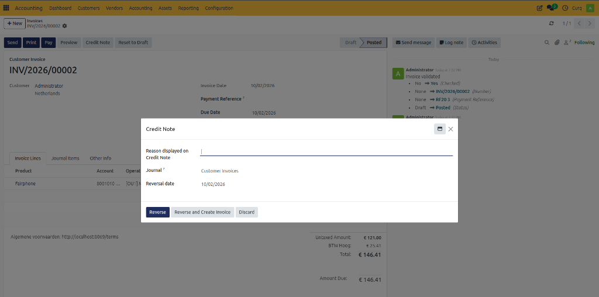
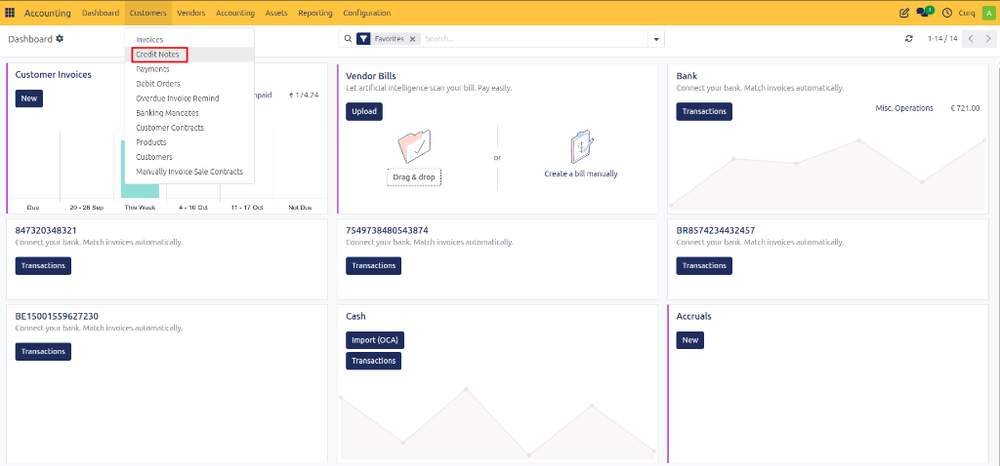

# Create Credit Notes

## Overview

Credit notes play an important role in maintaining accurate financial records. They are used to correct invoicing mistakes, process refunds, and handle returns or cancelled orders. By issuing a credit note, businesses can ensure that accounting records remain accurate and that customers receive the correct financial adjustments.

Common situations where a credit note is required include:
- Correcting invoice errors such as incorrect quantities, prices, or VAT amounts.
- Processing returns when customers return purchased products.
- Cancelling orders after an invoice has already been issued.
- Providing refunds or adjustments based on customer agreements.

---

## Create a Credit Note from a Sales Invoice

The easiest way to create a credit note is directly from an existing sales invoice.

Navigate to:

**Invoicing → Customers → Invoices**

Open the invoice you want to correct and click **[Create Credit Invoice]** (or **[Credit Note]**) at the top of the invoice.

After clicking the button, a dialog window appears with several options for creating the credit note.

### Credit Methods

CURQ provides several methods for creating credit notes:

| Method | Description |
| :--- | :--- |
| **Partial Credit** | Use this option when only part of the invoice needs to be corrected. CURQ creates a draft credit note based on the original invoice. Invoice lines are copied, and amounts remain positive. You can modify quantities, prices, or lines. The credit note must be reviewed and confirmed before sending. |
| **Full Credit** | Use this option when the entire invoice must be cancelled. CURQ creates a credit note containing all invoice details, which is automatically posted and reconciled with the original invoice. Neither remains outstanding, and only customer communication is needed. |
| **Full Credit and New Draft Invoice** | Use this option when the original invoice is completely incorrect and a replacement is required. CURQ creates a credit note to cancel the original invoice, then generates a new draft invoice based on the original. You can edit the new invoice and send the corrected version to the customer. |

### Additional Options

| Field | Description |
| :--- | :--- |
| **Reason** | Enter the reason for the credit note. This reason is stored on the credit note, appears in the Other Info tab, is printed on the PDF, and helps explain the correction to the customer. |
| **Credit Date / Reversal Date** | Choose how the accounting date is determined. Select **Booking Date** for CURQ to automatically use the current date, or **Specific Date** to select a custom accounting date. |
| **Journal** | Select the journal in which the credit note will be recorded. The default **Customer Invoices** journal is usually sufficient. |

### Finalize the Credit Note

After the credit note has been created:
1. Review the invoice lines.
2. Adjust quantities, prices, or descriptions if necessary.
3. Click **Confirm** to post the credit note.
4. Send the credit note to the customer via email or PDF.

Once confirmed, the credit note is recorded in the accounting system and linked to the original invoice.

---

## Create a Separate Credit Note

In some situations, you may need to create a credit note independently from a sales invoice. This can be useful when:
- Multiple invoices are involved.
- A refund is required that is not linked to a single invoice.
- Special agreements have been made with a customer.

Navigate to:

**Invoicing → Customers → Credit Invoices**

Creating a separate credit note follows the same process as creating a sales invoice.

### Important Guidelines

- Enter all amounts as **positive values** to ensure correct accounting processing.
- If negative lines are added, ensure that the total document amount never becomes negative.
- Complete the customer information, invoice lines, taxes, and accounting details as required.
- Confirm and send the credit note in the same way as a standard invoice.

Once posted, the credit note becomes part of your accounting records and can be used to process refunds, returns, or invoice corrections.
