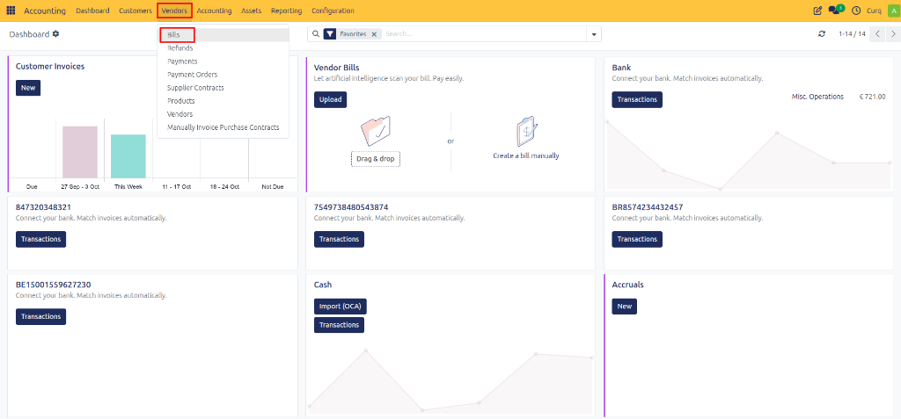
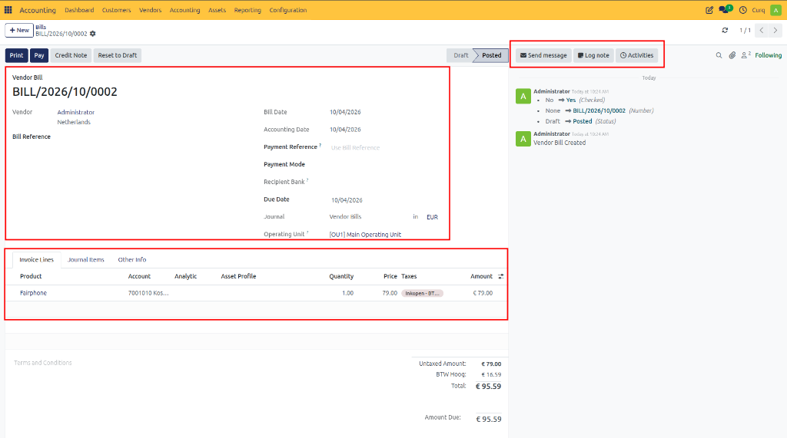
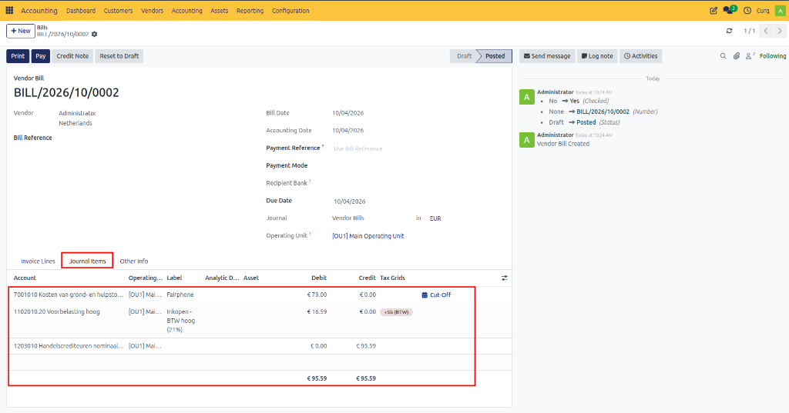
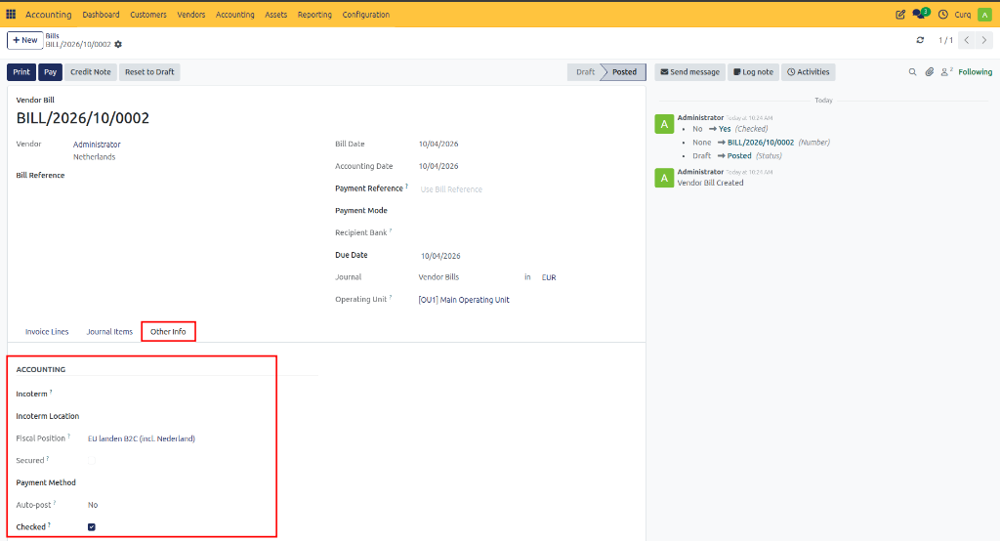

# Create a Supplier Invoice (Vendor Bill)

## Overview

Supplier invoices, also known as vendor bills, are used to record purchases made from suppliers and track amounts that need to be paid. In CURQ, supplier invoices can be created manually, uploaded from a PDF document, imported from email, or generated from purchase orders. Properly recording supplier invoices ensures accurate accounting, VAT reporting, and payment management.

---

## Access Supplier Invoices

To create or manage supplier invoices, open the Invoicing/Accounting module and navigate to:

**Suppliers → Supplier Invoices** (Vendor Bills)

You can either:
- Upload a supplier invoice received as a PDF document.
- Click **[New]** to manually create a supplier invoice.

---

## Creating a Supplier Invoice

The supplier invoice form is divided into several sections where general invoice information can be entered.

### General Information

- **Supplier:** Select the supplier from the list. The supplier’s address and related information are automatically populated.
- **Invoice Reference:** Enter the invoice number or reference provided by the supplier. This reference is useful for payment processing and supplier communication.
- **AutoComplete:** Use this option to automatically retrieve information from existing purchase orders or previous supplier invoices. *(When a purchase order is selected, CURQ automatically copies the purchase order lines into the invoice. Multiple purchase orders can be linked to a single supplier invoice.)*
- **Invoice Date:** Enter the supplier's invoice date. This field is mandatory. The accounting date is automatically set to the current date but can be adjusted if required.
- **Payment Reference:** Select the payment method that will be used to pay the invoice, such as SEPA, Credit Card, iDEAL, or Bank Transfer. *(When using SEPA payments, ensure the supplier's bank account is configured.)*
- **Due Date:** Indicates the latest date by which the invoice must be paid. If payment terms are configured on the supplier record, CURQ automatically applies them to the invoice.

### Invoice Lines

The Invoice Lines section contains the detailed information of the supplier invoice.

- **Product:** Select a product or service if products are managed within CURQ. Products are optional but recommended because they can automatically determine expense accounts, taxes, and product descriptions.
- **Description / Label:** Appears on the invoice line and explains what was purchased. When a product is selected, CURQ automatically fills in the description, but it can be edited if necessary.
- **Account:** Select the appropriate general ledger account. This determines where the expense will be recorded in the accounting system. When products are used, CURQ can automatically suggest the correct account.
- **Quantity:** Enter the quantity purchased.
- **Unit Price:** Enter the price per unit.
- **VAT:** CURQ automatically proposes the most appropriate VAT code based on the supplier and product configuration. Only change the VAT code if a different tax treatment applies.
- **Subtotal:** Automatically calculated (`Quantity × Unit Price`).

#### Terms and Conditions
The invoice can include standard terms and conditions. If these terms are available on your website, consider referring to the website instead of including lengthy text directly on invoices.

#### Totals
The totals section displays:
- Untaxed amount
- VAT amount
- Total invoice amount

---

## Journal Entries (Booking Rules)

The **Journal Items** or **Booking Rules** tab shows the accounting entries generated by the supplier invoice. Typical entries include expense accounts, VAT accounts, and accounts payable accounts. 

This section allows accountants and finance teams to verify that transactions are posted correctly.

---

## Other Information

The **Other Information** tab contains additional settings related to the invoice.

- **Delivery Terms:** If Incoterms are relevant to the purchase, they can be entered here. CURQ includes the most commonly used Incoterms by default.
- **Fiscal Position:** Defines the VAT treatment and tax regime applicable to the invoice.
- **Auto-Post:** Available only while the invoice remains in draft status. This feature allows you to schedule a future posting date, automatically post recurring invoices, or automate repetitive monthly invoices.
- **To Be Checked:** Enable this option when an invoice requires additional review (e.g., missing information, unusual amounts, accountant verification). Invoices marked as "To Be Checked" can easily be identified and reviewed later.

---

## PDF Invoice Preview

When a supplier invoice PDF is uploaded, CURQ displays a PDF preview on the right side of the screen. This feature helps users verify invoice information while entering accounting data. 

The preview makes it easier to review supplier details, invoice amounts, invoice dates, VAT information, and payment references. This significantly improves the speed and accuracy of invoice processing. 

> [!NOTE] 
> The PDF preview may not appear on smaller screens due to limited display space.

### Available PDF Viewer Controls
- **Page Navigation:** Move between pages when the PDF contains multiple pages.
- **Zoom Controls:** Zoom in or out to inspect invoice details more clearly.
- **Print or Download:** Print the document or download a local copy.
- **Multiple Attachments Navigation:** If several PDF files are attached, use the navigation controls to switch between documents.

If the PDF supports text selection, information can be copied directly from the document and pasted into invoice fields, making data entry faster and reducing errors.

*[Image placeholder: Invoice Preview]*

---

## Invoice Communication and Activity Log

The **Chatter** section at the bottom of the invoice records all activity related to the document. This includes status changes, user actions, emails, notes, and activities. If email integration is enabled, replies from suppliers can also appear in this section.

- **Send Message:** Send an email directly from the invoice.
- **Log Note:** Create an internal note visible only to employees. Internal notes are not visible to suppliers.
- **Activities:** Schedule activities such as follow-up tasks, approval requests, phone calls, or meetings.
- **Followers:** Contacts and employees can follow the document. Followers automatically receive notifications about changes based on their subscription preferences.

*[Image placeholder: Invoice Chatter]*

---

## Confirming the Invoice

After all invoice information has been entered and verified:
1. Review the invoice details.
2. Verify accounting entries.
3. Confirm taxes and payment terms.
4. Click **[Confirm]**.

*[Image placeholder: Confirm Invoice]*

Once confirmed, the invoice becomes an official accounting document. After confirmation, you can register a payment, create a credit note, view journal entries, or return the invoice to draft status (if permitted) for corrections.

---

## Ways to Create a Supplier Invoice

Supplier invoices can be created through several methods:

1. **Invoice Email Alias:** Send the supplier invoice PDF to the company's invoice processing email address. The email address can be found in `Invoicing → Dashboard`.
2. **Upload from Dashboard:** Use the **Upload** button on the Invoicing dashboard.
3. **Upload from Supplier Invoices:** Navigate to `Invoicing → Suppliers → Supplier Invoices` and select **Upload**.
4. **Create Manually:** Navigate to `Invoicing → Suppliers → Supplier Invoices` and click **New**. When using the manual method, the PDF invoice can still be attached afterward through the attachment section.

---

## Reviewing Accounting Entries from Booking Rules

Accountants often review invoices through the generated journal entries rather than the invoice form itself. CURQ allows users to review accounting transactions and, when required, open the related invoice document for verification.

This helps answer questions such as:
- Was the invoice booked to the correct expense account?
- Was the VAT recorded correctly?
- Was the supplier selected correctly?
- Are the amounts consistent with the original invoice?

You can access the booking rules overview through:

**Invoicing → Accounting → Booking Rules** (or Journal Items)

This provides an efficient way to audit and verify supplier invoice postings without opening every individual invoice.
