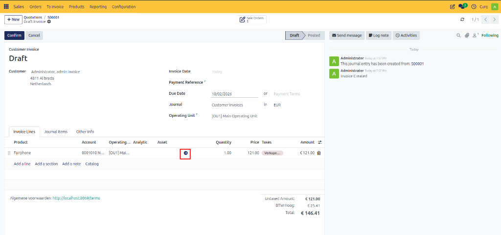
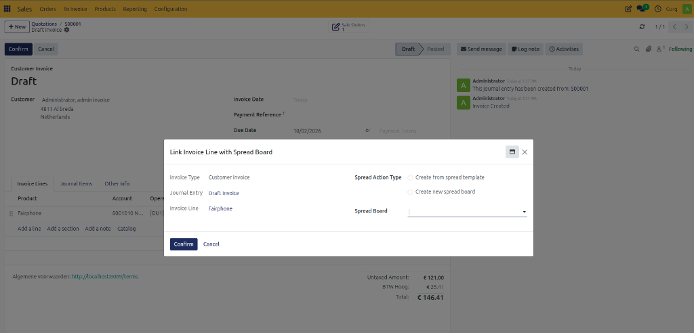
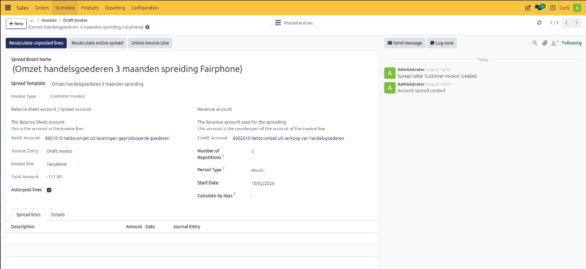
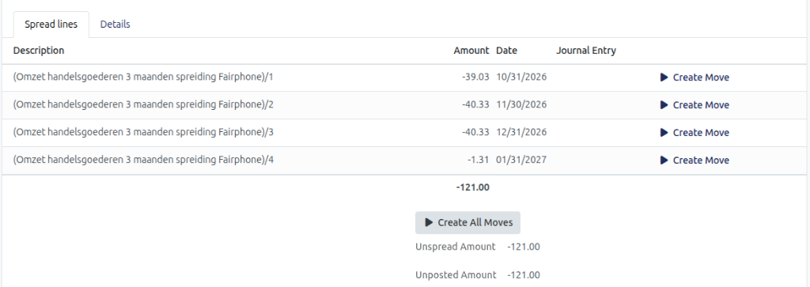

# Manage Spreading Costs/Revenues

## Spread Revenue from a Sales Invoice

Revenue can be spread directly from an invoice line. Revenue spreading can only be configured while the invoice remains in Draft status.

Navigate to the invoice line and click the **Revenue Spread icon** (circular arrow).

A configuration window will appear.

### Spread Action Type

This determines how the spread table will be created.

| Action Type | Description |
| :--- | :--- |
| **Link Invoice Line to Existing Spread Table** | Use this option when a spread table has already been created manually and needs to be linked to the invoice line. |
| **Create from Spread Template** | Creates the spread automatically using a predefined spread template. All settings are inherited from the selected template. |
| **Create New Spread Table** | Creates a completely new spread table manually. You must define the Revenue Account, Balance Sheet Account, Journal, and Spread Settings. |

After selecting and confirming the desired option, CURQ opens the corresponding Spread Table.

---

## Spread Table

A Spread Table contains the detailed schedule showing how revenue or expenses are recognized over time.

Spread tables can be:
- Generated automatically from invoices
- Generated from templates
- Created manually

Navigate to:

**Invoicing → Accounting → Cost / Revenue Spread**

### Spread Table Fields

| Field | Description |
| :--- | :--- |
| **Spread Table Name** | Name of the spread record. |
| **Spread Template** | Displays the linked spread template. |
| **Invoice** | Shows the invoice linked to the spread. |
| **Invoice Line** | Displays the specific invoice line associated with the spread. |
| **Total Amount** | The total amount that will be distributed across periods. |
| **Revenue Account** | The account where revenue will be recognized gradually. |
| **Balance Sheet Account** | The deferred revenue account used during the spreading period. |
| **Journal** | Journal used for posting spread entries. |
| **Auto-Post Lines** | When enabled, accounting entries are posted automatically. When disabled, entries remain in Draft status until manually posted. |
| **Start Date** | Defines the start of the spread schedule. For monthly spreads, entering the first day of the month ensures the first spread is recognized entirely within that month. |

---

## Managing Spread Tables

Once all configuration is completed, CURQ can calculate the spread schedule. You have several options to manage the spread calculation:

### Recalculate Unbooked Lines
**[RECALCULATE UNBOOKED LINES]**
Recalculates only lines that have not yet been posted. Useful when changes are made after some entries have already been created.

### Recalculate Full Spread
**[RECALCULATE FULL SPREAD]**
Completely rebuilds the spread table. 
> [!WARNING]
> Existing posted entries are removed and recreated. Use only when necessary.

### Undo Spread
**[UNDO SPREAD]**
Removes all spread calculations and allows you to start over.

### Unlink Invoice Line
**[UNLINK INVOICE LINE]**
Removes the connection between the invoice line and the spread table. Useful when an incorrect spread table has been assigned.

---

## Spread Lines and Accounting Entries

After calculation, CURQ automatically generates entries in the **Spread Lines** tab.

Each line represents a future revenue recognition entry and contains:
- Recognition Date
- Amount
- Revenue Account
- Status
- Journal Entry

### Create Accounting Entries

- **Create Move**: Click **[CREATE MOVE]** to create the accounting entry for a single spread line. You can review the generated journal entry and delete it if required.
- **Create All Moves**: Click **[CREATE ALL MOVES]** to generate accounting entries for all spread lines at once. This is useful when you want to process the entire spread schedule immediately.

If **Auto-Post Lines** is enabled, CURQ can automatically create and post these entries according to the configured schedule.
