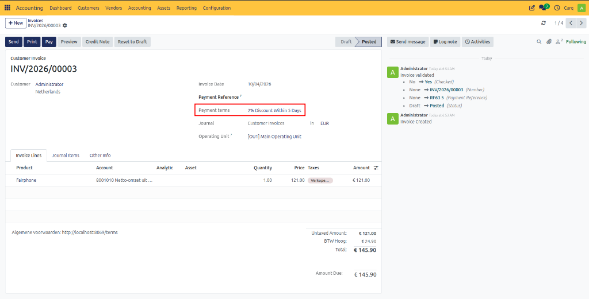
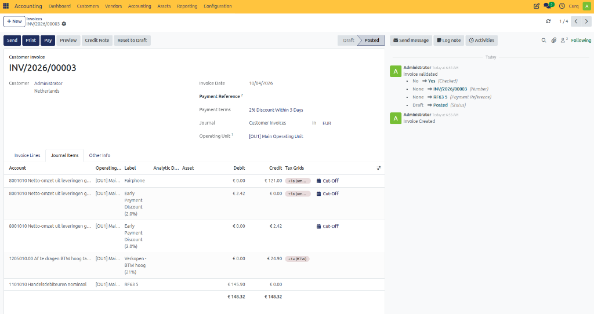

# Manage Payment Terms

## Example: Customer Payment Discount

Assume you create a sales invoice for €100 on 2 January.
- Full payment is due within 30 days.
- A 2% discount is offered if payment is received within 5 days.

This means:
- The customer can pay €98 until 7 January.
- After that date, the full amount of €100 must be paid by 31 January.

After selecting the payment term on a customer invoice, CURQ automatically calculates:
- Discount amount
- Discount deadline
- Due date
- VAT amounts
- Accounting entries

---

## Viewing Discount Details

On the **Journal Items** tab of the invoice, you can view the payment discount information. 

Display the following columns to see the discount period and the amount eligible for discount:
- **Discount Date**
- **Discount Amount**

The discount amount and discount deadline can also be printed on customer invoices. To display this information, enable the **Show Terms on Invoice** setting within the corresponding payment term configuration.

---

## Payment Registration

If the customer pays the discounted amount within the allowed period, CURQ automatically proposes posting the difference to the configured Payment Difference Account when registering the payment directly from the invoice.

> [!TIP]
> If payments are processed through imported bank statements, it is recommended to create a Reconciliation Model to automatically write off the payment difference.
