# Configure and Manage Assets

## Overview

Asset management in financial accounting involves tracking and managing everything a company owns, from physical equipment and buildings to technological resources and financial investments. Proper asset management starts with accurately recording each asset and assigning the correct value to it.

Over time, assets may lose value due to wear and tear, aging, or technological obsolescence. To reflect this decrease in value, companies apply depreciation, which gradually reduces the recorded value of the asset in the accounting records. This ensures that financial statements accurately represent the current value of company assets.

Asset management also helps organizations comply with accounting standards and reporting requirements while providing insight into the value and performance of company assets.

### Examples of Assets
Common assets recorded in accounting include:
- Buildings
- Machinery
- Vehicles
- Land
- Computer equipment

These assets are recorded on the balance sheet and contribute to the overall value of the business.

### Example: Depreciation Calculation
Suppose a company purchases a machine for €10,000 with:
- Estimated useful life: 5 years
- Residual value: €2,000

The annual depreciation is calculated as:
**Depreciation per year = (Purchase Value − Residual Value) ÷ Useful Life**
(€10,000 − €2,000) ÷ 5 = €1,600

The machine is therefore depreciated by €1,600 per year.

After the first year:
- Purchase value: €10,000
- Depreciation: €1,600
- Book value: €8,400

This process continues until the asset reaches its residual value of €2,000.

---

## Asset Groups

Asset Groups are used to organize assets into categories. Grouping assets provides a clear overview and improves reporting.

Navigate to:

**Invoicing → Configuration → Asset Groups**

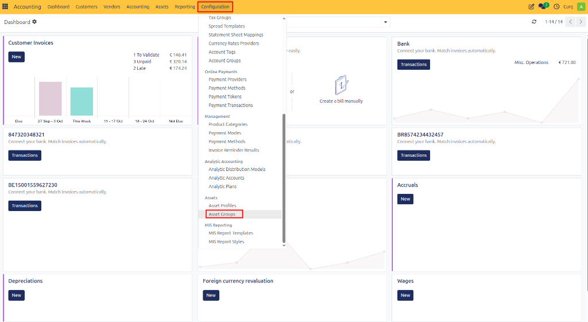

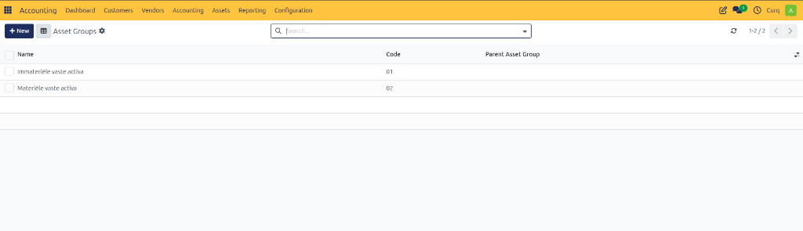

### Fields
- **Name:** Name of the asset group.
- **Code:** Short code used to identify the group.
- **Parent Asset Group:** Link the group to a parent group to create a hierarchical structure.

---

## Asset Profiles

Asset Profiles define how assets are depreciated and which accounting accounts are used. Profiles can also be linked to products so that assets are created automatically from supplier invoices.

Navigate to:

**Invoicing → Configuration → Asset Profiles**

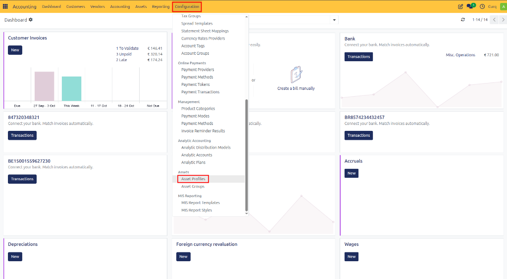

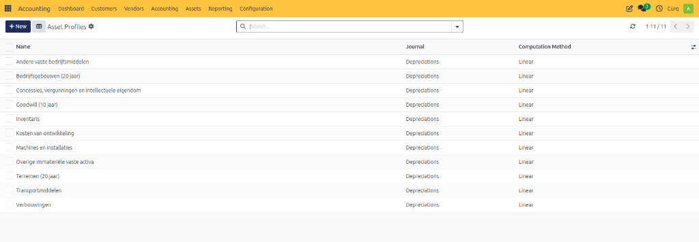

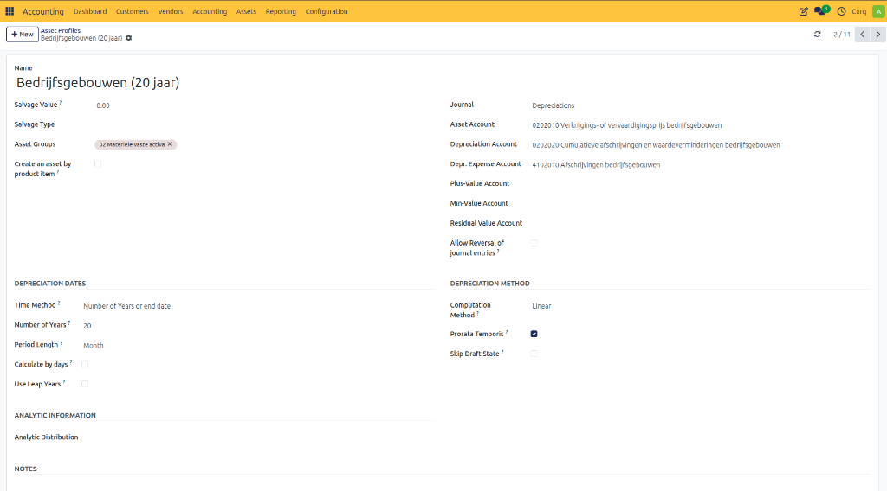

### General Information
- **Name:** Name of the asset profile.
- **Asset Group:** Asset group linked to the profile.
- **Create an Asset per Product:** Creates separate assets based on products in invoice lines.
- **Journal:** Journal used for depreciation entries.

### Value Settings
- **Salvage Value:** Estimated value of the asset at the end of its useful life.
- **Salvage Type:**
  - *Fixed* – Fixed residual value amount.
  - *Percentage of Price* – Residual value calculated as a percentage of the purchase value.

### Accounting Accounts
- **Asset Account:** Balance sheet account where the asset value is recorded.
- **Depreciation Account:** Accumulated depreciation account.
- **Depreciation Expense Account:** Expense account used for periodic depreciation costs.
- **Positive Value Account:** Account used for gains on asset disposal.
- **Negative Value Account:** Account used for losses on asset disposal.
- **Residual Value Account:** Account used for the residual value of the asset.

### Depreciation Configuration
- **Allow Reversal of Journal Entries:** Allows reversing entries instead of deleting them.
- **Time Method:** Define depreciation based on years, end date, or number of depreciations.
- **Number of Years:** Useful life of the asset.
- **Period Length:** Monthly, quarterly, or yearly depreciation.
- **Calculate by Days:** Calculates depreciation using actual calendar days.
- **Use Leap Years:** Includes leap years in calculations.

### Calculation Methods
- **Linear:** Depreciation Basis ÷ Number of Depreciations
- **Linear Limit:** Depreciates linearly until the residual value is reached.
- **Declining Balance:** Residual Value × Declining Balance Factor
- **Declining Balance – Linear:** Switches from declining balance to linear depreciation when linear depreciation becomes higher.
- **Declining Balance Limit:** Declining balance depreciation until the residual value is reached.

### Additional Options
- **Prorata Temporis:** Calculates the first depreciation based on the exact start date.
- **Skip Draft Status:** Automatically activates assets created from invoices.
- **Analytic Information:** Analytic data applied to the asset.

---

## Create Assets

Assets can be created manually.

Navigate to:

**Invoicing → Assets → Assets**

Click **[New]** to create an asset.

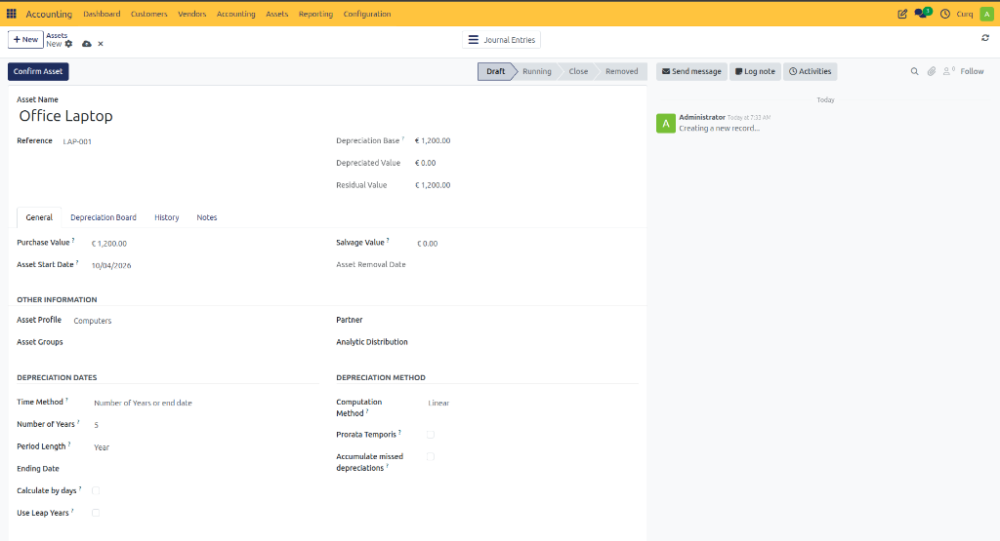

### Main Fields
- **Name:** Asset name.
- **Reference:** Internal reference or code.
- **Depreciation Base Amount:** Amount used to calculate depreciation.
- **Depreciated Value:** Total depreciation booked so far.
- **Residual Value:** Remaining value after depreciation.

### General Tab
The following information can be configured on the General tab:
- Purchase Value
- Asset Start Date
- Residual Value
- Asset Removal Date
- Asset Profile
- Asset Group
- Partner
- Analytic Information
- Time Method
- Number of Years
- Period Length
- End Date
- Calculate by Days
- Use Leap Years
- Calculation Method
- Prorata Temporis
- Accumulate Missed Depreciation

### Depreciation Schedule
After entering all information, click **[CALCULATE]**. CURQ generates the complete depreciation schedule and displays all depreciation entries.

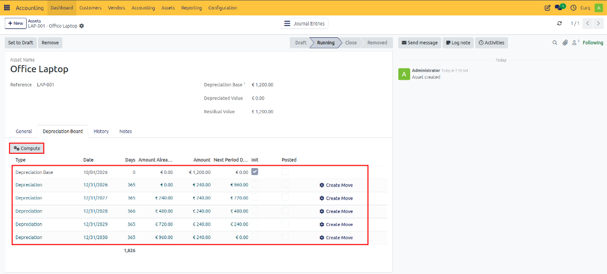

You can:
- Review calculated depreciations.
- Modify depreciation lines if necessary.
- Delete depreciation lines before activation.

> [!NOTE]
> In most cases, manual adjustments are not required.

---

## Activate Assets

Once the depreciation schedule has been verified, click **[CONFIRM ASSET]**.

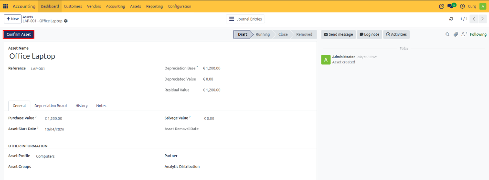

After confirmation:
- The asset becomes active.
- Depreciation entries are posted according to the schedule.
- Posted depreciations appear in the **Depreciation Card** tab.

From the Depreciation Card, you can:
- Review depreciation details.
- Open related journal entries.
- Reverse or delete entries when permitted.

> [!TIP]
> The **History** tab contains all accounting entries related to the asset.
>
> 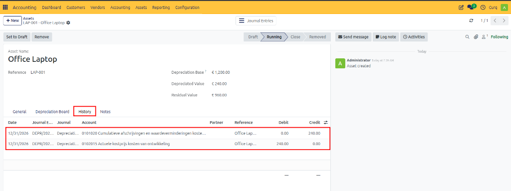

---

## Sell or Remove Assets

When an asset is sold or removed, CURQ calculates any gain or loss based on the difference between the asset’s book value and sale value. 

Use the **[REMOVE]** button to dispose of an asset.

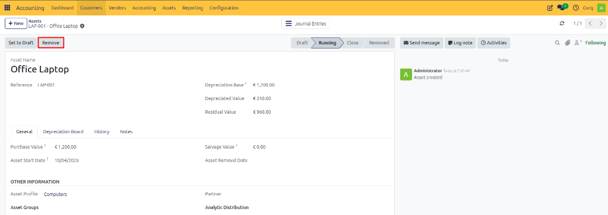

### Disposal Fields

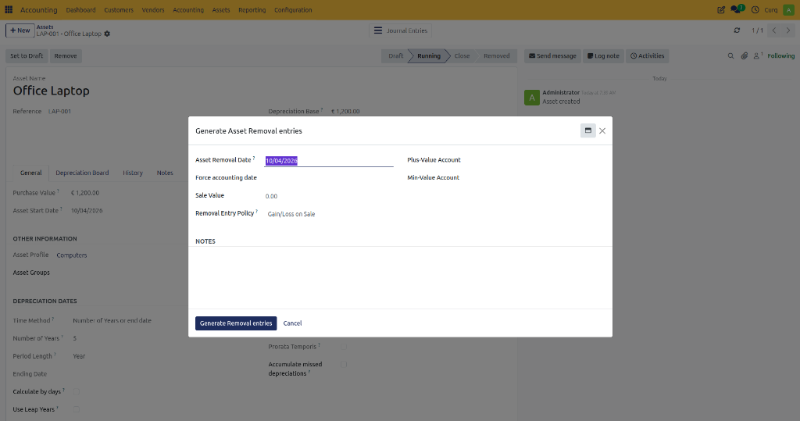
- **Asset Removal Date**
- **Force Accounting Date**
- **Sale Value**
- **Asset Sales Account**

### Disposal Policy
- **Residual Value:** Removes the asset using the remaining book value only.
- **Profit/Loss on Sale:** Calculates and records profit or loss based on sale value and book value.

### Accounting Accounts
- **Residual Value Account**
- **Positive Value Account**
- **Negative Value Account**

After disposal:
- The asset status changes to **Removed**.
- The removal date is recorded.
- Related journal entries are available in the Depreciation Card and History tabs.

---

## Record Depreciation Manually

CURQ can automatically post depreciation entries, but you can also process depreciation manually.

Navigate to:

**Invoicing → Assets → Calculate Assets** (Compute Assets)

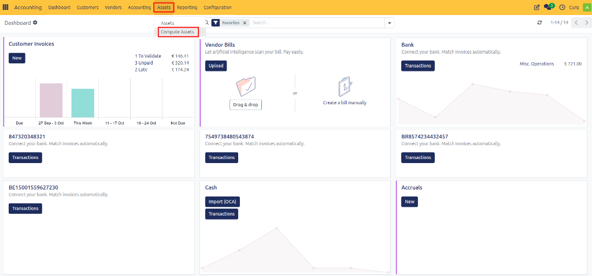

All depreciation entries up to the selected date will be generated and posted.

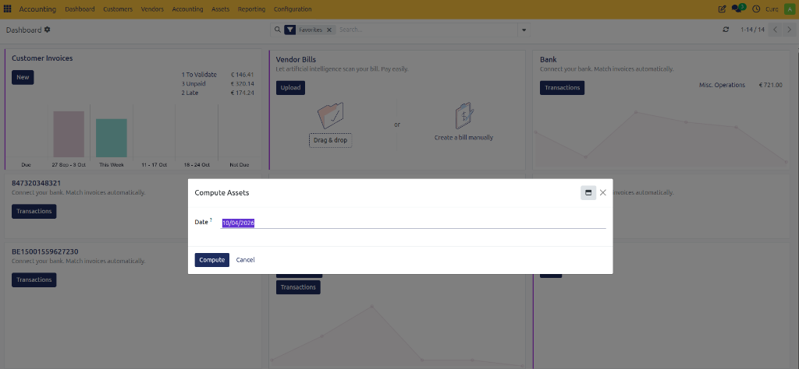

---

## Asset Report

The Asset Report provides an overview of asset values, depreciation, and asset movements.

Navigate to:

**Invoicing → Reports → Financial Asset Report**

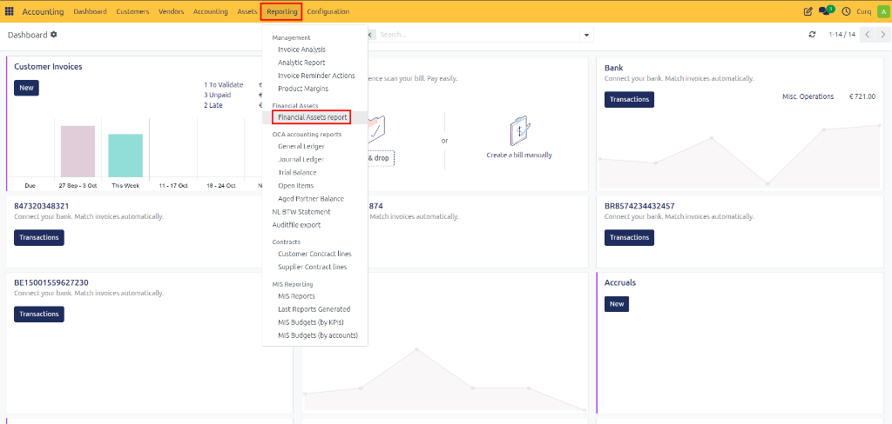

### Report Filters

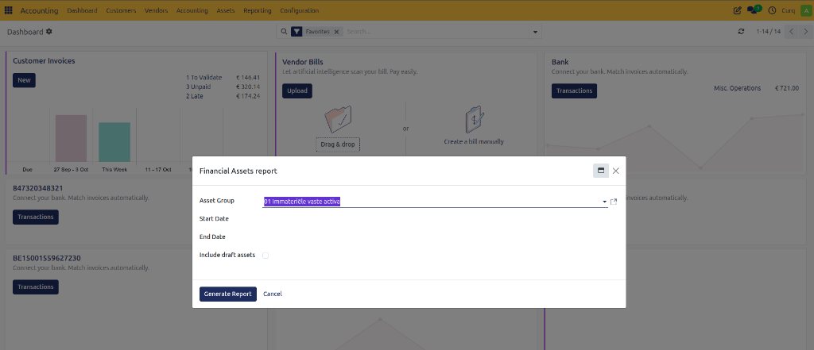
- **Asset Group**
- **Start Date**
- **End Date**
- **Include Draft Assets**

The report is generated as an Excel file and contains multiple worksheets for detailed analysis.
