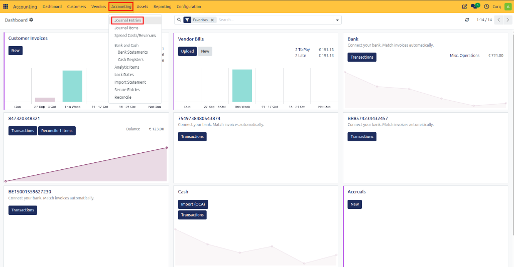
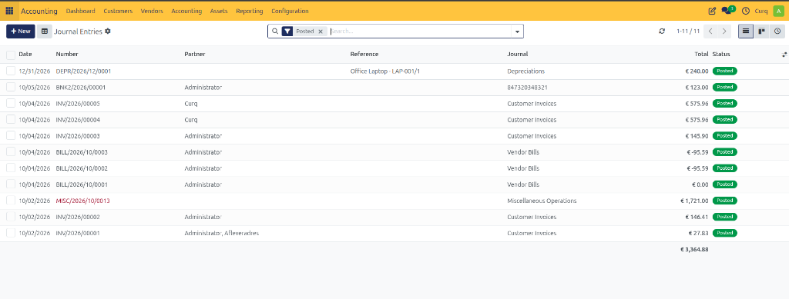
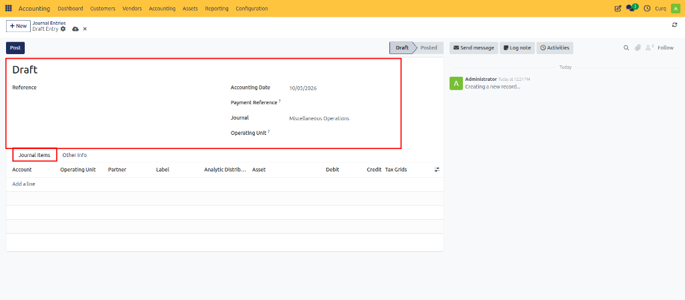
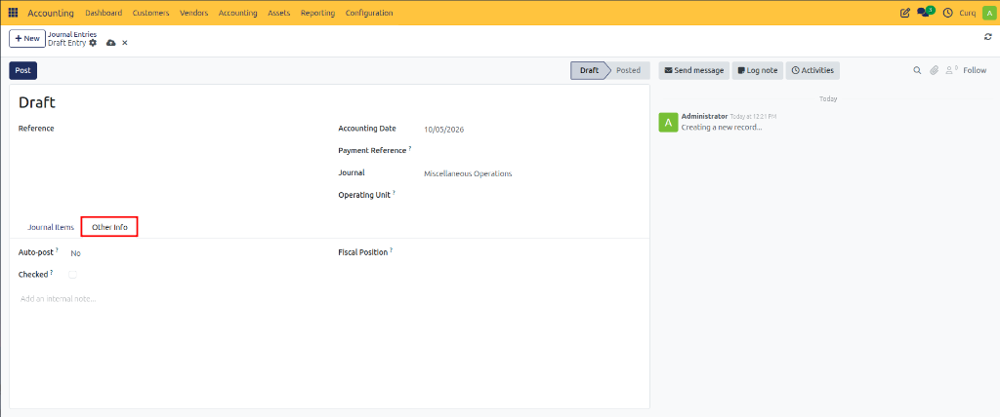

# Create Journal Entry

A Journal Entry is used to manually record accounting transactions that are not automatically generated by invoices, payments, or other accounting processes. Journal entries are commonly used for adjustments, corrections, accruals, depreciation, opening balances, and year-end closing activities.

To create a journal entry, navigate to:
`Accounting → Accounting → Journal Entries`

Click **New** to create a new journal entry.

---

## Journal Entry Fields

| Field | Description |
|---|---|
| **Reference** | A unique description or identifier for the journal entry. |
| **Accounting Date** | The date on which the transaction is recorded in the accounting records. |
| **Payment Reference** | An optional reference used to identify a related payment or external document. |
| **Journal** | The journal in which the transaction will be recorded, such as Miscellaneous Operations, Sales, Purchases, or Bank. |
| **Operating Unit** | Specifies the department, branch, or operating unit responsible for the transaction. |

---

## Journal Items

The **Journal Items** tab contains the accounting lines that make up the journal entry. 
The total debit amount must always equal the total credit amount before the entry can be posted.

| Field | Description |
|---|---|
| **Account** | The general ledger account affected by the transaction. |
| **Operating Unit** | The operating unit assigned to the journal line. |
| **Partner** | The related customer, supplier, or contact. |
| **Label** | A short description of the journal line. |
| **Analytic Distribution** | Used to distribute amounts across one or more analytic accounts for reporting purposes. |
| **Asset** | Links the journal line to a fixed asset when applicable. |
| **Debit** | The debit amount recorded for the account. |
| **Credit** | The credit amount recorded for the account. |
| **Tax Grids** | Determines how the transaction is included in tax and VAT reporting. |

---

## Other Information

The **Other Info** tab contains additional settings related to the journal entry.

| Field | Description |
|---|---|
| **Auto-Post** | Automatically posts the journal entry on a scheduled date. If set to No, the entry must be posted manually. |
| **Checked** | Marks the journal entry as reviewed or verified. |
| **Fiscal Position** | Applies specific tax rules and tax mappings to the journal entry. |
| **Internal Note** | Used to store internal comments or additional information about the journal entry. |

---

## Posting a Journal Entry

1. Enter the journal entry details.
2. Add the required journal lines.
3. Verify that total debits equal total credits.
4. Review the information entered.
5. Click **Post** to validate and record the transaction.

Once posted, the journal entry becomes part of the company's accounting records and will appear in financial reports.
