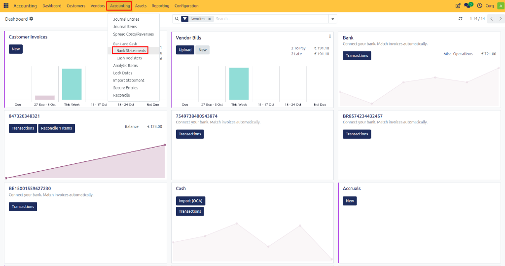
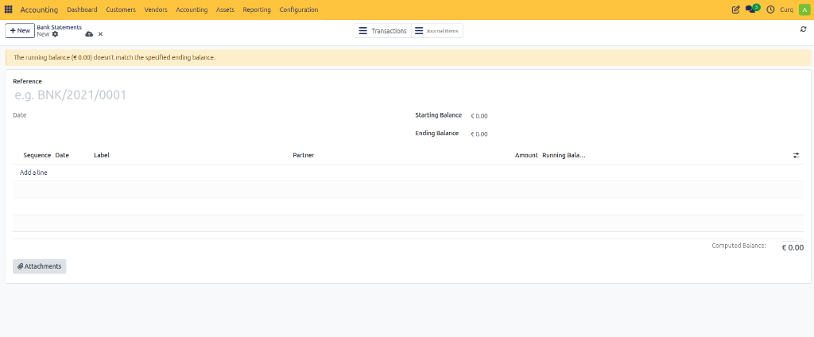

# Manage Bank Statements

A bank statement is a record of all transactions that occurred on a bank account during a specific period. In CURQ, bank statements help you review imported or manually entered bank transactions and verify that your accounting records match your bank balances.

Bank statements can be created automatically through bank synchronization or manually when importing transactions.

**Navigation:**
`Accounting → Accounting → Bank Statements`

---

## Bank Statement Overview

A bank statement contains all transactions for a specific period and provides a summary of the opening and closing balances of the bank account.

The statement can include:
- Imported bank transactions
- Synchronized bank transactions
- Manually entered transactions
- Opening balance entries

Each transaction line contributes to the final balance of the statement.

---

## Bank Statement Fields

| Field | Description |
|---|---|
| **Reference** | The unique identifier of the bank statement. Example: *Bank - 2026-01-01/1* |
| **Date** | The date of the bank statement. This usually represents the statement date provided by the bank. |
| **Company** | The company to which the bank statement belongs. |
| **Starting Balance** | The bank account balance at the beginning of the statement period. |
| **Ending Balance** | The expected balance at the end of the statement period. |
| **Computed Balance** | The balance calculated from all transactions included in the statement. The computed balance should normally match the ending balance. |

---

## Transaction Lines

The transaction section contains all bank movements included in the statement.

| Field | Description |
|---|---|
| **Sequence** | Defines the order of the transaction within the statement. |
| **Date** | The transaction date. |
| **Label** | A description or reference for the transaction. Examples: Invoice payments, Bank fees, Initial Balance, Supplier payments |
| **Partner** | The customer, supplier, or contact related to the transaction. |
| **Amount** | The transaction amount. - Positive amounts increase the bank balance. - Negative amounts decrease the bank balance. |
| **Running Balance** | Displays the bank balance after the transaction has been processed. This helps track how the balance changes throughout the statement. |

---

## Adding Transactions

New transaction lines can be added directly to the statement by clicking:
**Add a line**

When creating a transaction, enter:
- Date
- Description (Label)
- Partner (if applicable)
- Amount

Adding complete information helps improve reconciliation accuracy.

---

## Attachments

The Attachments section allows you to upload supporting documents such as:
- PDF bank statements
- Bank export files
- Supporting documentation

Attachments help maintain a complete audit trail for the statement.

---