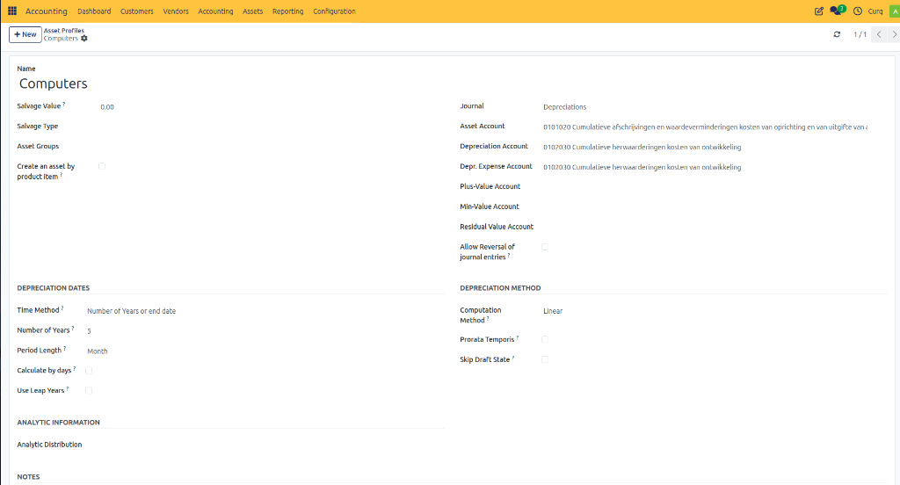
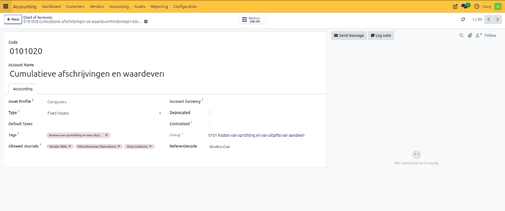
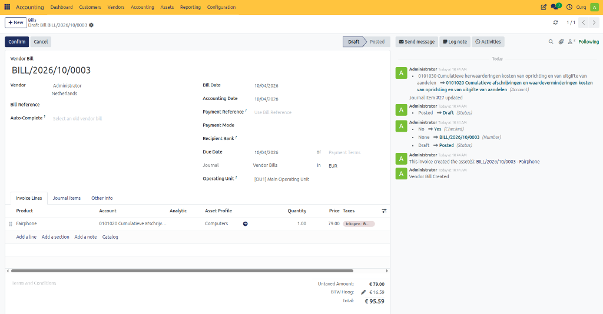
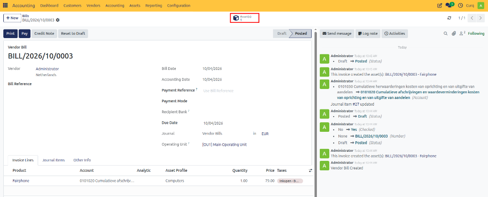
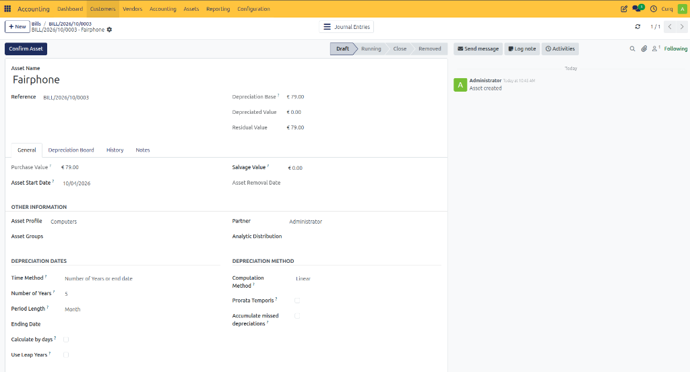
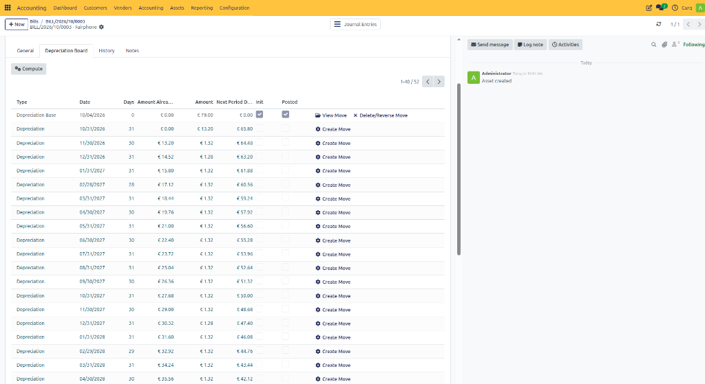

# Assets from Supplier Invoices

CURQ allows you to create fixed assets directly from supplier invoices, making it easy to register investments and automatically start the asset management process. When a supplier invoice is posted to a designated asset account, CURQ can automatically generate the corresponding asset record and link it to the invoice.

To use this functionality, the selected general ledger account must be configured as an asset account and linked to an appropriate Asset Profile.

---

## Creating an Asset from a Supplier Invoice

Navigate to:

**Invoicing → Suppliers → Supplier Invoices**

Create a new supplier invoice and enter the required supplier and invoice information.

In the Invoice Lines section, select the appropriate general ledger account for assets. Examples include:
- Office Equipment
- Computers and Hardware
- Vehicles
- Machinery
- Furniture

If the selected account is correctly configured and linked to an asset profile, CURQ automatically populates the Asset Profile field.

---

## Automatic Asset Creation

Once all invoice information has been entered and the supplier invoice is confirmed, CURQ automatically:
- Creates the asset record
- Links the asset to the supplier invoice
- Uses the configured asset profile to determine depreciation settings and asset behavior

This eliminates the need to manually create the asset after posting the invoice.

---

## Reviewing the Asset

After the asset has been generated, review the asset details to ensure they are correct.

Verify information such as:
- Asset name
- Acquisition value
- Asset category
- Depreciation method
- Depreciation period
- Asset profile

If any adjustments are required, they should be made before activating the asset.

---

## Confirming the Asset

Once the asset details have been verified, activate the asset by clicking:

**[CONFIRM ASSET]**

After confirmation, the asset becomes active and CURQ can begin processing depreciation entries according to the configured asset profile.

---

## Process Overview

1. Configure an asset general ledger account and link it to an Asset Profile.
2. Navigate to **Invoicing → Suppliers → Supplier Invoices**.
3. Create a new supplier invoice.
4. Select the appropriate asset account on the invoice line.
5. Verify that the Asset Profile is populated automatically.
6. Confirm the supplier invoice.
7. Review the automatically generated asset.
8. Click **[CONFIRM ASSET]** to activate the asset.

This process ensures that purchases of fixed assets are recorded correctly in both the accounting records and the asset management system, reducing manual work and maintaining accurate depreciation tracking.
