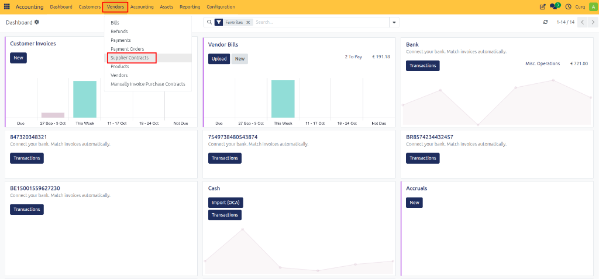

# Manage Contracts

## Overview

The Contracts module allows you to sell products and services as subscriptions and automatically generate recurring invoices based on predefined billing schedules. Customers can view their subscriptions through the Customer Portal, while CURQ handles recurring invoicing automatically according to the contract settings.

Contracts can be created individually or based on Contract Templates. If you frequently create subscriptions with similar configurations, using templates is recommended to streamline the process and ensure consistency.

---

## How Contracts Work

The typical process for creating and managing a contract consists of the following steps:
1. Create a contract, optionally based on a contract template.
2. Define the subscription period and billing frequency.
3. Enter the required contract details and add the products and/or services to be invoiced.
4. CURQ automatically generates recurring invoices based on the configured schedule.
5. If required, generate the first invoice manually using the **Manual Invoicing of Sales Contracts** menu.
6. Send the contract to the customer using the **Send by Email** button.

---

## Creating a Contract

Customer contracts can be created through:

**Invoicing → Customers → Customer Contracts**

Supplier contracts can be created through:

**Invoicing → Suppliers → Supplier Contracts**

From these menus, you can create, manage, and monitor all active contracts.

---

## Contract Details

When creating a contract, complete the general contract information and billing parameters.

### General Information
- **Contract Name:** Enter a descriptive name that clearly identifies the contract.
- **Customer:** Select the customer for whom the subscription is being created.
- **Payment Method:** Choose the payment method agreed upon with the customer. For recurring collections, you can select Direct Debit. *(To use direct debit, a valid bank mandate must first be configured through: `Invoicing → Customers → Bank Mandates`)*
- **Price List (Optional):** If the customer has specific pricing agreements, select the appropriate price list. Price lists can be assigned directly on the contract or inherited from a contract template.

---

## Invoicing Settings

The Invoicing Settings section determines how and when recurring invoices are generated.

### Recurrence at Line Level
Enable **Recurring at Line Item Level** if different products or services within the same contract require different billing frequencies. This allows multiple subscriptions to be managed under a single contract.

For example:
- Monthly software subscription
- Annual maintenance subscription

CURQ generates invoices based on the recurrence settings defined on each contract line.

*[Image placeholder: Multiple Billing Periods in One Contract]*

### Invoice Every
Define how frequently invoices should be generated. Available intervals include:
- Days
- Weeks
- Months
- Last Day of Month
- Years

### Dates
The following fields can be configured:
- **Start Date:** The date on which the subscription begins.
- **Next Invoice Date:** The next planned invoice date. CURQ calculates this automatically, but it can be adjusted if necessary.
- **End Date:** Optional date indicating when the subscription should stop generating invoices.

### Invoice Type
The invoice type determines when invoices are generated in relation to the subscription period.
- **Pre-Paid:** Invoices are generated at the beginning of the billing period.
  *(Example: January subscription invoiced on January 1st.)*
- **Post-Paid:** Invoices are generated after the billing period has ended.
  *(Example: January subscription invoiced on February 1st.)*

### Additional Dates
- **First Invoice Date:** Specify the date on which the first invoice should be generated. Subsequent invoice dates are automatically calculated based on the selected invoice frequency and invoice type.
- **Invoice End Date:** Optionally specify the last date on which invoices may be generated for the contract. After this date, recurring invoicing automatically stops.

---

## Contract Content

This section defines the products and services included in the subscription.

- **Document Type:** The document generated by the contract depends on the contract type:
  - Sales Contract → Invoice
  - Supplier Contract → Vendor Bill

### Subscription Products
Add the products and/or services that should be invoiced through the contract. For each line, specify:
- Product or Service
- Description
- Quantity
- Unit Price

These contract lines form the basis for recurring invoicing.

- **Auto Price:** Enable Auto Price to automatically retrieve prices from the selected price list. This ensures that contract pricing remains aligned with customer-specific pricing agreements.

### Using #START# and #END# in Descriptions
You can include special placeholders in the line description:
- `#START#`
- `#END#`

When invoices are generated, CURQ automatically replaces these placeholders with the invoiced period dates.

**Example**
- **Description:** `Software Subscription (#START# - #END#)`
- **Generated invoice line:** `Software Subscription (01-01-2026 - 31-01-2026)`

This provides customers with clear information about the billing period.

### Stopping a Contract Line
Use the **Stop** button to terminate a specific contract rule. When stopping a contract line, you can:
- Enter the reason for termination
- Specify the end date
- Stop recurring invoicing for that line

This is useful when only part of a contract needs to be discontinued.

---

## Automatic Invoice Generation

CURQ includes a scheduled process called: **Generate Recurring Invoices from Contracts**

This automated task runs daily and checks whether contracts require new invoices. When an invoice is due, CURQ automatically creates it according to the contract settings.

In Developer Mode (Debug Mode), invoices can also be generated manually using the available action button.

---

## Managing Contract Invoices

### Show Recurring Invoices
The **Show Recurring Invoices** shortcut displays all invoices that have been generated from the contract. This provides a complete overview of:
- Generated invoices
- Invoice dates
- Invoice statuses
- Billing history

### Print Contract
The complete contract overview can be printed using the Print menu. This is useful for internal documentation or customer approval processes.

### Send Contract by Email
Once the contract has been reviewed, it can be sent directly to the customer using the **Send by Email** button. The customer receives the contract document and can view ongoing subscriptions through the customer portal.

---

## Contract Lifecycle Overview

1. Create a customer or supplier contract.
2. Configure billing frequency and subscription period.
3. Add products and/or services.
4. Configure pricing and payment method.
5. Set invoice generation options.
6. Send the contract to the customer.
7. CURQ automatically generates recurring invoices.
8. Monitor generated invoices through the contract.
9. Modify or stop contract lines when required.
10. End the contract when the subscription period expires.

The Contracts module provides a centralized solution for managing recurring subscriptions, automated invoicing, customer agreements, and long-term service contracts while reducing manual administrative work.
