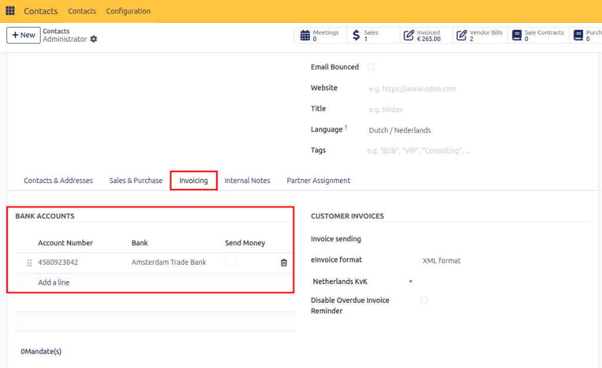

# Manage Payments

## Overview

CURQ provides flexible payment management by allowing payments to be linked directly to invoices and bills or recorded independently for reconciliation at a later stage. This ensures accurate tracking of customer receipts, supplier payments, and outstanding balances.

When a payment is linked to an invoice or bill, the outstanding balance is reduced automatically. Multiple payments can be linked to the same invoice, making it possible to manage partial payments and installment-based settlements.

If a payment is not linked to a specific invoice, it remains as an outstanding customer credit or supplier debit. These outstanding amounts can later be matched against open invoices through the reconciliation process.

In most organizations, invoices are marked as paid when the payment is received and matched through bank reconciliation. However, CURQ also allows users to manually register payments on customer and supplier invoices.

> [!NOTE]
> If supplier payments are processed through SEPA payment files, use the outgoing payments functionality described in the SEPA documentation. These payments are not processed through the standard Payments button.

**Navigation:**
`Invoicing → Suppliers → Outgoing Payments`

---

## Bank Account Verification

Before processing payments, always verify the bank account details of customers and suppliers.

CURQ includes built-in validation to help verify bank account numbers and IBANs. A dedicated payment verification option allows users to explicitly confirm that an account has been reviewed and approved for payments.

If an entered account number does not conform to the IBAN format, CURQ displays a warning. Since non-IBAN account numbers may still be valid in certain situations, this warning does not block further processing.

When the Payments option is enabled, the account can be used for payment transactions.

---

## Registering a Payment

Payments can be registered directly from a customer invoice or supplier bill.

When you click **Register Payment**, CURQ automatically:
1. Creates a payment journal entry.
2. Updates the outstanding amount on the invoice.
3. Posts the balancing entry to an Outstanding Receipts or Outstanding Payments account.
4. Marks the invoice as Paid when the full amount has been settled.

**Navigation:**
- Open a Customer Invoice or Supplier Bill.
- Click **Register Payment**.

Once the corresponding bank statement is imported and reconciled, CURQ automatically transfers the amount from the outstanding account to the bank account. This process creates a complete accounting trail and ensures that both the invoice and bank transaction are correctly recorded.

*[Image placeholder: Payment Journal Entries]*

---

## Payment Information

Each registered payment contains additional information that can be accessed through the information icon next to the payment line.

From the payment details screen, you can view:
- Payment information
- Linked invoice or bill
- Journal used for the transaction
- Reconciliation status
- Related accounting entries

Selecting **View** opens the complete payment record.

*[Image placeholder: Payment Information Screen]*

---

## Undoing a Payment Reconciliation

If a payment has been linked to the wrong invoice, the reconciliation can be reversed. After removing the reconciliation, the payment can be deleted or reassigned.

**Navigation:**
1. Open the payment details.
2. Remove the reconciliation.
3. Navigate to:
   - `Invoicing → Customers → Payments`, or
   - `Invoicing → Suppliers → Payments`
4. Delete or reassign the payment.

---

## Partial Payments

CURQ supports partial payments for both customer invoices and supplier bills.

To register a partial payment:
1. Open the invoice or bill.
2. Click **Register Payment**.
3. Enter the amount received or paid.
4. Choose how the remaining balance should be handled.

You will be presented with two options:

### Keep Open
Select **Keep Open** if part of the invoice remains unpaid. The invoice status will change to Partially Paid, and the remaining balance will remain outstanding.

### Mark as Fully Paid
Select **Mark as Fully Paid** if the remaining difference should be written off and the invoice should be considered settled.

Partial payments can also originate from bank statements. In these situations, the remaining balance can either:
- Remain outstanding on the customer or supplier account, or
- Be written off to a difference account.

Further information about handling payment differences can be found in the reconciliation section.

---

## Reconciliation

Reconciliation is used to match payments and receipts with open invoices and bills.

**Navigation:**
`Accounting → Reconciliation`

In this menu, CURQ displays all outstanding payments, receipts, and open invoices that have not yet been matched. Typical examples include:
- Manually registered customer payments
- Advance payments
- Customer credits
- Supplier prepayments
- Outstanding receipts
- Outstanding payments

*[Image placeholder: Reconciliation Overview]*

### Matching Payments and Invoices
Within the reconciliation screen, you can select an outstanding payment and match it to the corresponding invoice or bill.

For example:
- A manual customer payment has been recorded.
- A sales invoice remains unpaid.
- Both records can be selected and reconciled together.

After reconciliation:
- The invoice balance is reduced.
- The payment is linked to the invoice.
- The invoice status is updated accordingly.
- If the payment does not cover the full amount, the invoice is marked as Partially Paid.
