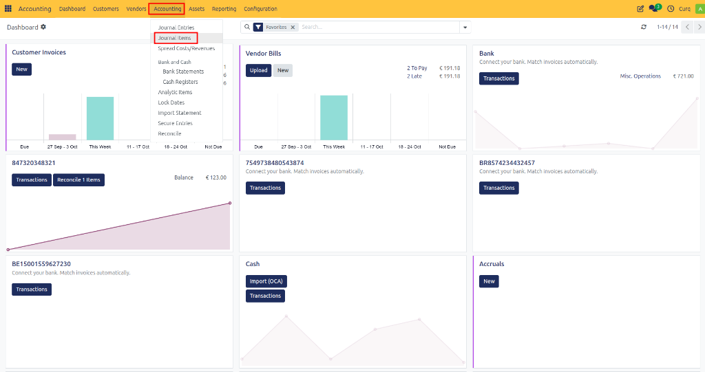
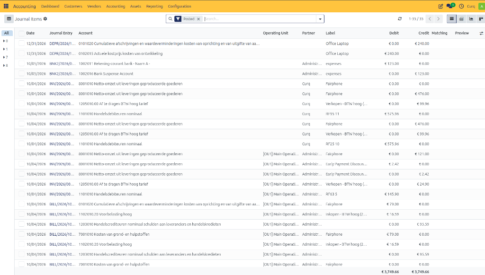
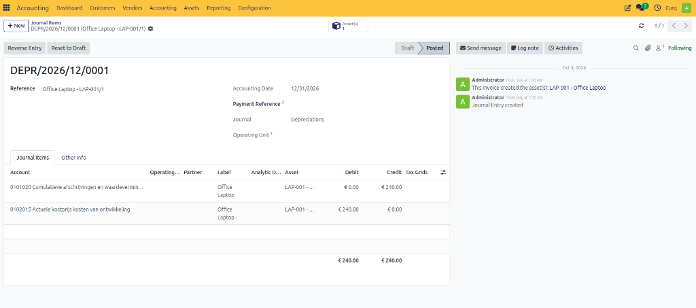

# Journal Items

Journal Items provide a detailed view of all accounting lines created in CURQ. Every journal entry consists of one or more journal items that record the debit and credit movements for specific accounts.

You can access the Journal Items menu through:
`Accounting → Accounting → Journal Items`

This view allows users to review, search, filter, and analyze all accounting transactions recorded in the system.

---

## Journal Items Overview

The Journal Items list displays every accounting line created from:
- Customer invoices
- Vendor bills
- Payments
- Bank transactions
- Asset depreciation entries
- Manual journal entries
- Other accounting operations

Each row represents a single debit or credit posting.

---

## Journal Item Fields

| Field | Description |
|---|---|
| **Date** | The accounting date of the journal item. |
| **Journal Entry** | The journal entry number to which the line belongs. |
| **Account** | The general ledger account used for the posting. |
| **Operating Unit** | The operating unit or business division associated with the transaction. |
| **Partner** | The customer, supplier, or contact linked to the journal item. |
| **Label** | A description explaining the transaction line. |
| **Debit** | The amount debited to the account. |
| **Credit** | The amount credited to the account. |
| **Matching** | Indicates whether the journal item has been reconciled or matched with another transaction. |
| **Preview** | Provides quick access to view related transaction details. |

---

## Searching and Filtering Journal Items

The Journal Items screen provides powerful search and filtering options.

You can filter journal items by:
- Journal Entry
- Account
- Customer
- Supplier
- Date
- Journal
- Operating Unit
- Posted Entries
- Draft Entries

These filters help users quickly locate specific accounting transactions.

---

## Viewing Transaction Details

Clicking a Journal Entry number opens the complete journal entry, allowing you to review:
- Header information
- Debit and credit lines
- Related partner information
- Tax information
- Reconciliation details

This makes it easy to trace accounting movements back to their source document.
