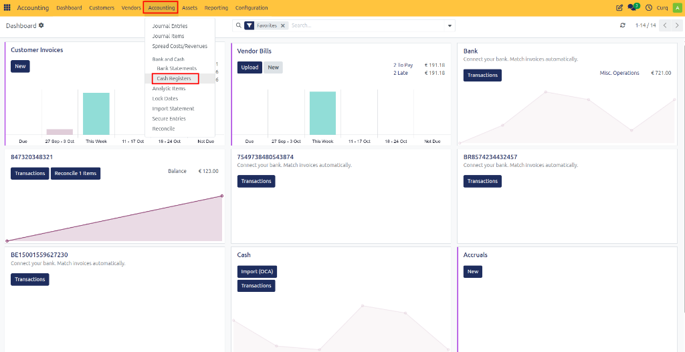
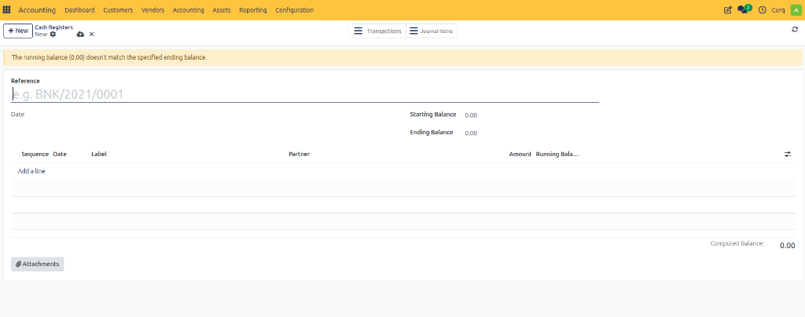

# Manage Cash Registers

A Cash Register is used to record and manage cash transactions within the company. It helps track cash movements such as cash sales, petty cash expenses, cash deposits, and cash withdrawals.

In CURQ, cash registers work similarly to bank statements by maintaining an opening balance, recording transactions, and calculating the closing balance for a specific period.

**Navigation:**
`Accounting → Accounting → Cash Registers`

---

## Cash Register Overview

A cash register contains all cash transactions recorded during a specific period.

Each register provides:
- Opening cash balance
- Cash receipts
- Cash payments
- Running balance
- Closing cash balance

This helps ensure that the physical cash on hand matches the balance recorded in CURQ.

---

## Cash Register Fields

| Field | Description |
|---|---|
| **Reference** | A unique identifier for the cash register. Example: *CSH/2026/0001* This reference helps distinguish one cash register period from another. |
| **Date** | The date of the cash register. This is typically the date for which the cash transactions are being recorded. |
| **Starting Balance** | The cash balance at the beginning of the period. This amount is usually carried forward from the previous cash register or entered manually when creating the first register. |
| **Ending Balance** | The expected cash balance at the end of the period. This should match the actual cash counted in the cash register. |
| **Computed Balance** | The balance automatically calculated by CURQ based on all transaction lines entered in the register. If the computed balance differs from the ending balance, CURQ displays a warning message. |

---

## Transaction Lines

The transaction section contains all cash movements recorded in the register.

| Field | Description |
|---|---|
| **Sequence** | The order of the transaction within the cash register. |
| **Date** | The date on which the cash transaction occurred. |
| **Label** | A description of the transaction. Examples: Cash Sale, Office Supplies, Petty Cash Expense, Cash Deposit, Cash Withdrawal |
| **Partner** | The customer, supplier, or contact related to the transaction. This field is optional but recommended when the transaction involves a specific business partner. |
| **Amount** | The value of the cash transaction. - Positive amounts increase the cash balance. - Negative amounts decrease the cash balance. |
| **Running Balance** | Shows the cash balance after each transaction is applied. This allows users to track how the balance changes throughout the period. |

---

## Adding Cash Transactions

To record a new cash movement:
1. Open the cash register.
2. Click **Add a line**.
3. Enter the transaction details.
4. Save the transaction.

It is recommended to provide a clear label and select a partner when applicable.

---

## Balance Verification

CURQ compares the following values:
- Computed Balance
- Ending Balance

If the values do not match, a warning message appears.

**Example:**
> The running balance does not match the specified ending balance.

This indicates that the entered transactions do not reconcile with the expected cash balance and should be reviewed.
